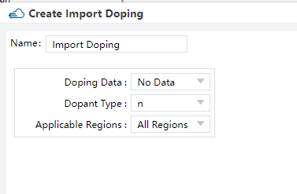
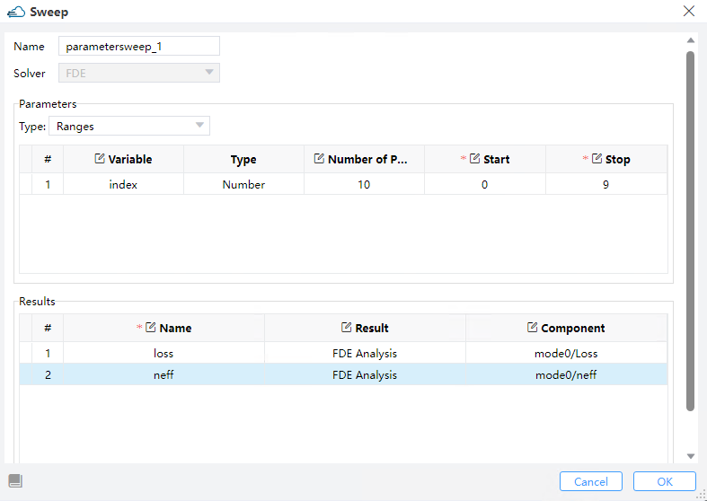

import 'katex/dist/katex.min.css';
import { InlineMath, BlockMath } from 'react-katex';

# Modulator

<font face = "Calibri">

<div class="text-justify">

##  Introduction

​We have developed an electro-optic modulator based on carrier-depletion mechanism in silicon to simulate carrier and index distribution in a global structure. The drift and diffusion of carriers result in depletion at the PN junction. Applying a reverse bias voltage at the cathode broadens the depletion region, altering the carrier concentration and modulating the material's refractive index. Gaussian doping was employed in this model. Modulation efficiency, capacitance, and resistance were calculated to analyze the electro-optic characteristics of the modulator.

​The figure below illustrates the device structure we constructed, wherein the aluminum electrode is applied to the silicon modulator, and the entire device is encapsulated with silicon dioxide material.


## Simulation 

​The present structural file provides a comprehensive guide for constructing a simulation structure and establishing a Gaussian doping distribution. Initially, one must construct the geometric structure of the device, incorporate materials and physical models, specify the doping distribution, and simulation boundary conditions, and set the light source and simulation solver. Eventually, the simulation result data should be extracted and output. 

​Our simulation is designed with a light source entering along the X-axis, and the primary optoelectronic characteristic analysis takes place within the three-dimensional structure on the YZ plane. The FDE solver is utilized to preview the distribution of effective refractive index, and the OEDevice solver is used to preview the doping distribution of the device. Finally, we generate ad output the  distribution map of doping and index in modulator structure.


### 1. Simulation Structure

It is essential to incorporate materials for structure. The electrical and optical parameters of SiO2、Al and Si materials in the `Material Library` can be accessed. Then set simulation structure from structure of home.


In the Ribbon menu, select "New Material", specify the material name in the pop-up window, and then click the "Load from Standard Library" button on both the "Optical" and "Electrical" property pages to choose the corresponding optical and electrical materials. Adjust the material parameters as needed. Then click "Import to Project" to import the material into the current project and close the window.


Click on "Structure" in the Ribbon menu, then select the corresponding structure type from the drop-down list. Set the name, geometric parameters, and material of the structure in the pop-up window, and finally click the "OK" button. 
To begin with, it is advisable to define the geometric region of the device structure in `geometry` and add materials to this region by `material`. The background material, which is usually Air or SiO2, should be added first. In the overlapping area of the materials, the material with a higher order value will take precedence over the one with a lower value. If the values of `Mesh Order` are the same, the material defined later will override the one defined earlier. It is worth noting that the material Aluminium will call the PEC material library.


| Parameter | Units | Description                                                  |
| --------- | ----- | ------------------------------------------------------------ |
| name      |       | Restricts the applicability of the statement to regions with the specified name. |
| material  |       | Restricts the applicability of the statement to regions of the specified material. |
| geometry  |       | Specifies the boundary of specified region in 3D direction   |
| x_min, x_max, y_min, y_max, z_min, z_max       | um    | Specifies the minimum or maximum value in X/Y boundary of modulator structure. |
| x_mean, x_span, y_mean, y_span, z_mean, z_span | um    | Specifies the center or spacing value in X/Y boundary of modulator structure. |

|  name  |Structure   |  x/x span  |  y/y span  |  z/z span  |   material  |
|:------:|:----------:|:----------:|:----------:|:----------:|:-----------:|
|Slab    |Rectangle   |  0/1       |   0/10     | 0.045/0.09 |   Silicon   |
|Rg      |Rectangle   |  0/1       |   0/0.5    | 0.155/0.13 |   Silicon   |
|Anode   |Rectangle   |  0/1       |  -4.4/1.2  | 0.34/0.5   |   Aluminum  |
|Cathode |Rectangle   |  0/1       |   4.4/1.2  | 0.34/0.5   |   Aluminum  |

#### 1.1 Edit DDM

Adding electrical silmulation solver, is the prerequisite for output structure file. The type of `ddm` module can be invoked to enable the charge carrier transport solver for analyzing the optoelectronic properties of a device. In the Ribbon menu, select "Setup Solvers", then choose "DDM" from the drop-down list, and then set parameters such as background material, normal direction length of the device, and simulation area in the pop-up window.


Specifies the  boundary of electrical simulation for `DDM` solver in 2D direction. Additionally, we define the length of the three-dimensional X direction and the solution mode and temperature during the composite process. 


When specifying meshes, a balance should be struck between accuracy and numerical efficiency. The accuracy, convergence, and program memory of the subsequent computation are all affected by the quality and size of the elements in the mesh, making mesh partitioning crucial in this module. Achieving accuracy requires a fine mesh that can resolve all significant features of the solution, while numerical efficiency requires a coarse mesh that minimizes the total number of grid points.  
Due to the relatively simple structure of this modulator, a rough initial mesh can be established for electrical simulation of the entire device. 


We utilize the `newton` iteration method for calculation, and the `mumps`  direct solver is employed as the linear solver. The `max_iterations` parameter defines the maximum number of nonlinear iterations. When the number of iterations exceeds this value, the solver reduces the voltage step and starts a new iterative computations. 


#### 1.2 Set Doping

You should define the `name` and `geometry` for doping region,and basic parameters of doping module in `dopant`, such as  `dopant type` and `concentration`.   

##### 1.2.1 Constant Doping

Specifies the  concentration of uniform doping by `Concentration` and its boundary throuth `Geometry` in Y-Z plane. `Dopant Type` specifies the n-type or donor dopant in `n` , and  p-type or acceptor dopant in `p` , which may be used with gaussian and uniform profile types.


| Parameter                                      | Units | Description                                                  |
| :--------------------------------------------: | :---: | :----------------------------------------------------------: |
| x_min, x_max, y_min, y_max, z_min, z_max       | um    | Specifies the minimum or maximum value in X/Y boundary of modulator structure. |
| x_mean, x_span, y_mean, y_span, z_mean, z_span | um    | Specifies the center or spacing value in X/Y boundary of modulator structure. |
| applicable_regions                             |       | Selections are ['all_regions','solid','material']            |

##### 1.2.2 Diffusion Doping

Specifies the  junction width and peak concentration of gaussian doping by`Junction Width` and  `Concentration` , its boundary throuth `Geometry`.Then define source face、junction width、peak concentration and  reference concentration in gaussian doping. `ref_concentration` specifies the diffusion boundary of Gaussian doping.


##### 1.2.3 Import Doping

Import a new doped file with device structure from the "Data Space" that has already stored doped data files, or from a local path.




#### 1.3 Set Contact


#### 1.4 Set Monitor

Charge Monitor support both 2D and 1D geometry.


|         **Parameters**         | Default |  Type   |                            Notes                             |
| :----------------------------: | :-----: | :-----: | :----------------------------------------------------------: |
|interpolate_accuracy  |    1    | integer |  Set the accuracy of the rectangular grid for extracting the monitor result. Restrained by condition: >=1 && <= 10. Here 1 means the grid size is 10nm, and 10 means the grid size is 1nm, and the grid size varies uniformly with the variation in 'interpolate_accuracy'.           |


|         **Parameters**         | Default |  Type   |                            Notes                             |
| :----------------------------: | :-----: | :-----: | :----------------------------------------------------------: |
|monitor_type      |         | string  | Selections are ['linear_x', 'linear_y', 'linear_z', '2d_x_normal', '2d_y_normal', '2d_z_normal']. |

### 2. Simulation Steps

#### 2.1 Obtain Carrier Distribution

Set the BC model and scanning method here. First, select "Steady State" in Solver Mode of DDM.


​The operational mechanism of the device we simulated in this study primarily revolves around the application of a reverse voltage to modify the width of the depletion region, thereby effectively modifying the carrier concentration and subsequently modulating the refractive index. Hence, it is necessary to specify the voltage of initial、termination and step, with both parameters expressed in volts.  The bias voltage range is set for steady-state solutions. 


Chick `Run` and wait simulation result.
Right-click on the "Charge" result in the "Result View" and select the "Save As" option to save the carrier distribution data with device coordinates as a cdat format file. Then import this data file into the "data space" for use in FDE analysis.


#### 2.2 Modulation efficiency

You could right-click on an existing version and click "Create a new version" in "Versions"

The half-wave voltage refers to the applied voltage required by the modulator's optical signal to generate a phase difference of pi radians, directly reflecting the modulation efficiency of the modulator. Usually, the modulation efficiency of a device is represented by multiplying the half-wave voltage with a parameter that represents the length of the modulator required for phase variation. A smaller value of this parameter indicates higher modulation efficiency, resulting in a smaller required device size. 

According to the modulator's operating principle, the extra carriers created by the doped device under external bias form an internal electric field and depletion layer in the device via drift diffusion, resulting in changes in refractive index and loss. You may determine np density using DDM's steady-state solution by `DDM` and then input the data into FDE to calculate changes in optical loss and refractive index by `FDE`. 

The initial and ultimate step involves importing the optical characteristics of the substance and activating the nanoparticle density model for silicon materials.


Select FDE from Setup Solvers, and set up the general, Geometry, Mesh Settings, Boundary Conditions and Advanced.


Import the `np density` file, which contains the carrier distribution derived from the `DDM` method, into the `FDE` model. This integration facilitates the analysis of refractive index and loss variations as a function of bias voltage at specific wavelengths.


Add FDE analysis about wavelength as follows:


Run FDE solver and add the analysis to calculate the change of effective refractive index and optical loss under specific wavelength. Set the value of "V_cathode" as global parameter to sweep in "Sweeps".




​This section of the program is dedicated to calculating the parameters *VpiL* and *VpiLoss*.
​You should extract the parameters for transmission loss and the real part of effective refractive index.


#### 2.3 Capacitance And Resistance

You could right-click on an existing version and click "Create a new version" in "Versions"

​Capacitance and resistance play crucial roles in determining the performance of devices. Optimal capacitance values enable the modulator to selectively allow or block signals within specific frequency ranges, facilitating signal coupling. Suitable resistance values enable adjustment of signal amplitude and modulation current determination.

​The simulation program for calculating capacitance and voltage exhibits numerous similarities to the program used for investigating modulation efficiency. Prior to conducting the simulation, it is necessary to import the module in order to invoke the structures and physical models.

​The voltages to be applied to the electrodes of the device are specified.

​You can add a solver for the simulation and define its properties. Furthermore, the properties of the AC small-signal module are defined in this section. The frequency interval is logarithmically defined, specifying the initial frequency, final frequency, and the number of frequencies. The variable `ssac_amplitude"` represents the amplitude of the small signal. In this instance, three frequency values (1, 100, and 10000 MHz) are selected from the range of 1e6 to 1e10.


​You can directly invoke the engineering function and device structure created, and then add the electrodes and their attributes. In this case, a bias voltage ranging from -0.5 V to 4 V with a scan step of 0.5 V is applied to the `cathode` electrode during small-signal simulation.


Run DDM solver and wait simulation results, and export the data of the real and imaginary parts of the AC small signal current,post processed exported data.
```python
# region --- 7. Post Processing ---
        fontsize = 20
        linewidth = 1
        plt.rcParams.update({"font.size": fontsize})
        for i,val in enumerate(ssac_frequency_span):
            plot_path_f = os.path.join(plot_path, f"{val/1e6:.2f}MHz")
            Iac_real_data = np.genfromtxt(f"{plot_path_f}/Iac_Cathode_real.csv", skip_header=1, delimiter=",")
            Iac_imag_data = np.genfromtxt(f"{plot_path_f}/Iac_Cathode_imag.csv", skip_header=1, delimiter=",")
            Iac = Iac_real_data[:,1] + 1j * Iac_imag_data[:,1]
            Vdc = Iac_real_data[:,0]
            Z = ssac_amplitude/Iac
            R = np.abs(np.real(Z))
            C = np.abs(np.imag(1/Z)/(2*np.pi*ssac_frequency_span[i]))/1e4*1e15

            np.savetxt(f"{plot_path_f}/resistance.csv", np.array((Vdc, R)).T, fmt='%f,%.15e', header='voltage,resistance')
            np.savetxt(f"{plot_path_f}/capacitance.csv", np.array((Vdc, C)).T, fmt='%f,%.15e', header='voltage,capacitance')

            fig, ax1 = plt.subplots()
            fig.set_size_inches(12, 8)
            ax1.plot(Vdc, R, c='b', linewidth=linewidth, label=f"f:{val/1e6:.2f}MHz",marker='o')
            ax1.set_xlabel('VBias[V]')
            ax1.set_ylabel('Resistance[Ohm]')
            ax1.legend()
            ax1.grid()
            plt.savefig(f"{plot_path_f}/resistance.jpg")
            plt.close()

            fig, ax2 = plt.subplots()
            fig.set_size_inches(12, 8)
            ax2.plot(Vdc, C, c='b', linewidth=linewidth, label=f"f:{val/1e6:.2f}MHz",marker='o')
            ax2.set_xlabel('VBias[V]')
            ax2.set_ylabel('Capacitance[fF/um]')
            ax2.legend()
            ax2.grid()
            plt.savefig(f"{plot_path_f}/capacitance.jpg")    
            plt.close()
    # endregion
```

### 3 Output Result

#### 3.1 NP Density
The charge distribution of n type and p type from charge monitor.


#### 3.2 Loss

​This section displays the variation of losses with bias voltage.


#### 3.3 Effective Index

​This section displays the variation of effective index with bias voltage.
 

#### 3.4 Modulation efficiency

​	These graphs illustrate the relationship between two parameters that represent modulation efficiency as a function of bias voltage.

|                          *VpiL*                           |                          *VpiLoss*                           |
| :-------------------------------------------------------: | :----------------------------------------------------------: |
|  |  |

#### 3.5 Small Signal AC Current

​This section displays the variations of  AC current with respect to bias voltage at 100MHZ.
  

#### 3.6 Capacitance

​This section displays the variations of capacitance with respect to bias voltage at 100MHZ.
 


</div>


</font>