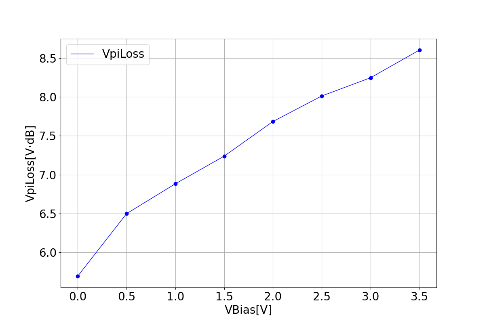
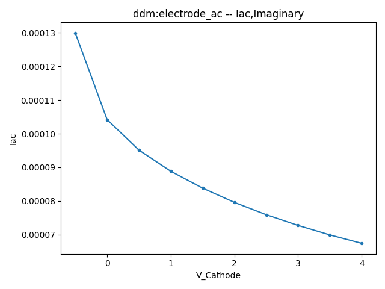

import 'katex/dist/katex.min.css';
import { InlineMath, BlockMath } from 'react-katex';

# Modulator

<font face = "Calibri">

<div class="text-justify">

##  Introduction

​We have developed an electro-optic modulator based on carrier-depletion mechanism in silicon to simulate carrier and index distribution in a global structure. The drift and diffusion of carriers result in depletion at the PN junction. Applying a reverse bias voltage at the cathode broadens the depletion region, altering the carrier concentration and modulating the material's refractive index. Gaussian doping was employed in this model. Modulation efficiency, capacitance, and resistance were calculated to analyze the electro-optic characteristics of the modulator.

​The figure below illustrates the device structure we constructed, wherein the aluminum electrode is applied to the silicon modulator, and the entire device is encapsulated with silicon dioxide material.


## Simulation Structure

​The present structural file provides a comprehensive guide for constructing a simulation structure and establishing a Gaussian doping distribution. Initially, one must construct the geometric structure of the device, incorporate materials and physical models, specify the doping distribution, and simulation boundary conditions, and set the light source and simulation solver. Eventually, the simulation result data should be extracted and output. 

​Our simulation is designed with a light source entering along the X-axis, and the primary optoelectronic characteristic analysis takes place within the three-dimensional structure on the YZ plane. The FDE solver is utilized to preview the distribution of effective refractive index, and the DDM solver is used to preview the doping distribution of the device. Finally, we generate ad output the  distribution map of doping and index in modulator structure.

Application Library path: `:\mo_sdk_solution_v3.2.3.0\examples\active_demo\doping_function\MOD\MOD00_structure.py`

### 1. Basic Operations

It is essential to incorporate materials for structure. Although module of `maxoptics_sdk.all` provides default values for standard semiconductors, these values can be customized in `MOD_material.py` . 

Application Library path: `:\mo_sdk_solution_v3.2.3.0\examples\active_demo\doping_function\MOD\MOD_material.py`

The module of `fundamental` specifies the base parameters of the material electrical structure .  The `recombination` includes recombination of  Auger, SRH, and Radiative. It is crucial to define the model type and parameter values, if another model is used instead of the default. The default mobility model of Silicon is `Analytic` , but we use the mobility model of `Masetti` in  `Mobility` of this modulator.

```python
elec_Si_properties = {
    "permittivity": {
        "permittivity": 11.7
    },
    "work_function":4.2,
    "fundamental": {
        "electron": "density_of_states",
        "hole": "density_of_states",  
        "nc": {
            # "constant": 3.21657e19,
            "enable_model": True,
            "nc300": 3.21657e19
        },
        "nv": {
            # "constant": 1.82868e19,
            "enable_model": True,
            "nv300": 1.82868e19
        },
        "eg": {
            # "constant": 1.12416,
            "enable_model": True,
            "alpha": 0.000473,
            "beta": 636,
            "eg0": 1.16
        },
        "narrowing": {
            "model": "slotboom",
            "slotboom": {
                "e0": 0.0045,
                "n0": 1.0e17
            }
        },
    },
    "recombination":{
        "trap_assisted": {
            "enabled": True,
            "taun": {
                "enable_model": False,
                # "constant": 1e-5,
                # "alpha": 0,
                "dopant": {
                    "model": "scharfetter",  
                    "scharfetter": {
                        "nref": 7.1e15,
                        "taumax": 3.3e-6,
                        "taumin":0
                    }
                },
                "field": {
                    "model": "none",  
                    # "schenk": {
                    #     "hbar_omega": 0.068,
                    #     "mt": 0.258,
                    #     "s": 3.5
                    # }
                }
            },
            "taup": {
                "enable_model": False,
                # "constant": 3e-6,
                # "alpha": 0,
                "dopant": {
                    "model": "scharfetter",  
                    "scharfetter": {
                        "nref": 7.1e15,
                        "taumax": 4e-6,
                        "taumin": 0
                    }
                },
                "field": {
                    "model": "none",
                    # "schenk": {
                    #     "hbar_omega": 0.068,
                    #     "mt": 0.24,
                    #     "s": 3.5
                    # }
                }
            },
            "ei_offset": 0.0
        },
        "radiative": {
            "enabled": True,
            "copt": 1.6e-14
        },
        "auger": {
            "enabled": True,
            "caun": {
                "constant": 2.8e-31,
                "enable_model": False,
                # "a": 6.7e-32,
                # "b": 2.45e-31,
                # "c": -2.2e-32,
                # "h": 3.46667,
                # "n0": 1e18 
            },
            "caup": {
                "constant": 9.9e-32,
                "enable_model": False,
                # "a": 7.2e-32,
                # "b": 4.5e-33,
                # "c": 2.63e-32,
                # "h": 8.25688,
                # "n0": 1e18
            }
        },
        "band_to_band_tunneling": {
            "enabled": False,
            # "model": "hurkx",  # or "schenk"
            # "hurkx": {
            #     "agen": 3.5e21,
            #     "arec": 3.5e21,
            #     "bgen": 2.25e7,
            #     "brec": 2.25e7,
            #     "pgen": 2.0,
            #     "prec": 2.0,
            #     "alpha": 0
            # },
            # "schenk": {
            #     "a": 8.977e20,
            #     "b": 2.1466e7,
            #     "hbar_omega": 0.0186
            # }
        }

    },
    "mobility":{
        "mun": {
            "lattice": {
                # "constant": 1417,
                "enable_model": True,
                "eta": -2.5,
                "mumax": 1471
            },
            "impurity": {
                "model": "masetti", 
                "masetti": {
                    "alpha": 0.68,
                    "beta": 2,
                    "cr": 9.68e16,
                    "cs": 3.43e20,
                    "mu1": 43.4,
                    "mumin1": 52.2,
                    "mumin2": 52.2,
                    "pc": 0
                }
            },
            "high_field": {
                "model": "none",  
                # "canali": {
                #     "alpha": 0,
                #     "beta0": 1.109,
                #     "eta": 0.66
                # },
                # "driving_field": {
                #     "model": "e_dot_j",  # or "grad_phi",
                #     "grad_phi": {
                #         "nref": 1e5
                #     }
                # },
                # "vsat": {
                #     "constant": 1.07e7,
                #     "enable_model": False,
                #     "gamma": 0.87,
                #     "vsat0": 1.07e7
                # }
            }
        },
        "mup": {
            "lattice": {
                # "constant": 470.5,
                "enable_model": True,
                "eta": -2.2,
                "mumax": 470.5
            },
            "impurity": {
                "model": "masetti",  # or "none"
                "masetti": {
                    "alpha": 0.719,
                    "beta": 2,
                    "cr": 2.23e17,
                    "cs": 6.1e20,
                    "mu1": 29,
                    "mumin1": 44.9,
                    "mumin2": 44.9,
                    "pc": 0
                }
            },
            "high_field": {
                "model": "none",  
                # "canali": {
                #     "alpha": 0,
                #     "beta0": 1.213,
                #     "eta": 0.17
                # },
                # "driving_field": {
                #     "model": "e_dot_j",  # or "grad_phi",
                #     "grad_phi": {
                #         "nref": 1e5
                #     }
                # },
                # "vsat": {
                #     "constant": 8.37e6,
                #     "enable_model": True,
                #     "gamma": 0.52,
                #     "vsat0": 8.37e6
                # },
            },
        },
    },
}

```

The parameter values of `opto_Si_properties_1550` and `opto_Si_properties_1310` are used to describe the perturbation variation of carrier distribution on refractive index. Should choose the "index_perturbation" model and enable the "np_density" model to define these parameters.

```python
opto_Si_properties_1550 = {
    "index_perturbation":
    {
        "enabled": True,
        "np_density": 
        {
            "enable_model": True,
            "np_density_model": "soref_and_bennett", 
            "coefficients": "user_input",   
            "isotropic_data": [
            {
                "dalpha_an": 8.5e-18,
                "dalpha_ap": 6e-18,
                "dalpha_en": 1,
                "dalpha_ep": 1,
                "dn_an": -8.8e-22,
                "dn_ap": -8.5e-18,
                "dn_en": 1,
                "dn_ep": 0.8,
            }
            ]
        }
    }
}

opto_Si_properties_1310 = {
    "index_perturbation":
    {
        "enabled": True,
        "np_density": 
        {
            "enable_model": True,
            "np_density_model": "soref_and_bennett", 
            "coefficients": "user_input",   
            "isotropic_data": [
            {
                "dalpha_an": 6e-18,
                "dalpha_ap": 4e-18,
                "dalpha_en": 1,
                "dalpha_ep": 1,
                "dn_an": -6.2e-22,
                "dn_ap": -6e-18,
                "dn_en": 1,
                "dn_ep": 0.8,
            }
            ]
        }
    }
}
```

### 2. Code description

#### 2.1 Import Modules

To begin, we need to use the `import` command to call the relevant functional modules and  parameter values of material from previously defined file.

```python
import sys

# encoding: utf-8

from moapi.v3.aggregate import AggregatedUIService as Project
import maxoptics_sdk.all as mo
from maxoptics_sdk.helper import timed, with_path
import os
import time
from typing import NamedTuple
import sys
current_dir = os.path.dirname(__file__)
sys.path.extend([current_dir])
from MOD_material import elec_Si_properties, opto_Si_properties_1550, opto_Si_properties_1310
```
The `typing` module provides support for type hints and annotations, which are used to indicate the expected types of variables, function arguments, and return values in your code. <br/>The `os` module provides a way to use operating system-dependent functionality such as reading or writing to the file system, working with environment variables, and executing system commands.<br/>The `time` module provides various functions to work with time-related operations and to measure time intervals. <br/>The `maxoptics_sdk` package provides all in one optical simulation with Python.
#### 2.2 Define Parameters

##### 2.2.1 General Parameters

We define these parameters for entire simulation process.

```python
wavelength = 1.55    # um
temperature = 300    # K
normal_length = 1e4  # um
egrid_global = 0.01  # um
ogrid_global_y = 0.02   # um
ogrid_global_z = 0.02   # um
ogrid_local_y = 0.002    # um
ogrid_local_z = 0.002    # um
run_mode = "local"
simu_name = "MOD00"

```

| Parameter      | Units | Description                                                  |
| -------------- | ----- | ------------------------------------------------------------ |
| wavelength     | um    | Specifies the optical wavelength of the source beam (in the vacuum) for mono-spectral simulations. |
| temperature    | K     | Specifies the temperature in Kelvin.                         |
| normal_length  | um    | Specifies the extent of a mesh section in the X direction.   |
| egrid_loacal   | um    | Specifies the appropriate size of mesh in the Y and Z direction for overall region of DDM simulation. |
| ogrid_global_y | um    | Specifies the mesh spacing in the Y direction for region of optical simulation. |
| ogrid_global_z | um    | Specifies the mesh spacing in the Z direction for region of optical simulation. |
| ogrid_local    | um    | Specifies the mesh spacing in the Y and Z direction for local region of optical simulation. |
| run_mode       |       | Specifies the simulate model.                                |
| simu_name      |       | Specifies this file name to define name of output result folder. |


Since we explore two communication wavelength, you should define the wavelength, and use next code to choose  relavent parameters values, which we defines in `MOD_material.py` .

```python
if wavelength > 1.4:
    Si_index_vs_doping = opto_Si_properties_1550
else:
    Si_index_vs_doping = opto_Si_properties_1310
```

##### 2.2.2 Structure Geometry

You should define the location of material in X, Y and Z direction about the modulator structure.

```python
st_x_min = -0.3
st_x_max = 0.3
st_x_mean = 0.5*(st_x_min+st_x_max)
st_x_span = st_x_max-st_x_min

st_y_min = -5
st_y_max = 5
st_y_mean = 0.5*(st_y_min+st_y_max)
st_y_span = st_y_max-st_y_min

st_z_min = -0.3
st_z_max = 0.8

slab_height = 0.09
rg_height = 0.22
rg_width = 0.5
elec_height = 0.5
elec_width = 1.2
```

| Parameter                                      | Units | Description                                                  |
| ---------------------------------------------- | ----- | ------------------------------------------------------------ |
| x_min, x_max, y_min, y_max, z_min, z_max       | um    | Specifies the minimum or maximum value in X/Y boundary of modulator structure. |
| x_mean, x_span, y_mean, y_span, z_mean, z_span | um    | Specifies the center or spacing value in X/Y boundary of modulator structure. |
| slab_height                                    | um    | Specifies the height of slab layer in Z direction.           |
| rg_height                                      | um    | Specifies the height of RG layer in Z direction.             |
| elec_height, elec_width                        | um    | Specifies the Z-direction height and Y-direction width of electron. |

##### 2.2.3 Electrical Simulation Boundary

Specifies the  boundary of electrical simulation for `DDM` solver in 3D direction.

```python
oe_x_min = 0
oe_x_max = 0
oe_x_mean = 0.5*(oe_x_min+oe_x_max)
oe_x_span = oe_x_max-oe_x_min

oe_y_min = st_y_min
oe_y_max = st_y_max
oe_y_mean = 0.5*(oe_y_min+oe_y_max)
oe_y_span = oe_y_max-oe_y_min

oe_z_min = st_z_min
oe_z_max = st_z_max
oe_z_mean = 0.5*(oe_z_min+oe_z_max)
oe_z_span = oe_z_max-oe_z_min
```

Specifies the  concentration of uniform doping by `constant_con` and its boundary throuth `center` and `span` in Y-Z plane.

```python
constant_y_center = 0
constant_y_span = 10
constant_z_center = 0.1
constant_z_span = 0.3
constant_con = 1e15
```

Specifies the  junction width and peak concentration of gaussian doping by`_jw` and  `_con` , its boundary throuth `center` and `span` in Y-Z plane of slab.

```python
p_slab_y_center = -2.575
p_slab_y_span = 4.85
p_slab_z_center = -0.105
p_slab_z_span = 0.39
p_slab_jw = 0.1
p_slab_con = 7e17

n_slab_y_center = 2.575
n_slab_y_span = 4.85
n_slab_z_center = -0.105
n_slab_z_span = 0.39
n_slab_jw = 0.1
n_slab_con = 5e17
```

Specifies the doping region of high concentration in slab layer, including boundary、junction width and peak concentration.

```py
p_plus_y_center = -3.5
p_plus_y_span = 3
p_plus_z_center = -0.04
p_plus_z_span = 0.52
p_plus_jw = 0.1
p_plus_con = 1e19

n_plus_y_center = 3.5
n_plus_y_span = 3
n_plus_z_center = -0.04
n_plus_z_span = 0.52
n_plus_jw = 0.1
n_plus_con = 1e19
```

Specifies the doping region of high concentration in waveguide structure, including boundary、junction width and peak concentration.

```py
p_wg_y_center = -0.12
p_wg_y_span = 0.36
p_wg_z_center = 0.1275
p_wg_z_span = 0.255
p_wg_jw = 0.12
p_wg_con = 5e17

n_wg_y_center = 0.105
n_wg_y_span = 0.29
n_wg_z_center = 0.12
n_wg_z_span = 0.235
n_wg_jw = 0.11
n_wg_con = 7e17
```

##### 2.2.4 Optical simulation Boundary

Specifies the boundary of optical simulation  for `FDE` solver in 3D direction. We only consider optical characteristic of Y-Z plane, since the light travels along X-axis.

```python
x_min = 0
x_max = 0
x_mean = 0.5*(x_min+x_max)
x_span = x_max-x_min

y_min = -2.3
y_max = 2.3
y_mean = 0.5*(y_min+y_max)
y_span = y_max-y_min

z_min = -1.5
z_max = 1.5
z_mean = 0.5*(z_min+z_max)
z_span = z_max-z_min
```

#### 2.3 Define Engineering Function

To facilitate the calling of other simulation scripts, it is recommended to define a function that can set materials, model, dope, and add boundary conditions.

##### 2.3.1 Create Project

Create a new simulation project.

```python
class RunOptions(NamedTuple):
    index_preview: bool = False
    doping_preview: bool = False
    calculate_modes: bool = False
    run: bool = False
    extract: bool = False
def create_project(project_name, run_options: RunOptions) -> Project:
    # region --- 1. Project ---
    pj = mo.Project(name=project_name)
    # endregion
    return pj

```

##### 2.3.2 Set Material

The electrical and optical parameters of SiO2、Al and Si materials in the material library can be accessed. If the parameters defined in the Si section of `MOD_material.py`  are different from the default parameters in the material library, the former will be prioritized. In the overlapping area of the materials, the material with a higher order value will take precedence over the one with a lower value. If the values are the same, the material defined later will override the one defined earlier. It is worth noting that the material Aluminium will call the PEC material library.

```python
# region --- 2. Material ---
    mt = pj.Material()

    mt.add_lib(name="mat_sio2", data=mo.OE_Material.SiO2, order=1)
    mt.add_lib(name="mat_al", data=mo.OE_Material.Al, order=2, override={"work_function": 4.1})
    mt.add_lib(name="mat_si", data=mo.OE_Material.Si, order=2, override=elec_Si_properties)
    mt["mat_sio2"].set_optical_material(data=mo.Material.SiO2_Palik)
    mt["mat_al"].set_optical_material(data=mo.Material.PEC)
    mt["mat_si"].set_optical_material(data=mo.Material.Si_Palik, override=Si_index_vs_doping)
    # endregion
```

##### 2.3.3 Define structure

To begin with, it is advisable to define the geometric region of the device structure in `geometry` and add materials to this region by `material`. The background material, which is usually Air or SiO2, should be added first.

```python
# region --- 3. Structure ---
    st = pj.Structure()

    st.add_geometry(name="Slab", type="Rectangle", property={
        "material": {"material": mt["mat_si"]},
        "geometry": {"x": st_x_mean, "x_span": st_x_span, "y": st_y_mean, "y_span": st_y_span, "z_min": 0, "z_max": slab_height}})

    st.add_geometry(name="Rg", type="Rectangle", property={
        "material": {"material": mt["mat_si"]},
        "geometry": {"x": st_x_mean, "x_span": st_x_span, "y": 0, "y_span": rg_width, "z_min": slab_height, "z_max": rg_height}})

    # endregion
```

| Parameter | Units | Description                                                  |
| --------- | ----- | ------------------------------------------------------------ |
| name      |       | Restricts the applicability of the statement to regions with the specified name. |
| type      |       | Specifies the  geometry of specified region.                 |
| material  |       | Restricts the applicability of the statement to regions of the specified material. |
| geometry  |       | Specifies the boundary of specified region in 3D direction   |

We offer several alternative electrode region for establishing the electrical simulation area.

```python   
    st.add_geometry(name="Anode", type="Rectangle", property={
        "material": {"material": mt["mat_al"]},
        "geometry": {"x": st_x_mean, "x_span": st_x_span, "y_min": st_y_min, "y_max": st_y_min + elec_width,
                        "z_min": slab_height, "z_max": slab_height + elec_height}})

    st.add_geometry(name="Cathode", type="Rectangle", property={
        "material": {"material": mt["mat_al"]},
        "geometry": {"x": st_x_mean, "x_span": st_x_span, "y_min": st_y_max - elec_width, "y_max": st_y_max,
                        "z_min": slab_height, "z_max": slab_height + elec_height}})
```

##### 2.3.4 Add Doping

You should define the `name` and `type` for doping region,and basic parameters of doping module in `property`, such as  `dopant` and `geometry`. `applicable regions` can choose the all region、material or solid to reduce the doping region.Then define source face、junction width、peak concentration and  reference concentration in gaussian doping, or only concentration in uniform doping.  `type` specifies the n-type or donor dopant in `n` , and  p-type or acceptor dopant in `p` , which may be used with gaussian and uniform profile types.  `ref_concentration` specifies the diffusion boundary of Gaussian doping.

```python
def add_ddm_settings(pj: Project, run_options: RunOptions):
    # region --- 4. DDM:Doping ---
    mt = pj.Material()
    st = pj.Structure()
    dp = pj.Doping()
    dp.add(name="background_doping", type="constant_doping", property={
        "dopant": {"dopant_type": "p", "concentration": constant_con},
        "geometry": {"x": st_x_mean, "x_span": st_x_span,
                     "y": constant_y_center, "y_span": constant_y_span,
                     "z": constant_z_center, "z_span": constant_z_span,
                     "applicable_regions": "all_regions"
                     }})
    dp.add(name="p_slab", type="diffusion_doping", property={
        "dopant": {"dopant_type": "p", "concentration": p_slab_con, "ref_concentration": 1e6,
                   "source_face": "upper_z", "diffusion_function": "gaussian", "junction_width": p_slab_jw},
        "geometry": {"x": st_x_mean, "x_span": st_x_span, 
                     "y": p_slab_y_center, "y_span": p_slab_y_span, 
                     "z": p_slab_z_center, "z_span": p_slab_z_span,
                     "applicable_regions": "all_regions"
                     }})
    dp.add(name="n_slab", type="diffusion_doping", property={
        "dopant": {"dopant_type": "n", "concentration": n_slab_con, "ref_concentration": 1e6,
                   "source_face": "upper_z", "diffusion_function": "gaussian", "junction_width": n_slab_jw},
        "geometry": {"x": st_x_mean, "x_span": st_x_span, 
                     "y": n_slab_y_center, "y_span": n_slab_y_span, 
                     "z": n_slab_z_center, "z_span": n_slab_z_span,
                     "applicable_regions": "all_regions"
                     }})
    dp.add(name="p_plus", type="diffusion_doping", property={
        "dopant": {"dopant_type": "p", "concentration": p_plus_con, "ref_concentration": 1e6,
                   "source_face": "upper_z", "diffusion_function": "gaussian", "junction_width": p_plus_jw},
        "geometry": {"x": st_x_mean, "x_span": st_x_span, 
                     "y": p_plus_y_center, "y_span": p_plus_y_span, 
                     "z": p_plus_z_center, "z_span": p_plus_z_span,
                     "applicable_regions": "all_regions"
                     }})
    dp.add(name="n_plus", type="diffusion_doping", property={
        "dopant": {"dopant_type": "n", "concentration": n_plus_con, "ref_concentration": 1e6,
                   "source_face": "upper_z", "diffusion_function": "gaussian", "junction_width": n_plus_jw},
        "geometry": {"x": st_x_mean, "x_span": st_x_span, 
                     "y": n_plus_y_center, "y_span": n_plus_y_span, 
                     "z": n_plus_z_center, "z_span": n_plus_z_span,
                     "applicable_regions": "all_regions"
                     }})
    dp.add(name="p_wg", type="diffusion_doping", property={
        "dopant": {"dopant_type": "p", "concentration": p_wg_con, "ref_concentration": 1e6,
                   "source_face": "lower_y", "diffusion_function": "gaussian", "junction_width": p_wg_jw},
        "geometry": {"x": st_x_mean, "x_span": st_x_span, 
                     "y": p_wg_y_center, "y_span": p_wg_y_span, 
                     "z": p_wg_z_center, "z_span": p_wg_z_span,
                     "applicable_regions": "all_regions"
                     }})    
    dp.add(name="n_wg", type="diffusion_doping", property={
        "dopant": {"dopant_type": "n", "concentration": n_wg_con, "ref_concentration": 1e6,
                   "source_face": "upper_y", "diffusion_function": "gaussian", "junction_width": n_wg_jw},
        "geometry": {"x": st_x_mean, "x_span": st_x_span, 
                     "y": n_wg_y_center, "y_span": n_wg_y_span, 
                     "z": n_wg_z_center, "z_span": n_wg_z_span,
                     "applicable_regions": "all_regions"
                     }})    
    # endregion

```
| Parameter                                      | Units | Description                                                  |
| :--------------------------------------------: | :---: | :----------------------------------------------------------: |
| x_min, x_max, y_min, y_max, z_min, z_max       | um    | Specifies the minimum or maximum value in X/Y boundary of modulator structure. |
| x_mean, x_span, y_mean, y_span, z_mean, z_span | um    | Specifies the center or spacing value in X/Y boundary of modulator structure. |
| applicable_regions                             |       | Selections are ['all_regions','solid','material']            |

##### 2.3.5 Set Monitor
Charge Monitor and Electrical Monitor support both 2D and 1D geometry, whereas Band Monitor can only be used for 1D geometry and Doping Monitor only supports 2D geometry. 

```python
# region --- 5. DDM:Monitor ---

    mn = pj.Monitor()
    mn.add(name="charge_monitor", type="charge_monitor", property={
        "general": {"interpolate_accuracy": 1},
        "geometry": {"monitor_type": "2d_x_normal", "x": st_x_mean, "x_span": 0,
                     "y": st_y_mean, "y_span": st_y_span, "z": st_z_mean, "z_span": st_z_span}
    })

    mn.add(name="elec_monitor", type="electrical_monitor", property={
        "general": {"interpolate_accuracy": 1},
        "geometry": {"monitor_type": "2d_x_normal", "x": st_x_mean, "x_span": 0,
                     "y": st_y_mean, "y_span": st_y_span, "z": st_z_mean, "z_span": st_z_span}
    })
    mn.add(name="band_monitor", type="band_monitor", property={
        "general": {"interpolate_accuracy": 1},
        "geometry": {"monitor_type": "y_linear", "x": st_x_mean, "x_span": 0,
                     "y": st_y_mean, "y_span": st_y_span, "z": 0.08, "z_span": 0}
    })
    mn.add(name="doping_monitor", type="doping_monitor", property={
        "general": {"interpolate_accuracy": 4},
        "geometry": {"monitor_type": "2d_x_normal", "x": st_x_mean, "x_span": 0,
                     "y": 0, "y_span": 0.8, "z_min": -0.1, "z_max": 0.3}
    })

    # endregion
```
| **Parameters** |      Description       |
| :------------: | :--------------------: |
|      name      |    The name of band monitor defined in the project.   |
|      type      |       To decide the type of monitor.       |
|    property    | The property of band monitor. |

|         **Parameters**         | Default |  Type   |                            Notes                             |
| :----------------------------: | :-----: | :-----: | :----------------------------------------------------------: |
| general.interpolate_accuracy  |    1    | integer |  Set the accuracy of the rectangular grid for extracting the monitor result. Restrained by condition: >=1 && <= 10. Here 1 means the grid size is 10nm, and 10 means the grid size is 1nm, and the grid size varies uniformly with the variation in 'interpolate_accuracy'.           |
monitor_type      |         | string  | Selections are ['linear_x', 'linear_y', 'linear_z', '2d_x_normal', '2d_y_normal', '2d_z_normal']. |

##### 2.3.6 Add Mesh

When specifying meshes, a balance should be struck between accuracy and numerical efficiency. The accuracy, convergence, and program memory of the subsequent computation are all affected by the quality and size of the elements in the mesh, making mesh partitioning crucial in this module. Achieving accuracy requires a fine mesh that can resolve all significant features of the solution, while numerical efficiency requires a coarse mesh that minimizes the total number of grid points.  

Due to the relatively simple structure of this modulator, a rough initial mesh can be established for electrical and optical simulation of the entire device. In order to obtain more accurate calculation results and better convergence, the `LocalMesh`  module is employed to refine the mesh of the regions with significant optical characteristics.

```python
def add_fde_settings(pj: Project, run_options: RunOptions):
    # region --- 6.FDE:Mesh ---
    lm = pj.LocalMesh()

    lm.add(name="Mesh", type="Mesh", property={
        "general": {"dy": ogrid_local_y, "dz": ogrid_local_z},
        "geometry": {"x": x_mean, "x_span": x_span, 
                     "y": 0, "y_span": 2*rg_width, 
                     "z_min": -0.5*rg_height, "z_max": 1.5*rg_height
                     }})
    # endregion
```
##### 2.3.6 Set preview Doping

​To analyze the doping distribution of the device, the `DDM`  module can be invoked. First, define the file name for the resulting image and save it to the "plot" folder. Then, configure the DDM solver and define the region from which to extract the refractive index distribution, which is the coordinate in the two-dimensional Y-Z plane where the X-axis equals 0. Additionally, save the simulation process to the "log" folder in the "project" directory.

Through invoking the `time` module and adding it to the file name, the output file of each simulation can be unique, which facilitates accurate file retrieval after multiple simulations. The `plot_path` will be used as the path for saving extracted results and is set here to the plots folder in the same directory as the script. 

```python
@timed
@with_path
def preview_doping(**kwargs):
    # region --- 6. Preview Doping ---
    run_options = RunOptions(index_preview=False, doping_preview=True, calculate_modes=False, run=False, extract=False)

    vsource = "Cathode" # electrode solid
    gnd = "Anode"       # electrode solid  
    path = kwargs["path"]
    time_str = time.strftime("%Y%m%d_%H%M%S", time.localtime())
    simu_name = "MOD00_structure_doping"
    project_name = f"{simu_name}_{time_str}"
    plot_path = f"{path}/plots/{project_name}/"
    current_file_path = os.path.abspath(__file__)
```

Adding electrical silmulation solver, is the prerequisite for output structure file. You can specify solver name and type in `name` and `type` module, and then define its other property. 

The type of `ddm` module can be invoked to enable the charge carrier transport solver for analyzing the optoelectronic properties of a device. For this study, we set the solver to solve the steady state of the device at room temperature.
, and should set the `electrode` in `BoundaryCondition`. Additionally, we define the length of the three-dimensional X direction and the solution mode and temperature during the composite process. 

Since the simulation analysis is conducted in the two-dimensional Y-Z plane that is perpendicular to the X-axis, `2d_x_normal`  is adopted to define the simulation calculation geometry. And set the mesh size for entire region of DDM.

We utilize the `newton` iteration method for calculation, and the `mumps`  direct solver is employed as the linear solver. The `max_iterations` parameter defines the maximum number of nonlinear iterations. When the number of iterations exceeds this value, the solver reduces the voltage step and starts a new iterative computations. 

```python
    pj: Project = create_project(project_name, run_options)

    create_structures(pj, run_options)

    mt = pj.Material()
    st = pj.Structure()

    simu = pj.Simulation()
    simu.add(name=simu_name, type="DDM", property={
        "background_material": mt["mat_sio2"], 
        "general": {"solver_mode": "steady_state",
                    "norm_length": normal_length,
                    "temperature_dependence": "isothermal",
                    "temperature": temperature,
                    },
        "geometry": {"dimension": "2d_x_normal", "x": oe_x_mean, "x_span": 0, "y_min": oe_y_min, "y_max": oe_y_max, "z_min": oe_z_min, "z_max": oe_z_max},
        "mesh_settings": {"mesh_size": egrid_global},
        "advanced": {"non_linear_solver": "newton",
                     "linear_solver": "mumps",
                     "fermi_statistics": "disabled", # or "enabled"
                     "damping": "none", # or "potential"
                     "potential_update": 1.0,
                     "max_iterations": 15,
                     "relative_tolerance": 1e-5,
                     "tolerance_relax": 1e5,
                     "divergence_factor": 1e25
                     }
    })

    add_ddm_settings(pj, run_options)

    bd = pj.BoundaryCondition()

    bd.add(name=vsource,type="electrode", property={
        "geometry": {"surface_type": "solid", "solid": st[vsource]},
        "general": {"electrode_mode": "steady_state",  
                    "contact_type": "ohmic_contact",
                    "sweep_type": "single", "voltage": 0,
                    "apply_ac_small_signal": "none", 
                    # "envelop": "uniform",
                    }
    })
    bd.add(name=gnd,type="electrode", property={
        "geometry": {"surface_type": "solid", "solid": st[gnd]},
        "general": {"electrode_mode": "steady_state",  
                    "contact_type": "ohmic_contact",
                    "sweep_type": "single", "voltage": 0,
                    "apply_ac_small_signal": "none",
                    # "envelop": "uniform",
                    }
    })

    simu[simu_name].preview_doping(monitor_name="doping_monitor", savepath=f"{plot_path}doping", export_csv=True, real=True, imag=False)
    # endregion
```
##### 2.3.6 Set Preview Index

You can invoke the `FDE`  module to analyze the refractive index distribution of the device. First, define the file name of the result image and save it to the "plot" folder, add structure and material about index region. To define the region of the refractive index distribution to be extracted in `geometry` , which is the coordinate in the two-dimensional Y-Z plane at X-axis equal to 0. Then run analysis module of FDE and store the extracted result in file path.

```python
@timed
@with_path
def preview_index(**kwargs):
    # region --- 7. Preview Index ---
    run_options = RunOptions(index_preview=True, doping_preview=False, calculate_modes=False, run=False, extract=False)

    path = kwargs["path"]
    simu_name = "MOD00_structure_index"
    time_str = time.strftime("%Y%m%d_%H%M%S", time.localtime())
    project_name = f"{simu_name}_{time_str}"
    plot_path = f"{path}/plots/{project_name}/"
    current_file_path = os.path.abspath(__file__)

    pj: Project = create_project(project_name, run_options)
    
    create_structures(pj, run_options)

    mt = pj.Material()
    st = pj.Structure()

    simu = pj.Simulation()
    simu.add(name=simu_name, type="FDE",
             property={"background_material": mt["mat_sio2"],
                       "geometry": {"x": x_mean, "x_span": x_span, "y": y_mean, "y_span": y_span, "z": z_mean, "z_span": z_span, },
                       "boundary_conditions": {"y_min_bc": "PEC", "y_max_bc": "PEC", "z_min_bc": "PEC", "z_max_bc": "PEC",},
                       # 'mode_removal': {'threshold': 0.02},
                       # default is '2d_x_normal' ['2d_x_normal','2d_y_normal','2d_z_normal']
                       'general': {'solver_type': '2d_x_normal'},
                       "mesh_settings": {"mesh_refinement": {"mesh_refinement": "curve_mesh"}, "mesh_factor": 1.2,
                                         "global_mesh_uniform_grid": {"dy": ogrid_global_y, "dz": ogrid_global_z, },
                                         #    'minimum_mesh_step_settings': {'min_mesh_step': 1.0e-4}
                                         }})

    add_fde_settings(pj, run_options)

    simu_res = simu[simu_name].run()

    analysis = pj.Analysis()
    analysis.add(name="fde_analysis", type="FDEAnalysis",
                    property={"workflow_id": simu_res.workflow_id, "simulation_name": "FDE",
                        "modal_analysis": {"calculate_modes": run_options.run, "mesh_structure": run_options.index_preview,
                                        "wavelength": wavelength, "wavelength_offset": 0.0001, "number_of_trial_modes": 5,
                                        "search": "max_index",  # ['near_n','max_index']
                                        # "n": 1,
                                        "calculate_group_index": False,
                                        "bent_waveguide": {"bent_waveguide": False, "radius": 1, "orientation": 0, "location": "simulation_center"}
                                        }})
    result_fde = analysis["fde_analysis"].run()

    result_fde.extract(data="mesh_structure", savepath=f"{plot_path}01_index", export_csv=True)
if __name__ == "__main__":
    preview_doping()
    preview_index()
```

### 3. Output Result

​Here, we present the device geometry as defined in the structure file, along with the P-type and N-type dopant distributions, and the overall doping distribution.

​Application Library path: `:mo_sdk_solution_v3.2.3.0\examples\active_demo\doping_function\MOD\plots\MOD00_structure_doping_time`

|                   Na Doping                   |                      N Doping                       |                   Nd Doping                   |
| :-----------------------------------------------------: | :---------------------------------------------------: | :----------------------------------------------------------: |
|  |  |  |

​	We can see the distribution of the refractive index in these three directions of device.

​	Application Library path: `:mo_sdk_solution_v3.2.3.0\examples\active_demo\doping_function\MOD\plots\MOD00_structure_index_time`

|                      X-axis                      |                      Y-axis                      |                      Z-axis                      |
| :----------------------------------------------: | :----------------------------------------------: | :----------------------------------------------: |
| .png) | .png) | .png) |

## Analytic Character

### 1.Modulation efficiency

​The half-wave voltage refers to the applied voltage required by the modulator's optical signal to generate a phase difference of pi radians, directly reflecting the modulation efficiency of the modulator. Usually, the modulation efficiency of a device is represented by multiplying the half-wave voltage with a parameter that represents the length of the modulator required for phase variation. A smaller value of this parameter indicates higher modulation efficiency, resulting in a smaller required device size. 

According to the modulator's operating principle, the extra carriers created by the doped device under external bias form an internal electric field and depletion layer in the device via drift diffusion, resulting in changes in refractive index and loss. You may determine np density using DDM's steady-state solution by `MOD02_np.py` and then input the data into FDE to calculate changes in optical loss and refractive index by `MOD0A_vpi.py`. 


​Application Library path: `:mo_sdk_solution_v3.2.3.0\examples\active_demo\doping_function\MOD\MOD02_np.py`
`:mo_sdk_solution_v3.2.3.0\examples\active_demo\doping_function\MOD\MOD0A_vpi.py`

#### 1.1 Basic Operations

​Before analyzing the characteristic parameters of the device, you need to set up the simulation environment in advance and invoke the modules into the file by  `import` . Please refer to the PD documentation for detailed instructions on specific Python commands.

#### 1.2 Code Description

##### 1.2.1 Import Modules

​To begin, we need to use the `import` command to call the relevant functional modules.

```python
import sys

# encoding: utf-8

from maxoptics_sdk.helper import timed, with_path
import os
import time
import sys
import numpy as np
current_dir = os.path.dirname(__file__)
sys.path.extend([current_dir])
from MOD00_structure import *

```

​For specific instructions, see the description document of PD device.

​By adding the runtime function module to the file name, you can ensure the orderly storage of simulation results without data overlay or overwriting during multiple simulation runs.

```python
@timed
@with_path
def simulation(*, run_options: "RunOptions", **kwargs, ):
```

##### 1.2.2 Define Parameters

​The operational mechanism of the device we simulated in this study primarily revolves around the application of a reverse voltage to modify the width of the depletion region, thereby effectively modifying the carrier concentration and subsequently modulating the refractive index. Hence, it is necessary to specify the voltage of initial、termination and step, with both parameters expressed in volts. 

```python
vsource = "Cathode" # electrode solid
    gnd = "Anode"       # electrode solid  

    sweep_vstart = -0.5
    sweep_vstop = 4
    sweep_vstep = 0.5  
```

##### 1.2.3 Set Path

​You could define the project name of path, and then define the parameters for path.

```python

    path = kwargs["path"]
    simu_name = "MOD02_np"
    time_str = time.strftime("%Y%m%d_%H%M%S", time.localtime())
    project_name = f"{simu_name}_local_{time_str}"
    plot_path = f"{path}/plots/{project_name}/"
    current_file_path = os.path.abspath(__file__)

    # endregion

    # region --- 1. Project ---

    pj: Project = create_project(project_name, run_options)

    # endregion
```

##### 1.2.4 Create Structure

Could directly reference the device structure and materials set in the previous file `MOD00_structure.py` and `MOD_material.py`.

```python
# region --- 1. Project ---

    pj: Project = create_project(project_name, run_options)

    # endregion

    # region --- 2. Structure ---

    create_structures(pj, run_options)

    mt = pj.Material()
    st = pj.Structure()

    # endregion
```

##### 1.2.5 Set Simulation

​You can add a electrical model solver here, include `DDM` solver and boundary conditons. ​You can specify the physical attributes of an electrode. You can set the BC model and scanning method here. The bias voltage range is set for steady-state solutions. Detailed information about the Electrode attribute can be found in the appendix of the PD documentation.

```python
    # region --- 3. Simulation ---
    simu = pj.Simulation()
    simu.add(name=simu_name, type="DDM", property={
        "background_material": mt["mat_sio2"], 
        "general": {"solver_mode": "steady_state",
                    "norm_length": normal_length,
                    "temperature_dependence": "isothermal",
                    "temperature": temperature,
                    },
        "geometry": {"dimension": "2d_x_normal", "x": oe_x_mean, "x_span": 0, "y_min": oe_y_min, "y_max": oe_y_max, "z_min": oe_z_min, "z_max": oe_z_max},
        "mesh_settings": {"mesh_size": egrid_global},
        "advanced": {"non_linear_solver": "newton",
                     "linear_solver": "mumps",
                     "fermi_statistics": "disabled", # or "enabled"
                     "damping": "potential", # or "none"
                     "potential_update": 1.0,
                     "max_iterations": 15,
                     "relative_tolerance": 1e-5,
                     "tolerance_relax": 1e5,
                     "divergence_factor": 1e25
                     }
    })

    # endregion

    # region --- 4. Simulation settings ---

    add_ddm_settings(pj, run_options)

    bd = pj.BoundaryCondition()

    bd.add(name=vsource,type="electrode", property={
        "geometry": {"surface_type": "solid", "solid": st[vsource]},
        "general": {"electrode_mode": "steady_state",  
                    "contact_type": "ohmic_contact",
                    "sweep_type": "range", "range_start": sweep_vstart, "range_stop": sweep_vstop, "range_step": sweep_vstep,
                    "apply_ac_small_signal": "none", 
                    # "envelop": "uniform",
                    }
    })
    bd.add(name=gnd,type="electrode", property={
        "geometry": {"surface_type": "solid", "solid": st[gnd]},
        "general": {"electrode_mode": "steady_state",  
                    "contact_type": "ohmic_contact",
                    "sweep_type": "single", "voltage": 0,
                    "apply_ac_small_signal": "none",
                    # "envelop": "uniform",
                    }
    })
    # endregion
```

##### 1.2.6 Run

​It is recommended to include a module that runs the solver and initiates the simulation. The `result_device` variable stores simulation results for subsequent extraction. 

```python
    # region --- 5. Run ---
    if run_options.run:
        result_ddm = simu[simu_name].run(resources={"threads": 4})
    # endregion
```

##### 1.2.7 Extract Parameters 

​You can extract and export simulation results to the plot folder.

```python
# region --- 6. Extract ---
    if run_options.run and run_options.extract:
        export_options = {"export_csv": True,
                          "export_mat": True, "export_zbf": False}

        # --- Voltage list ---
        result_ddm.extract(data="ddm:electrode", electrode_name=vsource, savepath=f"{plot_path}I_{vsource}",
                           target="line", attribute="I", plot_x=f"V_{vsource}", real=True, imag=False, show=False, export_csv=True)
        
        result_ddm.save_as(data="ddm:charge_monitor", monitor_name="charge_monitor", savepath=f"{plot_path}/charge")        
        
        voltage_list = np.genfromtxt(f"{plot_path}I_{vsource}.csv", delimiter=",", skip_header=1)[:,0]

        # --- Monitor Result ---
        for voltage in voltage_list:
            slice_options = {f"v_{vsource.lower()}": voltage, f"v_{gnd.lower()}": 0.0}

            # --- Charge Monitor ---
            attribute = "n"  # "n", "p"
            result_ddm.extract(data="ddm:charge_monitor", monitor_name="charge_monitor", savepath=f"{plot_path}{attribute}/{voltage}V",
                               target="intensity", attribute=attribute, real=True, imag=False, log=False, show=False, **slice_options, **export_options)
            
            # --- Electrical Monitor ---
            attribute = "E"  # "E", "Ex", "Ey", "Ez"
            result_ddm.extract(data="ddm:electrical_monitor", monitor_name="elec_monitor", savepath=f"{plot_path}{attribute}/{voltage}V",
                               target="intensity", attribute=attribute, real=True, imag=False, log=False, show=False, **slice_options, **export_options)

            # --- Band Monitor ---
            attribute = "Ec" # "Ec", "Ev", "Efn", "Efp"                   
            result_ddm.extract(data="ddm:band_monitor", monitor_name="band_monitor", savepath=f"{plot_path}{attribute}/{voltage}V",
                               target="line", attribute=attribute, plot_x="y", real=True, imag=False, log=False, show=False, **slice_options, export_csv=True)

    # endregion

    return result_ddm if run_options.run else None

if __name__ == "__main__":
    simulation(run_options=RunOptions(index_preview=False, doping_preview=False, calculate_modes=False, run=True, extract=True))

```
##### 1.2.8 Calculate

Import the `np density` file, which contains the carrier distribution derived from the `DDM` method, into the `FDE` model. This integration facilitates the analysis of refractive index and loss variations as a function of bias voltage at specific wavelengths.

​According to the phase change formula, we can determine that the refractive index *n* is a function of bias voltage, which means that we can change the refractive index of the material by adjusting the bias voltage. 

<BlockMath math="\Delta\varphi=\frac{2\pi}{\lambda}\Delta n(V)L\\=\frac{2\pi}{\lambda}\frac{dn}{dV}\Delta VL" />

​With the following formula, when the phase difference is pi:

<BlockMath math="\Delta V_\pi L=\frac{\Delta V}{\Delta n}\frac{\lambda}{2}" />


​Application Library path: 
`:mo_sdk_solution_v3.2.3.0\examples\active_demo\doping_function\MOD\MOD0A_vpi.py`

The fundamental simulation process entails loading Python modules, retrieving the device's structural and material properties from `MOD00_structure`, and obtaining the DDM simulation  setting from `MOD02_np`, while also specifying the file paths.

```python
import sys

# encoding: utf-8
from maxoptics_sdk.helper import timed, with_path
import os
import time
import sys
import numpy as np
current_dir = os.path.dirname(__file__)
sys.path.extend([current_dir])

from MOD00_structure import *
from MOD02_np import simulation as ddm_simulation

run_with_ddm = True # True: run ddm first, then import the np result to fde solver automatically
                    # False: run fde only, the np file path need to be specified manually

@timed
@with_path
def simulation(*, run_options: "RunOptions", **kwargs, ):
    # region --- 0. General Parameter ---

    vsource = "Cathode" # electrode solid
    gnd = "Anode"       # electrode solid

    path = kwargs["path"]
    np_file = kwargs["np_file"]
    simu_name = "MOD0A_FDE"
    time_str = time.strftime("%Y%m%d_%H%M%S", time.localtime())
    project_name = f"{simu_name}_{time_str}"
    plot_path = f"{path}/plots/{project_name}/"
    current_file_path = os.path.abspath(__file__)

    # endregion
    # region --- 1. Project ---
    pj: Project = create_project(project_name, run_options)
    # endregion
    
    create_structures(pj, run_options)

    mt = pj.Material()
    st = pj.Structure()
```
The optical solver `FDE` can be configured in this location, allowing for the inclusion of `np density` file within `data space`.

```python
    # region --- 2. Simulation ---
    simu = pj.Simulation()
    simu.add(name=simu_name, type="FDE",
             property={"background_material": mt["mat_sio2"],
                       "geometry": {"x": x_mean, "x_span": x_span, "y": y_mean, "y_span": y_span, "z": z_mean, "z_span": z_span, },
                       "boundary_conditions": {"y_min_bc": "PEC", "y_max_bc": "PEC", "z_min_bc": "PEC", "z_max_bc": "PEC",},
                       # 'mode_removal': {'threshold': 0.02},
                       # default is '2d_x_normal' ['2d_x_normal','2d_y_normal','2d_z_normal']
                       'general': {'solver_type': '2d_x_normal'},
                       "mesh_settings": {"mesh_refinement": {"mesh_refinement": "curve_mesh"}, "mesh_factor": 1.2,
                                         "global_mesh_uniform_grid": {"dy": ogrid_global_y, "dz": ogrid_global_z, },
                                         #    'minimum_mesh_step_settings': {'min_mesh_step': 1.0e-4}
                                         }})
    # endregion

    # region --- 3. Simulation settings ---
    add_fde_settings(pj, run_options)

    ds = pj.DataSpace()
    ds.import_data(name="np", type="np_density", property={"path": np_file})

    attr = pj.Attribute()
    attr.add(name="np", type="np_density", property={
        "data": ds["np"], "index": {f"V_{vsource}": kwargs[f"V_{vsource}_index"], f"V_{gnd}": 0}
    })

    # endregion

```
Run FDE solver and add the analysis to calculate the change of effective refractive index and optical loss under specific wavelength.

```python
# region --- 4. Run ---
    simu_res = simu[simu_name].run()

    # --- Analysis ---
    analysis = pj.Analysis()
    analysis.add(name="fde_analysis", type="FDEAnalysis",
                    property={"workflow_id": simu_res.workflow_id, "simulation_name": "FDE",
                        "modal_analysis": {"calculate_modes": run_options.run, "mesh_structure": run_options.index_preview,
                                        "wavelength": wavelength, "wavelength_offset": 0.0001, "number_of_trial_modes": 5,
                                        "search": "max_index",  # ['near_n','max_index']
                                        # "n": 1,
                                        "calculate_group_index": False,
                                        "bent_waveguide": {"bent_waveguide": False, "radius": 1, "orientation": 0, "location": "simulation_center"}
                                        }})
    result_fde = analysis["fde_analysis"].run()
    # endregion
```
​This section of the program is dedicated to calculating the parameters *VpiL* and *VpiLoss*.

​You should first extract the parameters for transmission loss and the real part of effective refractive index.

​The filename `01_neff.csv` is automatically generated for the n-V data file. The initial `0`  indicates the electrode number, which changes when extracting current from different electrodes. Therefore, iterate from 0 to 9 to locate the saved n-V data files.

```python
    # region --- 5. Extract ---
    
    export_options = {"export_csv": True,
                      "export_mat": True, "export_zbf": True}

    if run_options.extract:
        if run_options.index_preview:
            result_fde.extract(
                data="mesh_structure", savepath=f"{plot_path}01_index", export_csv=True)
            
        if run_options.run:
            res = result_fde.extract(
                data="calculate_modes", savepath=f"{plot_path}02_neff_table", export_csv=True)
            # print(res.to_string(index=True))
            # for m in range(len(res)):
            #     result_fde.extract(data="calculate_modes", savepath=f"{plot_path}03_mode{m}",
            #                         attribute="E", mode=m, real=True, imag=True, **export_options, show=False)
            return res
    # endregion

    return None

if __name__ == "__main__":
    simu_name="MOD0A_vpi"
    time_str = time.strftime("%Y%m%d_%H%M%S", time.localtime())
    plot_folder = os.path.join(current_dir, "plots", f"{simu_name}_{time_str}")

    if not os.path.exists(plot_folder):
        os.makedirs(plot_folder)

    if run_with_ddm:
        result_ddm = ddm_simulation(run_options=RunOptions(run=True))
        result_ddm.save_as(data="ddm:charge_monitor", monitor_name="charge_monitor", savepath=f"{plot_folder}/charge")
        np_density_file = f"{plot_folder}/charge.cdat"
    else:
        np_density_file = os.path.join(os.path.dirname(__file__), "MOD02_np.cdat")

    voltage_list = np.linspace(-0.5, 4, 10)
    neff = []
    loss = []
    for index in range(len(voltage_list)):
        res = simulation(run_options=RunOptions(run=True, extract=True), V_Cathode_index=index, np_file=np_density_file)
        neff.append(res["neff_real"][0])
        loss.append(res["loss_dBpcm"][0])
```
​Generate the relationship curve and data file for the product of half-wave voltage and effective modulation length (*VpiL*), the product of half-wave voltage and loss (*VpiLoss*), as well as VBias, and save them in the respective newly created files.

```python    
    vpil = []
    volt_out = []
    vpiloss = []

    for i in range(1, len(voltage_list)-1):
        volt_out.append(voltage_list[i])
        vpil.append((voltage_list[i+1]-voltage_list[i-1])/(neff[i+1]-neff[i-1])*wavelength/2*1e-4)
        vpiloss.append(vpil[-1]*loss[i])

    neff_file = os.path.join(plot_folder, "01_neff.csv")
    loss_file = os.path.join(plot_folder, "02_loss.csv")
    vpil_file = os.path.join(plot_folder, "03_vpil.csv")
    vpiloss_file = os.path.join(plot_folder, "04_vpiloss.csv")

```
​You can use the following program to set up the title and style of the picture.

```python
    np.savetxt(neff_file, np.array((voltage_list, neff)).T, fmt='%f,%.15f', header='voltage,neff')
    np.savetxt(loss_file, np.array((voltage_list, loss)).T, fmt='%f,%.15f', header='voltage,loss')
    np.savetxt(vpil_file, np.array((volt_out, vpil)).T, fmt='%f,%.15f', header='voltage,VpiL')
    np.savetxt(vpiloss_file, np.array((volt_out, vpiloss)).T, fmt='%f,%.15f', header='voltage,VpiLoss')
```

#### 1.3 Output Result

​Application Library path: `:mo_sdk_solution_v3.2.3.0\examples\active_demo\doping_function\MOD\plots\MOD0A_vpi_local_time`

##### 1.3.1 Loss

​This section displays the variation of losses with bias voltage.


##### 1.3.2 Effective Index

​These graphs depict the real and imaginary components of the refractive index as a function of bias voltage.

|                    Reffective index real                     |                  Reffective index imaginary                  |
| :----------------------------------------------------------: | :----------------------------------------------------------: |
|  |  |

##### 1.3.3 Modulation efficiency

​	These graphs illustrate the relationship between two parameters that represent modulation efficiency as a function of bias voltage.
        
|                          *VpiL*                           |                          *VpiLoss*                           |
| :-------------------------------------------------------: | :----------------------------------------------------------: |
|  |  |


### 2. Capacitance And Resistance

​Capacitance and resistance play crucial roles in determining the performance of devices. Optimal capacitance values enable the modulator to selectively allow or block signals within specific frequency ranges, facilitating signal coupling. Suitable resistance values enable adjustment of signal amplitude and modulation current determination.

​Application Library path: `:mo_sdk_solution_v3.2.3.0\examples\active_demo\doping_function\MOD\MOD0B_RC.py`

#### 2.1 Basic Operations

​The simulation program for calculating capacitance and voltage exhibits numerous similarities to the program used for investigating modulation efficiency. Prior to conducting the simulation, it is necessary to import the module in order to invoke the structures and physical models defined in the `MOD00_structure.py` .

#### 2.2 Code Description

##### 2.2.1 Import Modules

​The necessary Python modules for the program are invoked within the process.

```python
import sys

# encoding: utf-8

from maxoptics_sdk.helper import timed, with_path
import os
import time
import sys
import numpy as np
current_dir = os.path.dirname(__file__)
sys.path.extend([current_dir])
from MOD00_structure import *
```

##### 2.2.2 Define Parameters

​The voltages to be applied to the electrodes of the device are specified.

```python
@timed
@with_path
def simulation(*, run_options: "RunOptions", **kwargs, ):
    
    # region --- 0. General Parameter ---

    vsource = "Cathode" # electrode solid
    gnd = "Anode"       # electrode solid  

    sweep_vstart = -0.5
    sweep_vstop = 4
    sweep_vstep = 0.5

    ssac_amplitude = 0.001
```

##### 2.2.3 Set Path

​You can use the time module for file naming conventions and then store the files in the `plot_path` folder.

```python
  path = kwargs["path"]
    simu_name = "MOD01_RC"
    time_str = time.strftime("%Y%m%d_%H%M%S", time.localtime())
    project_name = f"{simu_name}_local_{time_str}"
    plot_path = f"{path}/plots/{project_name}/"
    current_file_path = os.path.abspath(__file__)
```
##### 2.2.4 Set Simulation

​You can add a solver for the simulation and define its properties. Furthermore, the properties of the AC small-signal module are defined in this section. The frequency interval is logarithmically defined, specifying the initial frequency, final frequency, and the number of frequencies. The variable `ssac_amplitude"` represents the amplitude of the small signal. In this instance, three frequency values (1, 100, and 10000 MHz) are selected from the range of 1e6 to 1e10.

```python
# region --- 1. Project ---

    pj: Project = create_project(project_name, run_options)

    # endregion

    # region --- 2. Structure ---

    create_structures(pj, run_options)

    mt = pj.Material()
    st = pj.Structure()

    # endregion

    # region --- 3. Simulation ---
    simu = pj.Simulation()
    simu.add(name=simu_name, type="DDM", property={
        "background_material": mt["mat_sio2"], 
        "general": {"solver_mode": "ssac",
                    "norm_length": normal_length,
                    "temperature_dependence": "isothermal",
                    "temperature": temperature,
                    "perturbation_amplitude": ssac_amplitude, "frequency_spacing": "log", 
                    "log_start_frequency": 1e6, "log_stop_frequency": 1e10, "number_of_points": 3
                    },
        "geometry": {"dimension": "2d_x_normal", "x": oe_x_mean, "x_span": 0, "y_min": oe_y_min, "y_max": oe_y_max, "z_min": oe_z_min, "z_max": oe_z_max},
        "mesh_settings": {"mesh_size": egrid_global},
        "advanced": {"non_linear_solver": "newton",
                     "linear_solver": "mumps",
                     "fermi_statistics": "disabled", # or "enabled"
                     "damping": "potential", # or "none"
                     "potential_update": 1.0,
                     "max_iterations": 15,
                     "relative_tolerance": 1e-5,
                     "tolerance_relax": 1e5,
                     "divergence_factor": 1e25
                     }
    })

    # endregion
```
##### 2.2.5 Create Component

​You can directly invoke the engineering function and device structure created in the `MOD00_structure.py`  file, and then add the electrodes and their attributes. In this case, a bias voltage ranging from -0.5 V to 4 V with a scan step of 0.5 V is applied to the `cathode` electrode during small-signal simulation.

```python

    # region --- 4. Simulation settings ---

    add_ddm_settings(pj, run_options)

    bd = pj.BoundaryCondition()

    bd.add(name=vsource,type="electrode", property={
        "geometry": {"surface_type": "solid", "solid": st[vsource]},
        "general": {"electrode_mode": "steady_state",  
                    "contact_type": "ohmic_contact",
                    "sweep_type": "range", "range_start": sweep_vstart, "range_stop": sweep_vstop, "range_step": sweep_vstep,
                    "apply_ac_small_signal": "all", 
                    # "envelop": "uniform",
                    }
    })
    bd.add(name=gnd,type="electrode", property={
        "geometry": {"surface_type": "solid", "solid": st[gnd]},
        "general": {"electrode_mode": "steady_state",  
                    "contact_type": "ohmic_contact",
                    "sweep_type": "single", "voltage": 0,
                    "apply_ac_small_signal": "none",
                    # "envelop": "uniform",
                    }
    })
    # endregion
```

##### 2.2.6 Run

​It is recommended to include a module to execute the solver and commence the simulation.

```python
    # region --- 5. Run ---
    if run_options.run:
        result_ddm = simu[simu_name].run(resources={"threads": 4})
    # endregion
```

##### 2.2.7 Extract Parameters

​Firstly, the names of the folders used to store the extracted data for the real and imaginary components of the refractive index should be defined. ​Secondly, the following program can be used to define the output files for the real and imaginary parts of the refractive index, as well as the capacitance and resistance, while also specifying the data content within the files and ensuring proper attention to the frequency units.

```python
    # region --- 6. Extract ---
    if run_options.run and run_options.extract:
        export_options = {"export_csv": True,
                          "export_mat": True, "export_zbf": False}
        
        # --- Frequency list ---
        result_ddm.extract(data="ddm:electrode_ac", electrode_name=vsource, savepath=f"{plot_path}Iac_f",
                            target="line", attribute="Iac", plot_x=f"frequency", real=True, imag=False, show=False, export_csv=True)
        ssac_frequency_span = np.genfromtxt(f"{plot_path}Iac_f.csv", skip_header=1, delimiter=',')[:,0]

        # --- Iac ---
        for i,val in enumerate(ssac_frequency_span):
            plot_path_f = os.path.join(plot_path, f"{val/1e6:.2f}MHz")
            result_ddm.extract(data="ddm:electrode_ac", electrode_name=vsource, savepath=f"{plot_path_f}/Iac_{vsource}_real",
                            target="line", attribute="Iac", plot_x=f"V_{vsource}", real=True, imag=False, frequency=val, show=False, export_csv=True)
            
            result_ddm.extract(data="ddm:electrode_ac", electrode_name=vsource, savepath=f"{plot_path_f}/Iac_{vsource}_imag",
                            target="line", attribute="Iac", plot_x=f"V_{vsource}", real=False, imag=True, frequency=val, show=False, export_csv=True)
    # endregion
```
2.2.8 Calculate

​Finally, the column names in the previously defined data files can be set, with the first column representing voltage and the second column representing capacitance or resistance. Additionally, the axis titles and styles should be set for the output images.

```python
    # region --- 7. Post Processing ---
        fontsize = 20
        linewidth = 1
        plt.rcParams.update({"font.size": fontsize})
        for i,val in enumerate(ssac_frequency_span):
            plot_path_f = os.path.join(plot_path, f"{val/1e6:.2f}MHz")
            Iac_real_data = np.genfromtxt(f"{plot_path_f}/Iac_Cathode_real.csv", skip_header=1, delimiter=",")
            Iac_imag_data = np.genfromtxt(f"{plot_path_f}/Iac_Cathode_imag.csv", skip_header=1, delimiter=",")
            Iac = Iac_real_data[:,1] + 1j * Iac_imag_data[:,1]
            Vdc = Iac_real_data[:,0]
            Z = ssac_amplitude/Iac
            R = np.abs(np.real(Z))
            C = np.abs(np.imag(1/Z)/(2*np.pi*ssac_frequency_span[i]))/1e4*1e15

            np.savetxt(f"{plot_path_f}/resistance.csv", np.array((Vdc, R)).T, fmt='%f,%.15e', header='voltage,resistance')
            np.savetxt(f"{plot_path_f}/capacitance.csv", np.array((Vdc, C)).T, fmt='%f,%.15e', header='voltage,capacitance')

            fig, ax1 = plt.subplots()
            fig.set_size_inches(12, 8)
            ax1.plot(Vdc, R, c='b', linewidth=linewidth, label=f"f:{val/1e6:.2f}MHz",marker='o')
            ax1.set_xlabel('VBias[V]')
            ax1.set_ylabel('Resistance[Ohm]')
            ax1.legend()
            ax1.grid()
            plt.savefig(f"{plot_path_f}/resistance.jpg")
            plt.close()

            fig, ax2 = plt.subplots()
            fig.set_size_inches(12, 8)
            ax2.plot(Vdc, C, c='b', linewidth=linewidth, label=f"f:{val/1e6:.2f}MHz",marker='o')
            ax2.set_xlabel('VBias[V]')
            ax2.set_ylabel('Capacitance[fF/um]')
            ax2.legend()
            ax2.grid()
            plt.savefig(f"{plot_path_f}/capacitance.jpg")    
            plt.close()
    # endregion
if __name__ == "__main__":
    simulation(run_options=RunOptions(index_preview=False, doping_preview=False, calculate_modes=False, run=True, extract=True))
```


#### 2.3 Output Result

​Application Library path: `:\examples\active_demo\doping_function\MOD\plots\MOD0B_RC_local_time`

##### 2.3.1 Small Signal AC Current

​This section displays the variations of the real and imaginary components of the AC current with respect to bias voltage at different frequencies.

|       | 1 MHZ                                                        | 100 MHZ                                                      | 10000 MHZ                                                    |
| ----- | ------------------------------------------------------------ | ------------------------------------------------------------ | ------------------------------------------------------------ |
| Real  |  |  |  |
| Image |  |  |  |

##### 2.3.2 Capacitance

​This section displays the variations of capacitance with respect to bias voltage at different frequencies.

| 1 MHZ                                                        | 100 MHZ                                                      | 10000 MHZ                                                    |
| ------------------------------------------------------------ | ------------------------------------------------------------ | ------------------------------------------------------------ |
|  |  |  |

##### 2.3.3 Resistance

​This section displays the variations of resistance with respect to bias voltage at different frequencies.

| 1 MHZ                                                        | 100 MHZ                                                      | 10000 MHZ                                                    |
| ------------------------------------------------------------ | ------------------------------------------------------------ | ------------------------------------------------------------ |
|  |  |  |


</div>


</font>