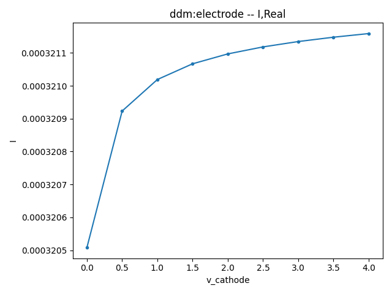

# Photodetector

<font face = "Calibri">

<div class="text-justify">

This example introduces the modeling and optoelectronic simulation of a vertical Ge-Si photodetector.


<br/>

## 1. Overview

This example utilizes FDTD simulation to obtain the optical field distribution in the Ge absorption layer. Subsequently, the photo-induced carrier generation rate is calculated based on the optical field, which is then imported into the OEDevice simulation to obtain the photo current. We also provide scripts for dark current, capacitance and resistance, frequency response, and saturation power. These simulations are divided into separate scripts, and they all call a unified script for modeling and material setup, making it convenient for modifications and management.


<br/>

## 2. Modeling

The modeling is completed by a callable function in the script file `VPD00_structure.py`.


<br/>

### 2.1 Import simulation toolkit

First, import `maxoptics_sdk` and other packages.

```
[1]
```
```python
import sys

# encoding: utf-8

from moapi.v3.aggregate import AggregatedUIService as Project
import maxoptics_sdk.all as mo
from maxoptics_sdk.helper import timed, with_path
import os
import time
from typing import NamedTuple
import sys
current_dir = os.path.dirname(__file__)
sys.path.extend([current_dir])
from VPD_material_Si import elec_Si_properties
from VPD_material_Ge import elec_Ge_properties

```
The script file `VPD_material.py` stores some modified electronic parameters of the materials, which are referenced to override default parameters in the modeling script.


<br/>

### 2.2 Set general parameters

Set some general parameters before modeling. At the beginning are those that need frequent modification during testing and optimization.

```
[2]
```
```python
# region --- 0. General Parameters ---
wavelength_center = 1.55    # um
wavelength_span = 0.1   # um
temperature = 298.15    # K
normal_length = 20  # um
Ge_SiO2_recombination_velocity = 225000    # cm/s
run_mode = "local"
simu_name = "VPD02_Id"
```
Wavelength, temperature, the mesh grid size and some other parameters are defined above. They will be detailed in the subsequent settings.

<br/>

```
[3]
```
``` python
# --- structure geometry ---
SiO2_x_center = 0
SiO2_x_span = 100
SiO2_y_center = 0
SiO2_y_span = 20
SiO2_z_center = 0
SiO2_z_span = 10

input_wg_x_center = -42.5
input_wg_length = 5
input_wg_width = 0.5
Si_z_span = 0.22
Si_y_center = 0
taper_x_min = input_wg_x_center+input_wg_length/2
taper_length = 40
taper_width = 4

Si_slab_length = 22
Si_slab_x_center = taper_x_min+taper_length+Si_slab_length/2
Si_slab_width = 20

Ge_x_center = 10.75
Ge_x_span_bottom = 20
Ge_x_span_top = 19.5
Ge_y_span_bottom = 4
Ge_y_span_top = 3
Ge_z_span = 0.5
Ge_z_center = Si_z_span+Ge_z_span/2

anode_x_center = 10.75
anode_x_span = 19
anode_y_center = 3.7
anode_y_span_top = 2
anode_y_span_bottom = 2
anode_z_span = 1.37
anode_z_center = Si_z_span+anode_z_span/2

cathode_x_center = 10.75
cathode_x_span = 19
cathode_y_center = 0
cathode_y_span_top = 2.2
cathode_y_span_bottom = 2.2
cathode_z_span = 1
cathode_z_center = Si_z_span+Ge_z_span+cathode_z_span/2
```
These are geometric parameters of the structures.

<br/>


```
[4]
```

```pyton
# --- electrical simulation boundary ---
oe_x_min = 10
oe_x_max = 10
oe_x_mean = 0.5*(oe_x_min+oe_x_max)
oe_x_span = oe_x_max-oe_x_min

oe_y_min = 0
oe_y_max = 3.7
oe_y_mean = 0.5*(oe_y_min+oe_y_max)
oe_y_span = oe_y_max-oe_y_min

oe_z_min = -0.15
oe_z_max = 1.25
oe_z_mean = 0.5*(oe_z_min+oe_z_max)
oe_z_span = oe_z_max-oe_z_min
```
These are geometric parameters of the electrical simulation region.

<br/>


```
[5]
```
```python
# --- doping parameters ---
p_uniform_x_center = 10.75
p_uniform_x_span = 22.5
p_uniform_y_center = 0
p_uniform_y_span = 15
p_uniform_z_center = Si_z_span/2
p_uniform_z_span = Si_z_span
p_uniform_con = 1e15

p_well_x_center = 10.75
p_well_x_span = 22.5
p_well_y_center = 0
p_well_y_span = 15
p_well_z_center = -0.035
p_well_z_span = 0.53
p_well_junction_width = 0.05
p_well_con = 7e18

p_pplus_x_center = 10.75
p_pplus_x_span = 22.5
p_pplus_y_center = 4.75
p_pplus_y_span = 4.5
p_pplus_z_center = 0.1675
p_pplus_z_span = 0.115
p_pplus_junction_width = 0.2
p_pplus_con = 3e19

n_pplus_x_center = 10.75
n_pplus_x_span = 19.7
n_pplus_y_center = 0
n_pplus_y_span = 3
n_pplus_z_center = 0.72
n_pplus_z_span = 0.02
n_pplus_junction_width = 0.02
n_pplus_con = 1e20
n_pplus_ref = 1e16
```
These are parameters for doping setup, including doping box, concentration and the diffusion junction width.

<br/>


```
[6]
```
```python
# --- optical simulation boundary  ---
x_min = -43  # light direction
x_max = 21
x_mean = 0.5*(x_min+x_max)
x_span = x_max-x_min

y_min = -3.2  # lateral
y_max = 3.2
y_mean = 0.5*(y_min+y_max)
y_span = y_max-y_min

z_min = -0.5  # vertical
z_max = 1
z_mean = 0.5*(z_min+z_max)
z_span = z_max-z_min
# endregion
```
These are geometry parameters for the optical simulation region.

<br/>


### 2.3 Define the function for creating a new project

A function is defined for creating a project, setting materials, modeling, doping, setting boundary conditions, etc., which can be called by other simulation script files.

```
[7]
```
```python
class RunOptions(NamedTuple):
    high_field: bool
    index_preview: bool
    run: bool
    extract: bool

def create_project(project_name, run_options: RunOptions) -> Project:
```


<br/>

#### 2.3.1 Create a new project

Create a new simulation project.

```
[8]
```
```python
	# region --- 1. Project ---
    pj = mo.Project(name=project_name, location=run_mode)
	# endregion
    return pj
```

`mo.Project()` parameters:

- `name`--Project name, which is also the folder name for the project files to be saved.
- `location`--The location of the computing resources. The active device simulation only support the option of `"local"` currently, which means the simulation uses the local computing resources.


<br/>

#### 2.3.2 Set materials

```
[9]
```
```python
def create_structures(pj: Project, run_options: RunOptions):
    # region --- 2. Material ---
    mt = pj.Material()

    if run_options.high_field:
        elec_Ge_properties["mobility"]["mun"]["high_field"]["model"]="canali"
        elec_Ge_properties["mobility"]["mup"]["high_field"]["model"]="canali"
```

The `pj.Material` variable imported from `VPD_material.py`, storing the modified electronic parameters for Silicon and Germanium. The `material_property` is used to determine which type of material parameters to choose. For details of the physics model and electronic parameter settings, please refer to the appendix.

<br/>


```
[10]
```
```python
    mt.add_lib(name="mat_sio2", data=mo.OE_Material.SiO2, order=2)
    mt.add_lib(name="mat_al", data=mo.OE_Material.Al, order=2, override={"work_function": 4.28})
    mt.add_lib(name="mat_si", data=mo.OE_Material.Si, order=2, override=elec_Si_properties)
    mt.add_lib(name="mat_ge", data=mo.OE_Material.Ge, order=2, override=elec_Ge_properties)   
    mt["mat_al"].set_optical_material(data=mo.Material.PEC)
    mt["mat_si"].set_optical_material(data=mo.Material.Si_Palik)
    mt["mat_ge"].set_optical_material(data=mo.Material.Ge_Palik)
    # endregion
```

When adding materials, start by using the `add_lib` function to add electrical materials from the material library.

`add_lib()` parameters:
- `name`--Custom material name
- `data`--Material data, requiring one of the built-in materials in the electrical material library, namely `mo.OE_Material`
- `order`--`mesh_order` of the material, default to be 2
- `override`--Override the default electronic parameters by custom values. It's empty by default, which means default models and parameters are applied

<br/>

Then, use the `set_optical_material` function to set the optical property for the material.

`set_optical_material()` parameters：

- `data`--Optical material property，which can be one of the built-in materials in the optical material library `mo.Material`, or be from the custom optical material.

<br/>


*Example of using custom optical material properties*

```
[11]
```
```python
    mt.add_lib(name="mat_sio2", data=mo.OE_Material.SiO2, order=2)
    mt["mat_sio2"].set_optical_material(data=mo.Material.SiO2_Palik)
```

<br/>


Note:

1. Although the electrical and optical material properties are bound together through a two-step setting, in reality, there is no inherent connection between them. For instance, it is possible to set both the electrical properties of SiO2 and the optical properties of Si for the same material. The simulation will not generate errors or warnings in such cases, so users need to determine by themselves whether the material settings align with physics.

2. The FDTD simulation currently doesn't support metal materials. Therefore, the optical property of metal materials should be set to `mo.Material.PEC` and the material name should also be `"pec"`.


<br/>

#### 2.3.3 Create structures

First, initialize an object of `pj.Structure()`.

```
[12]
```


`pj.Structure()` parameters:

- `mesh_type`--Type of mesh refinement for optical simulation
- `mesh_factor`--The grading factor of non-uniform grid
- `background_material`--Background material

<br/>


```
[13]
```
```python
# region --- 3. Structure ---
    st = pj.Structure()

    st.add_geometry(name="BOX", type="Rectangle", property={
        "material": {"material": mt["mat_sio2"]},
        "geometry": {"x": SiO2_x_center, "x_span": SiO2_x_span, "y": SiO2_y_center, "y_span": SiO2_y_span, "z_min": -SiO2_z_span/2, "z_max": SiO2_z_center}})

    st.add_geometry(name="SOX", type="Rectangle", property={
        "material": {"material": mt["mat_sio2"]},
        "geometry": {"x": SiO2_x_center, "x_span": SiO2_x_span, "y": SiO2_y_center, "y_span": SiO2_y_span, "z_min": SiO2_z_center, "z_max": SiO2_z_span/2}})
    
    st.add_geometry(name="Si_input", type="Rectangle", property={
        "material": {"material": mt["mat_si"]},
        "geometry": {"x": input_wg_x_center, "x_span": input_wg_length, "y": Si_y_center, "y_span": input_wg_width, "z": Si_z_span/2, "z_span": Si_z_span}})

    st.add_geometry(name="Si_taper", type="LinearTrapezoid", property={
        "material": {"material": mt["mat_si"]},
        "geometry": {"control_points":
                        [{"x": -40, "y": -0.25},
                         {"x": -40, "y": 0.25}, 
                         {"x": 0, "y": 2}, 
                         {"x": 0, "y": -2}],
                    "z_min": 0, "z_max": 0.22, "x": 0, "y": 0}})

    st.add_geometry(name="Si_base", type="Rectangle", property={
        "material": {"material": mt["mat_si"]},
        "geometry": {"x": Si_slab_x_center, "x_span": Si_slab_length, "y": Si_y_center, "y_span": Si_slab_width, "z": Si_z_span/2, "z_span": Si_z_span}})

    st.add_geometry(name="Ge", type="Pyramid", property={
        "material": {"material": mt["mat_ge"]},
        "geometry": {"x": Ge_x_center, "x_span_bottom": Ge_x_span_bottom, "x_span_top": Ge_x_span_top,
                     "y": 0, "y_span_bottom": Ge_y_span_bottom, "y_span_top": Ge_y_span_top, "z": Ge_z_center, "z_span": Ge_z_span}})

    st.add_geometry(name="Cathode", type="Pyramid", property={
        "material": {"material": mt["mat_al"]},
        "geometry": {"x": cathode_x_center, "x_span_bottom": cathode_x_span, "x_span_top": cathode_x_span,
                     "y": cathode_y_center, "y_span_bottom": cathode_y_span_bottom, "y_span_top": cathode_y_span_top,
                     "z": cathode_z_center, "z_span": cathode_z_span}})

    st.add_geometry(name="Anode", type="Pyramid", property={
        "material": {"material": mt["mat_al"]},
        "geometry": {"x": anode_x_center, "x_span_bottom": anode_x_span, "x_span_top": anode_x_span,
                     "y": anode_y_center, "y_span_bottom": anode_y_span_bottom, "y_span_top": anode_y_span_top,
                     "z": anode_z_center, "z_span": anode_z_span}})
    # endregion
```

`add_geometry()` parameters:

- `name`--Structure name
- `type`--Structure type
- `property`--Other properties, listed below


<br/>


`Rectangle` property list：

|                     | default   | type     | notes                         |
|:--------------------|:----------|:---------|:------------------------------|
| geometry.x_span     |           | float    | Restrained by condition: >0.  |
| geometry.x_min      |           | float    |                               |
| geometry.x_max      |           | float    |                               |
| geometry.y_span     |           | float    | Restrained by condition: >0.  |
| geometry.y_min      |           | float    |                               |
| geometry.y_max      |           | float    |                               |
| geometry.x          |           | float    |                               |
| geometry.y          |           | float    |                               |
| geometry.z          |           | float    |                               |
| geometry.z_span     |           | float    | Restrained by condition: >0.  |
| geometry.z_min      |           | float    |                               |
| geometry.z_max      |           | float    |                               |
| geometry.rotate_x   | 0         | float    |                               |
| geometry.rotate_y   | 0         | float    |                               |
| geometry.rotate_z   | 0         | float    |                               |
| material.material   |           | material |                               |
| material.mesh_order |           | integer  | Restrained by condition: >=0. |

<br/>


`LinearTrapezoid` property list：

|                     | default | type     | notes                         |
| :------------------ | :------ | :------- | :---------------------------- |
| geometry.point_1_x  |         | float    |                               |
| geometry.point_1_y  |         | float    |                               |
| geometry.point_2_x  |         | float    |                               |
| geometry.point_2_y  |         | float    |                               |
| geometry.point_3_x  |         | float    |                               |
| geometry.point_3_y  |         | float    |                               |
| geometry.point_4_x  |         | float    |                               |
| geometry.point_4_y  |         | float    |                               |
| geometry.x          |         | float    |                               |
| geometry.y          |         | float    |                               |
| geometry.z          |         | float    |                               |
| geometry.z_span     |         | float    | Restrained by condition: >0.  |
| geometry.z_min      |         | float    |                               |
| geometry.z_max      |         | float    |                               |
| geometry.rotate_x   | 0       | float    |                               |
| geometry.rotate_y   | 0       | float    |                               |
| geometry.rotate_z   | 0       | float    |                               |
| material.material   |         | material |                               |
| material.mesh_order |         | integer  | Restrained by condition: >=0. |

<br/>


`Pyramid` property list：

|                        | default | type     | notes                         |
| :--------------------- | :------ | :------- | :---------------------------- |
| geometry.x_span_bottom |         | float    | Restrained by condition: >=0. |
| geometry.y_span_bottom |         | float    | Restrained by condition: >=0. |
| geometry.x_span_top    |         | float    | Restrained by condition: >=0. |
| geometry.y_span_top    |         | float    | Restrained by condition: >=0. |
| geometry.theta_x       | 0       | float    |                               |
| geometry.theta_y       | 0       | float    |                               |
| geometry.x             |         | float    |                               |
| geometry.y             |         | float    |                               |
| geometry.z             |         | float    |                               |
| geometry.z_span        |         | float    | Restrained by condition: >0.  |
| geometry.z_min         |         | float    |                               |
| geometry.z_max         |         | float    |                               |
| geometry.rotate_x      | 0       | float    |                               |
| geometry.rotate_y      | 0       | float    |                               |
| geometry.rotate_z      | 0       | float    |                               |
| material.material      |         | material |                               |
| material.mesh_order    |         | integer  | Restrained by condition: >=0. |

<br/>


Note:

1. The `mesh_order` of a structure is default to be the mesh order of its material. And the default value will be overridden when the structure's `mesh_order` is set explicitly.
2. The larger of the `mesh_order` of a structure, the higher of its priority. With `mesh_order` of two structures being the same, the structure created later has a higher priority than the one created earlier. When structures overlap, the one with higher priority overrides the one with lower priority.


<br/>

#### 2.3.4 Add doping

```
[14]
```
```python
def add_ddm_settings(pj: Project, run_options: RunOptions):
    mt = pj.Material()
    st = pj.Structure()
    # region --- 4. DDM:Doping ---
    dp = pj.Doping()
    dp.add(name="p_uniform", type="constant_doping", property={
        "dopant": {"dopant_type": "p", "concentration": p_uniform_con},
        "geometry": {"x": p_uniform_x_center, "x_span": p_uniform_x_span,
                     "y": p_uniform_y_center, "y_span": p_uniform_y_span,
                     "z": p_uniform_z_center, "z_span": p_uniform_z_span,
                     "applicable_regions": "all_regions",
                     },})
    
    dp.add(name="p_well", type="diffusion_doping", property={
        "dopant": {"dopant_type": "p", "concentration": p_well_con, "ref_concentration": 1e6,
                   "source_face": "upper_z", "diffusion_function":"gaussian","junction_width": p_well_junction_width,},
        "geometry": {"x": p_well_x_center, "x_span": p_well_x_span, 
                     "y": p_well_y_center, "y_span": p_well_y_span,
                     "z": p_well_z_center, "z_span": p_well_z_span,
                     "applicable_regions": "all_regions",
                     },})
```


`add_doping()` parameters:

- `name`--Doping name
- `type`--Doping type. Options are `"n"` or `"p"` for n-type, p-type doping respectively
- `property`--Other properties

According to the selection of `general.type`, doping is divided into constant doping and gaussian doping. Detailed properties are listed below.

<br/>


Doping property list:

|                               | default | type  | notes                                              |
| :---------------------------- | :------ | :---- | :------------------------------------------------- |
| geometry.x                    |         | float |                                                    |
| geometry.x_span               |         | float |                                                    |
| geometry.y                    |         | float |                                                    |
| geometry.y_span               |         | float |                                                    |
| geometry.z                    |         | float |                                                    |
| geometry.z_span               |         | float |                                                    |
| geometry.rotate_x             |         | float |                                                    |
| geometry.rotate_y             |         | float |                                                    |
| geometry.rotate_z             |         | float |                                                    |
| geometry.x_min                |         | float |                                                    |
| geometry.x_max                |         | float |                                                    |
| geometry.y_min                |         | float |                                                    |
| geometry.y_max                |         | float |                                                    |
| geometry.z_min                |         | float |                                                    |
| geometry.z_max                |         | float |                                                    |
| general.type |         | str   | Selections are ['constant', 'gaussian']            |
| general.concentration         |         | float |                                                    |
| general.source_face           |         | str   | Available when type is 'gaussian' |
| general.junction_width        |         | float | Available when type is 'gaussian' |
| general.ref_concentration     |         | float | Available when type is 'gaussian' |
| geometry.applicable_regions            | 'all_regions'   | str   | Selections are ['all_regions', 'material', 'region']       |
| geometry.material_list          |         | list  | Available when geometry.applicable_regions is 'material'           |
| geometry.solid_list            |         | list  | Available when geometry.applicable_regions is 'region'             |

Description:

- `geometry`--Set the geometry parameters of doping box

- `general`--Set the distribution function, concentration and so on

  - `type`:
    - When it's set to `"constant"`, only `concentration` is required
    - When it's set to `"gaussian"`: `concentration`, `ref_concentration`, `junction_width`, `source_face` are required
  - `concentration`--Concentration in the non-diffusion area
  - `ref_concentration`--Concentration on the edge of diffusion area (edge of doping box)
  - `junction_width`--Diffusion junction width
  - `source_face`--The doping source face. Options are `"lower_x"`, `"lower_y"`, `"lower_z"`, `"upper_x"`, `"upper_y"` or `"upper_z"`. `"lower_x"` means the source face is `x=x_min`. Similarly for the rest. There is no diffusion area on the edge of source face. As for the other edges, there is a diffusion area within the doping box.

- `applicable_regions`--Set a list of regions or materials to be doped

  - `geometry.applicable_regions`:

    - When it's set to `"all_regions"`(by default)，the doping is applied to all the (semiconductor) structures, restricted by the doping box

    - When it's set to `"material"`, `material_list` is required, which means the doping is applied to the structures with one of the specified materials and restricted by the doping box

    - When it's set to `"solid"`, `solid_list` is required, which means the doping is applied to the specified structures and restricted by the doping box

<br/>


*Examples for complete doping setting syntax*

```
[15]
```

```python
    dp.add(name="p_pplus", type="diffusion_doping", property={
        "dopant": {"dopant_type": "p", "concentration": p_pplus_con, "ref_concentration": 1e6,
                   "source_face": "upper_z", "diffusion_function":"gaussian","junction_width": p_pplus_junction_width},
        "geometry": {"x": p_pplus_x_center, "x_span": p_pplus_x_span, 
                     "y": p_pplus_y_center, "y_span": p_pplus_y_span,
                     "z": p_pplus_z_center, "z_span": p_pplus_z_span,
                     "applicable_regions": "all_regions",
                     },})
    dp.add(name="n_pplus", type="diffusion_doping", property={
        "dopant": {"dopant_type": "n", "concentration": n_pplus_con, "ref_concentration": n_pplus_ref,
                   "source_face": "upper_z", "diffusion_function":"gaussian","junction_width": n_pplus_junction_width},
        "geometry": {"x": n_pplus_x_center, "x_span": n_pplus_x_span, 
                     "y": n_pplus_y_center, "y_span": n_pplus_y_span,
                     "z": n_pplus_z_center, "z_span": n_pplus_z_span,
                     "applicable_regions": "all_regions",
                     },})
    # endregion
```


<br/>

#### 2.3.5 Add surface recombination

```
[16]
```
```python
# region --- 5. DDM:Surface Recombination ---
    bd = pj.BoundaryCondition()
    bd.add(name="Cathode_Ge", type="surface_recombination", property={
        "general": {"electron": {"s0": 1e7},
                    "hole": {"s0": 1e7}},
        "geometry": {"surface_type": "solid_solid",  
                     "solid_1": st["Cathode"],
                     "solid_2": st["Ge"],
                     }
    })
    bd.add(name="Anode_Si", type="surface_recombination", property={
        "general": {"electron": {"s0": 1e7},
                    "hole": {"s0": 1e7}},
        "geometry": {"surface_type": "solid_solid",  
                     "solid_1": st["Anode"],
                     "solid_2": st["Si_base"],
                     }
    })
    bd.add(name="Ge_SiO2", type="surface_recombination", property={
        "general": {"electron": {"s0": Ge_SiO2_recombination_velocity},
                    "hole": {"s0": Ge_SiO2_recombination_velocity}},
        "geometry": {"surface_type": "solid_solid",  
                     "solid_1": st["SOX"],
                     "solid_2": st["Ge"],
                     }
    })
    # endregion
```

`add_surface_recombination()` parameters：

- `name`--Custom name
- `property`--Other properties

<br/>


Surface recombination property list:

|                        | default             | type   | notes                                                                                                                 |
|:-----------------------|:--------------------|:-------|:---------------------------------------------------------------------------------------------------------------------|
| surface_type           |   solid_solid       | string | Selections are ['solid_solid', 'material_material'].                                                               |
| general.hole.s0          | 0                   | float  | Surface recombination velocity of holes.                                          |
| general.electron.s0       | 0                   | float  | -Surface recombination velocity of electrons.                                          |
| solid_1               |                     | string | Available when surface_type is 'solid_solid'                                                                       |
| solid_2               |                     | string | Available when surface_type is 'solid_solid'                                                                       |
| material_1             |                     | material | Available when surface_type is 'material_material'                                                                 |
| material_2             |                     | material | Available when surface_type is 'material_material'                                                                 |

Description:

- `surface_type`--Type of selection for the surface
  - When `surface_type` is `"solid_solid"`, the surface is the interface between two structures 
  - When `surface_type` is "material_material"`, the surface is the interface between two materials

- `hole.s0`, `electron.s0`--Surface recombination velocity of holes and electrons. 

- `solid_1`, `solid_2`--Names of the two structures at the interface. They must be set explicitly when `surface_type` is `"solid_solid"`

- `material_1`, `material_2`--The two materials at the interface. They must be set explicitly when `surface_type` is `"material_material"`


<br/>


#### 2.3.6 Set local mesh

```
[19]
```
```python
# region --- 6. DDM:Mesh ---
    lm = pj.LocalMesh()
    
    lm.add(name="EMesh_Ge", type="EMesh", property={
        "general": {"mesh_size": 0.01},
        "geometry": {"geometry_type": "solid", "solid": st["Ge"]}
    })
    lm.add(name="EMesh_Si", type="EMesh", property={
        "general": {"mesh_size": 0.02},
        "geometry": {"geometry_type": "solid", "solid": st["Si_base"]}
    })
    lm.add(name="Ge_Boundary", type="EMesh", property={
        "general": {"mesh_size": 0.002},
        "geometry": {"geometry_type": "solid_solid", 
                     "solid_1": st["Ge"],
                     "solid_2": st["Ge"],
                     "growth_ratio": 2}
    })

    lm.add(name="Si_Boundary", type="EMesh", property={
        "general": {"mesh_size": 0.002},
        "geometry": {"geometry_type": "solid_solid", 
                     "solid_1": st["Si_base"],
                     "solid_2": st["Si_base"],
                     "growth_ratio": 2}
    })
    # endregion
```

`Emesh` set a rectangle region for local mesh of electrical simulation. Parameters:

- `name`--Custom name
- `property`--Other properties

<br/>

|                   | default | type  | notes                                          |
| :----------------: | :------: | :----: | :-----------------------------------------: |
| general.mesh_size |  0.01   | float |  The minimum value of the local mesh region.   |
| general.geometry_type | directly defined | string | Selections are ['directly defined', 'solid','solid_solid']  |
| solid_solid           |                     |string  |Names of the two structures at the interface.|
| solid_1               |                     | string | Available when geometry_type is 'solid_solid'                                                                       |
| solid_2               |                     | string | Available when geometry_type is 'solid_solid'                                                                       |

Local mesh of electrical simulation in rectangle region property list, when `geometry_type` is `directly defined`:

|           | default | type  | notes                                  |
| :-------- | :------ | :---- | :------------------------------------- |
| x         |         | float |                                        |
| x_span    |         | float | Restrained by condition: >=0.          |
| x_min     |         | float |                                        |
| x_max     |         | float |                                        |
| y         |         | float |                                        |
| y_span    |         | float | Restrained by condition: >=0.          |
| y_min     |         | float |                                        |
| y_max     |         | float |                                        |
| z         |         | float |                                        |
| z_span    |         | float | Restrained by condition: >=0.          |
| z_min     |         | float |                                        |
| z_max     |         | float |                                        |
| mesh_size |         | float | max size of electrical simulation mesh |

Note:

1. When the simulation region is in the xy plane, only the parameters in the x, y direction are effective, and parameters in the z direction will be ignored. Similarly for the rest.

<br/>

```python
    # region --- 10. FDTD:Mesh ---
    lm = pj.LocalMesh()
    lm.add(name="Mesh_Ge", type="Mesh", property={
        "general": {"dz": 0.02},
        "geometry": {"x": -42, "x_span": 0, "y": 0, "y_span": 0, "z": 0.47, "z_span": 0.5}
    })
    lm.add(name="Mesh_Si", type="Mesh", property={
        "general": {"dz": 0.025},
        "geometry": {"x": -42, "x_span": 0, "y": 0, "y_span": 0, "z": 0.11, "z_span": 0.22}
    })
    # endregion
```

`Mesh` set the local mesh for optical simulation, parameters:

- `name`--Custom name
- `property`--Other properties


<br/>


Optical local mesh property list:

|                         | default | type  | notes                         |
| :---------------------- | :------ | :---- | :---------------------------- |
| general.dx              |         | float | Restrained by condition: >0.  |
| general.dy              |         | float | Restrained by condition: >0.  |
| general.dz              |         | float | Restrained by condition: >0.  |
| geometry.x              |         | float |                               |
| geometry.x_span         |         | float | Restrained by condition: >=0. |
| geometry.x_min          |         | float |                               |
| geometry.x_max          |         | float |                               |
| geometry.y              |         | float |                               |
| geometry.y_span         |         | float | Restrained by condition: >=0. |
| geometry.y_min          |         | float |                               |
| geometry.y_max          |         | float |                               |
| geometry.z              |         | float |                               |
| geometry.z_span         |         | float | Restrained by condition: >=0. |
| geometry.z_min          |         | float |                               |
| geometry.z_max          |         | float |                               |

Description:

- `geometry`--Set the region of local mesh. When `x_span` doesn't vanish, the mesh setting will be applied to the range along the x axis. Similarly for the rest

- `general`--Set the mesh size in the corresponding direction

<br/>


<br/>

#### 2.3.7 Set waveform

```
[17]
```
```python
def add_fdtd_settings(pj: Project, run_options: RunOptions):
    waveform_name = f"wv{wavelength_center*1e3}"

    # region --- 7. FDTD:Waveform ---
    wv = pj.Waveform()
    wv.add(name=waveform_name, type='gaussian_waveform',
           property={'set': 'frequency_wavelength',  
                     'set_frequency_wavelength': {
                            'range_type': 'wavelength',  
                            'range_limit': 'center_span', 
                            'wavelength_center': wavelength_center,
                            'wavelength_span': wavelength_span,
                     },
                     }
           )
    # endregion
```

`pj.Waveform()` parameters：

- `name`--Name of the waveform
- `range_type`-- Selections are `frequency` or `wavelength`
- `wavelength_center`--Center of wavelength
- `wavelength_span`--Span of wavelength


<br/>

#### 2.3.8 Set optical sources

```
[20]
```

```python
    # region --- 8. FDTD:ModeSource ---
    src = pj.Source()
    if run_options.run:
        src.add(name="source", type="mode_source",
                property={"general": {"inject_axis": "x_axis", "direction": "forward",'amplitude': 1, 'phase': 0,
                    "waveform": {"waveform_id": wv[waveform_name]},   
                    "mode_selection": "user_select",'mode_index': 0,'rotations': {'theta': 0, 'phi': 0, 'rotation_offset': 0}},
                    "geometry": {"x": x_min + 1, "x_span": 0, "y": y_mean, "y_span": y_span, "z": z_mean, "z_span": z_span},
                    "modal_analysis": {"mode_removal": {"threshold": 0.01}}})
    # endregion
```


`pj.Source()` parameters：

- `name`--Name of the source
- `type`--Type of the source. It is mode source in this example
- `property`--Other properties
- `inject_axis`--Direction of the source. `"x_axis"` means light propagating along x axis and in the direction of increasing x coordinate. `"x_axis"` means the opposite direction. Similarly for the rest

<br/>


Mode source property list:

|                                     | default           | type    | notes                                                        |
| :---------------------------------- | :---------------- | :------ | :----------------------------------------------------------- |
| general.amplitude                   | 1.0               | float   |                                                              |
| general.phase                       | 0.0               | float   |                                                              |
| general.mode_selection              |                   | string  | Selections are ['fundamental', 'fundamental_TE', 'fundamental_TM', 'fundamental_TE_and_TM', 'user_select', 'user_import']. |
| general.mode_index                  | 0                 | integer |                                                              |
| general.search                      | max_index         | string  | Selections are ['near_n', 'max_index'].                      |
| general.n                           | 1.0               | float   |                                                              |
| general.number_of_trial_modes       | 20                | integer |                                                              |
| general.waveform.waveform_id_select |                   | any     |                                                              |
| general.rotations.theta             | 0                 | float   |                                                              |
| general.rotations.phi               | 0                 | float   |                                                              |
| general.rotations.rotation_offset   | 0                 | float   |                                                              |
| bent_waveguide.bent_waveguide       | false             | bool    |                                                              |
| bent_waveguide.radius               | 1                 | float   |                                                              |
| bent_waveguide.orientation          | 20                | float   |                                                              |
| bent_waveguide.location             | simulation_center | string  | Selections are ['simulation_center'].                        |
| geometry.x                          |                   | float   |                                                              |
| geometry.x_span                     |                   | float   | Restrained by condition: >=0.                                |
| geometry.x_min                      |                   | float   |                                                              |
| geometry.x_max                      |                   | float   |                                                              |
| geometry.y                          |                   | float   |                                                              |
| geometry.y_span                     |                   | float   | Restrained by condition: >=0.                                |
| geometry.y_min                      |                   | float   |                                                              |
| geometry.y_max                      |                   | float   |                                                              |
| geometry.z                          |                   | float   |                                                              |
| geometry.z_span                     |                   | float   | Restrained by condition: >=0.                                |
| geometry.z_min                      |                   | float   |                                                              |
| geometry.z_max                      |                   | float   |                                                              |

Description:

- `geometray`--Set geometric parameters of optical source

- `bent_waveguide`--Set parameters related to bent waveguide

- `general`：

  - `mode_selection`--Set the type of selection for the eigen mode. When it is `"user_select"`, the mode of index in `mode_index` is selected
  - `waveform`--Set the waveform of the source
    - `waveform_id_select`--Set to be a specified waveform


<br/>

#### 2.3.9 Set monitors

```
[21]
```
```python
    # region --- 9. FDTD:Monitor ---

    mn = pj.Monitor()
    mn.add(name="power_monitor", type="power_monitor",
           property={"general": {"frequency_profile": {"wavelength_center": wavelength_center, "wavelength_span": 0.1, "frequency_points": 5, }, },
                     "geometry": {"monitor_type": "3d", "x": 10.75, "x_span": 20, "y": 0, "y_span": 4, "z": 0.47, "z_span": 0.5}})
    mn.add(name="y=0", type="power_monitor",
           property={"general": {"frequency_profile": {"wavelength_center": wavelength_center, "wavelength_span": 0.1, "frequency_points": 5, }, },
                     "geometry": {"monitor_type": "2d_y_normal", "x": 10.75, "x_span": 20, "y": 0, "y_span": 0, "z": 0.47, "z_span": 0.5}})
    mn.add(name="z=0.47", type="power_monitor",
           property={"general": {"frequency_profile": {"wavelength_center": wavelength_center, "wavelength_span": 0.1, "frequency_points": 5, }, },
                     "geometry": {"monitor_type": "2d_z_normal", "x": 10.75, "x_span": 20, "y": 0, "y_span": 4, "z": 0.47, "z_span": 0}})

    # endregion
```

The monitor `"Power Monitor"` is of the 3D type, set to record the optical field profile in the `"Ge"` structure, which will be used to calculate the optical generation rate. The monitors `"y=0"` and `"z=0.47"` are both of the 2D type, set to visualize the optical field profile at the specified cross-sections.


`mn.add()` parameters：

- `name`--Name of the monitor
- `type`--Type of the monitor
- `property`--Other properties

<br/>


Power monitor property list:

|                                                    | default    | type    | notes                                                        |
| :------------------------------------------------- | :--------- | :------ | :----------------------------------------------------------- |
| general.frequency_profile.sample_spacing           | uniform    | string  | Selections are ['uniform'].                                  |
| general.frequency_profile.use_wavelength_spacing   | true       | bool    |                                                              |
| general.frequency_profile.spacing_type             | wavelength | string  | Selections are ['wavelength', 'frequency'].                  |
| general.frequency_profile.wavelength_min           |            | float   |                                                              |
| general.frequency_profile.wavelength_max           |            | float   |                                                              |
| general.frequency_profile.wavelength_center        |            | float   |                                                              |
| general.frequency_profile.wavelength_span          |            | float   |                                                              |
| general.frequency_profile.frequency_min            |            | float   |                                                              |
| general.frequency_profile.frequency_max            |            | float   |                                                              |
| general.frequency_profile.frequency_center         |            | float   |                                                              |
| general.frequency_profile.frequency_span           |            | float   |                                                              |
| general.frequency_profile.frequency_points         |            | integer |                                                              |
| geometry.monitor_type                              |            | string  | Selections are ['point', 'linear_x', 'linear_y', 'linear_z', '2d_x_normal', '2d_y_normal', '2d_z_normal', '3d']. |
| geometry.x                                         |            | float   |                                                              |
| geometry.x_span                                    |            | float   | Restrained by condition: >=0.                                |
| geometry.x_min                                     |            | float   |                                                              |
| geometry.x_max                                     |            | float   |                                                              |
| geometry.y                                         |            | float   |                                                              |
| geometry.y_span                                    |            | float   | Restrained by condition: >=0.                                |
| geometry.y_min                                     |            | float   |                                                              |
| geometry.y_max                                     |            | float   |                                                              |
| geometry.z                                         |            | float   |                                                              |
| geometry.z_span                                    |            | float   | Restrained by condition: >=0.                                |
| geometry.z_min                                     |            | float   |                                                              |
| geometry.z_max                                     |            | float   |                                                              |
| advanced.sampling_frequency.min_sampling_per_cycle | 2          | integer |                                                              |

Description:

- `geometry`--Set the geometric parameters of the monitor, including the dimension and the size

- `general`--Set the frequency points of the monitor

  - `frequency_profile`:

    - `use_wavelength_spacing`--Default to be `True`. When it' `True`, the frequency points in sampled in wavelength, otherwise, in frequency.

    - `spacing_type`--Default to be `"wavelength"`. When it's `"wavelength"`, the frequency range is set in wavelength; When it's `"frequency"`, the frequency range is set in frequency

    - `frequency_points`--Number of frequency points


<br/>

## 3. Simulation


<br/>

### 3.1 Dark current

This section performs the simulation of dark current in the `VPD0A_Id.py` script by invoking the `pd_project` function.


<br/>

#### 3.1.1 Import simulation toolkit

```
[26]
```

```python
import sys

# encoding: utf-8

from maxoptics_sdk.helper import timed, with_path
import os
import time
from typing import NamedTuple
import sys
current_dir = os.path.dirname(__file__)
sys.path.extend([current_dir])
from VPD00_structure import *
```

All the variables and functions from `VPD00_structure.py` are imported.


<br/>

#### 3.1.2 Set general parameters

```
[27]
```

```python
@timed
@with_path
def simulation(*, run_options: "RunOptions", **kwargs, ):
    # region --- 0. General Parameter ---

    vsource = "Cathode"
    gnd = "Anode"

    sweep_vstart = 0
    sweep_vstop = 4
    sweep_vstep = 0.5

    path = kwargs["path"]
    simu_name = "VPD0A_Id"
    time_str = time.strftime("%Y%m%d_%H%M%S", time.localtime())
    project_name = f"{simu_name}_local_{time_str}"
    plot_path = f"{path}/plots/{project_name}/"
    current_file_path = os.path.abspath(__file__)

    # endregion
```


<br/>

#### 3.1.3 Create a new project

```
[28]
```

```python
# region --- 1. Project ---
    pj: Project = create_project(project_name, run_options)
    # endregion
     create_structures(pj, run_options)

    mt = pj.Material()
    st = pj.Structure()
```


<br/>


#### 3.1.4 Add the solver

```
[30]
```
```python
 # region --- 2. Simulation ---
    simu = pj.Simulation()
    simu.add(name=simu_name, type="DDM", property={
        "background_material": mt["mat_sio2"], 
        "general": {"solver_mode": "steady_state", 
                    "norm_length": 20,
                    "temperature_dependence": "isothermal",
                    "temperature": 298.15,
                    },
        "geometry": {"dimension": "2d_x_normal", "x": 10, "x_span": 0, "y_min": 0, "y_max": 3.7, "z_min": -0.15, "z_max": 1.25},
        "mesh_settings": {"mesh_size": 0.06},
        "advanced": {"non_linear_solver": "newton",
                     "linear_solver": "mumps",
                     "fermi_statistics": "disabled", # or "enabled"
                     "damping": "potential", # or "none"
                     "potential_update": 1.0,
                     "max_iterations": 15,
                     "relative_tolerance": 1e-5,
                     "tolerance_relax": 1e5,
                     "divergence_factor": 1e25
                     }
    })

    # endregion
```

Description:

The detailed property list of `DDM` solver can be found in the appendix. 

- `geometry`--Set the geometric parameters for the simulation region

  - `dimension`--It's set to `2d_x_normal`, which means the simulation is in the yz plane

- `general`:

  - `norm_length`--It's set to `normal_length`, which is `20`, meaning that the size of the device in the third dimension is 20μm. That is to say its length in the x-direction is 20μm
  - `solver_mode`--It's set to `"steady_state"`, which means a steady state simulation


<br/>

#### 3.1.5 Add electrodes

```
[29]
```

```python


    # region --- 3. Simulation Settings ---
    add_ddm_settings(pj, run_options)

    bd = pj.BoundaryCondition()

    bd.add(name=vsource,type="Electrode", property={
        "geometry": {"surface_type": "solid", "solid": st[vsource]},
        "general": {"electrode_mode": "steady_state",  
                    "contact_type": "ohmic_contact",
                    "sweep_type": "range", "range_start": sweep_vstart, "range_stop": sweep_vstop, "range_step": sweep_vstep,
                    "apply_ac_small_signal": "none", 
                    "envelop": "uniform",
                    }
    })
    bd.add(name=gnd,type="Electrode", property={
        "geometry": {"surface_type": "solid", "solid": st[gnd]},
        "general": {"electrode_mode": "steady_state",  
                    "contact_type": "ohmic_contact",
                    "sweep_type": "single", "voltage": 0,
                    "apply_ac_small_signal": "none",
                    "envelop": "uniform",
                    }
    })

    # endregion

```

`pj.BoundaryCondition()` parameters:

- `name`--Name of the electrode
- `property`--Other properties

The detailed property list of electrode can be found in the appendix. Here a range of voltage from 0V to 4V is applied to the electrode `"cathode"`, and the step of the voltage is 0.5V.


<br/>


#### 3.1.6 Run the solver

```
[31]
```

```python
    # region --- 4. Run ---
    if run_options.run:
        result_ddm = simu[simu_name].run(
            # resources={"compute_resources": "gpu", "gpu_devices": [{"id": 0}]}
        )
    # endregion

```

`result_device` stores the information of the simulation result, which can be used to perform result extraction.


<br/>

#### 3.1.7 Extract the result

```
[32]
```

```python
# --- Extract ---
# region --- 5. Extract ---
    if run_options.extract:
        export_options = {"export_csv": True,
                          "export_mat": True, "export_zbf": True}
        slice_options = {f"v_{gnd.lower()}": 0.0}

        result_ddm.extract(data="ddm:electrode", electrode_name=vsource, savepath=f"{plot_path}I_{vsource}",
                           target="line", attribute="I", plot_x=f"v_{vsource.lower()}", real=True, imag=False, log=False, show=False, **slice_options, export_csv=True
                           )  # attribute = "I", "In", "Ip", "Id", "Vs"
    # endregion


```

`run_options.extract()` parameters：

- `data`--Type of the result. Here it's set to `"I"` to extract the I-V curve from the simulation result
- `electrode_name`--Name of an electrode, which means the current data is from the electrode
- `export_csv`--Whether to export the csv result
- `show`--Whether to show the plot in a popup window
- `savepath`--The save path for the result extraction

<br/>


*Result show of the dark current extraction*


<center>Fig 3. Dark Current</center>


<br/>

#### 3.1.8 Print the simulation time

```
[33]
```

```python
    return project_name
if __name__ == "__main__":
    simulation(run_options=RunOptions(high_field=False, index_preview=False, run=True, extract=True))
```


<br/>

### 3.2 Resistance

This simulation applies a forward bias to the electrode `"anode"`. And then the I-V curve is extracted and fitted to obtain the resistance. The script is in the `VPD0C_Rs.py` file.


<br/>

#### 3.2.1 Simulate and extract the I-V curve

```
[34]
```

```python
import sys

# encoding: utf-8

from maxoptics_sdk.helper import timed, with_path
import os
import time
import sys
current_dir = os.path.dirname(__file__)
sys.path.extend([current_dir])
from VPD00_structure import *


@timed
@with_path
def simulation(*, run_options: "RunOptions", **kwargs, ):
    # region --- 0. General Parameter ---

    vsource = "Anode"
    gnd = "Cathode"

    sweep_vstart = 0
    sweep_vstop = 1.5
    sweep_vstep = 0.25

    path = kwargs["path"]
    simu_name = "VPD0C_Rs"
    time_str = time.strftime("%Y%m%d_%H%M%S", time.localtime())
    project_name = f"{simu_name}_local_{time_str}"
    plot_path = f"{path}/plots/{project_name}/"
    current_file_path = os.path.abspath(__file__)

    # endregion
    # region --- 1. Project ---
    pj: Project = create_project(project_name, run_options)
    # endregion
    create_structures(pj, run_options)

    mt = pj.Material()
    st = pj.Structure()


    # region --- 2. Simulation ---
    simu = pj.Simulation()
    simu.add(name=simu_name, type="DDM", property={
        "background_material": mt["mat_sio2"], 
        "general": {"solver_mode": "steady_state", 
                    "norm_length": 20,
                    "temperature_dependence": "isothermal",
                    "temperature": 298.15,
                    },
        "geometry": {"dimension": "2d_x_normal", "x": 10, "x_span": 0, "y_min": 0, "y_max": 3.7, "z_min": -0.15, "z_max": 1.25},
        "mesh_settings": {"mesh_size": 0.06},
        "advanced": {"non_linear_solver": "newton",
                     "linear_solver": "mumps",
                     "fermi_statistics": "disabled", # or "enabled"
                     "damping": "potential", # or "none"
                     "potential_update": 1.0,
                     "max_iterations": 15,
                     "relative_tolerance": 1e-5,
                     "tolerance_relax": 1e5,
                     "divergence_factor": 1e25
                     }
    })

    # endregion

    # region --- 3. Electrode ---

    add_ddm_settings(pj, run_options)

    bd = pj.BoundaryCondition()

    bd.add(name=vsource,type="Electrode", property={
        "geometry": {"surface_type": "solid", "solid": st[vsource]},
        "general": {"electrode_mode": "steady_state",  
                    "contact_type": "ohmic_contact",
                    "sweep_type": "range", "range_start": sweep_vstart, "range_stop": sweep_vstop, "range_step": sweep_vstep,
                    "apply_ac_small_signal": "none", 
                    "envelop": "uniform",
                    }
    })
    bd.add(name=gnd,type="Electrode", property={
        "geometry": {"surface_type": "solid", "solid": st[gnd]},
        "general": {"electrode_mode": "steady_state",  
                    "contact_type": "ohmic_contact",
                    "sweep_type": "single", "voltage": 0,
                    "apply_ac_small_signal": "none",
                    "envelop": "uniform",
                    }
    })

    # endregion


    # region --- 4. Run ---
    if run_options.run:
        result_ddm = simu[simu_name].run(
            # resources={"compute_resources": "gpu", "gpu_devices": [{"id": 0}]}
        )
    # endregion


    # region --- 5. Extract ---
    if run_options.extract:
        export_options = {"export_csv": True,
                          "export_mat": True, "export_zbf": True}
        slice_options = {f"v_{gnd.lower()}": 0.0}

        result_ddm.extract(data="ddm:electrode", electrode_name=vsource, savepath=f"{plot_path}I_{vsource}",
                           target="line", attribute="I", plot_x=f"v_{vsource.lower()}", real=True, imag=False, log=False, show=False, **slice_options, export_csv=True
                           )  # attribute = "I", "In", "Ip", "Id", "Vs"
    # endregion
```

A range of voltage from 0V to 1.5V is applied to the electrode `"anode"`, with a step of 0.25V. No optical generation rate is applied. And a steady state simulation is performed to extract the I-V curve, which is saved to the folder `IV_file_folder`.


<br/>

*Result show of the I-V curve*

<center>Fig 4. I-V curve</center>

<br/>


#### 3.2.2 Fit V-I curve to obtain resistance

<br/>

##### 3.2.2.1 Read the saved I-V data

```
[35]
```

```python
# region --- calculate R ---
        Vdc = np.genfromtxt(f"{plot_path}I_Anode.csv",skip_header=1,delimiter=",")[:,0]
        Idc = np.genfromtxt(f"{plot_path}I_Anode.csv",skip_header=1,delimiter=",")[:,1]
```

`"0_I_Real.csv"` is filename generated automatically of the I-V result. The `"0"` in the beginning indicates the index of the electrode. When the I-V curve is from a different electrode, the index will change. Therefore, a iteration from 0 to 9 is applied to find the saved I-V data file.


<br/>

##### 3.2.2.2 Fit the data to obtain resistance

```
[36]
```

```python
        start_idx = len(Vdc)//2
        coeffs = np.polyfit(Idc[start_idx:], Vdc[start_idx:], 1)
        V_fit = coeffs[0]*Idc + coeffs[1]
        R = abs(coeffs[0])
```

Fit the data after the index `start_idx`, which is the start index of the approximately linear portion of the curve. A first-order polynomial fitting is performed on the V-I data. Then the coefficient of the first-order term is the device resistance.


<br/>


##### 3.2.2.3 Save data and plots

```
[37]
```

```python
 r_path = f"{plot_path}resistance"
        if not os.path.exists(r_path):
            os.makedirs(r_path)
        
        with open(f"{r_path}/Rdata.txt", "w") as fp:
            fp.write("Resistance: " + f"{R} Ohm\n")
        fontsize = 20
        linewidth = 1
        plt.rcParams.update({"font.size": fontsize})
        fig, ax = plt.subplots()
        fig.set_size_inches(12, 8)
        ax.plot(Idc, Vdc, c="b", linewidth=linewidth, label="V-I")
        ax.plot(Idc, V_fit, c="g", linewidth=linewidth, label="V_fit-I")
        ax.set_xlabel("I[A]")
        ax.set_ylabel("V[V]")
        plt.legend()
        plt.ticklabel_format(style="sci", scilimits=(-1, 2))
        ax.grid()
        plt.savefig(f"{plot_path}resistance/Rs.jpg")
        plt.close()
# endregion

print("\x1b[6;30;42m" + "[Finished in %(t)s mins]" % {"t": round((time.time() - start)/60, 2)} + "\x1b[0m")
```


<br/>

*Result show of the V-I fitting*

<center>Fig 5. V-I fitting</center>

<br/>


### 3.3 Capacitance

This section performs a SSAC simulation, and extracts the capacitance. The script is in the `VPD0A_C.py` file.

```
[38]
```

```python
import sys

# encoding: utf-8

from maxoptics_sdk.helper import timed, with_path
import os
import time
import sys
current_dir = os.path.dirname(__file__)
sys.path.extend([current_dir])
from VPD00_structure import *


@timed
@with_path
def simulation(*, run_options: "RunOptions", **kwargs, ):
    # region --- 0. General Parameter ---

    vsource = "Cathode"
    gnd = "Anode"

    sweep_vstart = 0
    sweep_vstop = 3
    sweep_vstep = 0.5

    path = kwargs["path"]
    simu_name = "VPD0B_C"
    time_str = time.strftime("%Y%m%d_%H%M%S", time.localtime())
    project_name = f"{simu_name}_local_{time_str}"
    plot_path = f"{path}/plots/{project_name}/"
    current_file_path = os.path.abspath(__file__)

    # endregion
    # region --- 1. Project ---
    pj: Project = create_project(project_name, run_options)
    # endregion
    create_structures(pj, run_options)

    mt = pj.Material()
    st = pj.Structure()


    # region --- 2. Simulation ---
    simu = pj.Simulation()
    simu.add(name=simu_name, type="DDM", property={
        "background_material": mt["mat_sio2"], 
        "general": {"solver_mode": "ssac",
                    "norm_length": 20,
                    "temperature_dependence": "isothermal",
                    "temperature": 298.15,
                    "perturbation_amplitude": 0.001, "frequency_spacing": "single", "frequency": 1e8
                    },
        "geometry": {"dimension": "2d_x_normal", "x": 10, "x_span": 0, "y_min": 0, "y_max": 3.7, "z_min": -0.15, "z_max": 1.25},
        "mesh_settings": {"mesh_size": 0.06},
        "advanced": {"non_linear_solver": "newton",
                     "linear_solver": "mumps",
                     "fermi_statistics": "disabled", # or "enabled"
                     "damping": "potential", # or "none"
                     "potential_update": 1.0,
                     "max_iterations": 15,
                     "relative_tolerance": 1e-5,
                     "tolerance_relax": 1e5,
                     "divergence_factor": 1e25
                     }
    })

    # endregion

    # region --- 3. Simulation Settings ---

    add_ddm_settings(pj, run_options)

    bd = pj.BoundaryCondition()

    bd.add(name=vsource,type="Electrode", property={
        "geometry": {"surface_type": "solid", "solid": st[vsource]},
        "general": {"electrode_mode": "steady_state",  
                    "contact_type": "ohmic_contact",
                    "sweep_type": "range", "range_start": sweep_vstart, "range_stop": sweep_vstop, "range_step": sweep_vstep,
                    "apply_ac_small_signal": "all", 
                    "envelop": "uniform",
                    }
    })
    bd.add(name=gnd,type="Electrode", property={
        "geometry": {"surface_type": "solid", "solid": st[gnd]},
        "general": {"electrode_mode": "steady_state",  
                    "contact_type": "ohmic_contact",
                    "sweep_type": "single", "voltage": 0,
                    "apply_ac_small_signal": "none",
                    "envelop": "uniform",
                    }
    })

    # endregion


    # region --- 4. Run ---
    if run_options.run:
        result_ddm = simu[simu_name].run(
            # resources={"compute_resources": "gpu", "gpu_devices": [{"id": 0}]}
        )
    # endregion


    # region --- 5. Extract ---
    if run_options.extract:
        export_options = {"export_csv": True,
                          "export_mat": True, "export_zbf": True}

        result_ddm.extract(data="ddm:electrode_ac", electrode_name=vsource, savepath=f"{plot_path}C",
                           target="line", attribute="C", plot_x=f"v_{vsource.lower()}", real=True, imag=False, frequency=1e8, show=False, export_csv=True)
    # endregion

    return project_name

if __name__ == "__main__":
    simulation(run_options=RunOptions(high_field=False, index_preview=False, run=True, extract=True))
```

Description:

For `DDM` solver, the detailed properties can be found in the appendix. Here:

- `general`:

  - `solver_mode`--It's set to `"SSAC"`, which means a SSAC simulation

    - `frequency_spacing`--It's set to `"single"`, which means a single frequency point
    
    - `frequency`--Set the value of the single frequency

<br/>


For the electrode `"cathode"`, a range of voltage from 0V to 3V is applied to it, with a step of 0.5V.

- `apply_AC_small_signal`--It's set to `All`, which means the small signal analysis is applied at each voltage step

<br/>


For the result extraction:

- `data`--It's set to `"C"`, which is available after the SSAC simulation and is used to extract the capacitance


<br/>

*Result show of the capacitance*

<center>Fig 6. Capacitance</center>

<br/>


### 3.4 Optical generation rate

This section performs a FDTD simulation to obtain the optical field profile in the structure of `"Ge"`, and then calculate the photo-induced carrier generation rate. The average of the optical generation rate in the light propagating direction, which is the x-direction, is then taken to obtain the profile in the yz plane to be imported to the OEDevice simulation. The script is in the `VPD01_FDTD.py` file.


<br/>

#### 3.4.1 Import simulation toolkit

```
[39]
```

```python
import sys

# encoding: utf-8
from maxoptics_sdk.helper import timed, with_path
import os
import time
import sys
current_dir = os.path.dirname(__file__)
sys.path.extend([current_dir])

from VPD00_structure import *
```


<br/>

#### 3.4.2 Set general parameters

```
[40]
```

```python
start = time.time()
time_str = time.strftime("%Y%m%d_%H%M%S/", time.localtime())

# ----------------------   set project_path
@timed
@with_path
def simulation(*, run_options: "RunOptions", **kwargs, ):
    # region --- 0. General Parameter ---

    path = kwargs["path"]
    simu_name = "VPD01_FDTD"
    time_str = time.strftime("%Y%m%d_%H%M%S", time.localtime())
    project_name = f"{simu_name}_local_{time_str}"
    plot_path = f"{path}/plots/{project_name}/"
    current_file_path = os.path.abspath(__file__)

    # endregion
```


<br/>

#### 3.4.3 Create a new project

```
[41]
```

```python
    # region --- 1. Project ---
    pj: Project = create_project(project_name, run_options)
    # endregion
    
    create_structures(pj, run_options)

    mt = pj.Material()
    st = pj.Structure()
```


<br/>

#### 3.4.4 Add the solver

```
[42]
```

```python
   # region --- 2. Simulation ---
    simu = pj.Simulation()
    simu.add(name=simu_name, type="FDTD",
             property={"background_material": mt["mat_sio2"],
                       "geometry": {"x": x_mean, "x_span": x_span, "y": y_mean, "y_span": y_span, "z": z_mean, "z_span": z_span, },
                       "general": {"simulation_time": 2000, },
                       "mesh_settings": {"mesh_factor": 1.2, "mesh_type": "auto_non_uniform",
                                         "mesh_accuracy": {"cells_per_wavelength": 14},
                                         "minimum_mesh_step_settings": {"min_mesh_step": 1e-4},
                                         "mesh_refinement": {"mesh_refinement": "curve_mesh", }},
                       "boundary_conditions": {"x_min_bc": "PML", "x_max_bc": "PML", "y_min_bc": "PML", "y_max_bc": "PML", "z_min_bc": "PML", "z_max_bc": "PML",
                                               "pml_settings": {"all_pml": {"profile":"standard","layer": 8, "kappa": 2, "sigma": 0.8, "polynomial": 3, "alpha": 0, "alpha_polynomial": 1, }}},
                       'advanced_options': {'auto_shutoff': {'auto_shutoff_min': 1.00e-4, 'down_sample_time': 200}},
                       })
    # endregion
    # region --- 3. Simulation Settings ---
    add_fdtd_settings(pj, run_options)

    mn = pj.Monitor()

    # endregion
```

The `FDTD` solver for active device simulation can be used to extract the optical generation rate.


<br/>

#### 3.4.5 Run and extract the result

```
[43]
```

```python
   # region --- 4. Run ---
    if run_options.run:
        result_fdtd = simu[simu_name].run(
            # resources={"compute_resources": "gpu", "gpu_devices": [{"id": 0}]}
        )

        """ Analysis """
        analysis = pj.Analysis()
        analysis.add(name="generation_rate", type="generation_rate",
                     property={"power_monitor": "power_monitor", "average_dimension": "x", "light_power": 1, "workflow_id": result_fdtd.workflow_id})
        gen_res = analysis["generation_rate"].run()
    # endregion

    # region --- 5. Extract ---
        export_options = {"export_csv": True,
                          "export_mat": True, "export_zbf": True}
        gen_res.extract(data="fdtd:generation_rate", savepath=f"{plot_path}genrate", generation_rate_name="generation_rate",
                        target="intensity", attribute="G", real=True, imag=False, **export_options, show=False)
        gen_res.extract(data="fdtd:generation_rate", savepath=f"{plot_path}pabs_total", generation_rate_name="generation_rate",
                        target="line", attribute="Pabs_total", plot_x="frequency", real=True, imag=False, show=False, export_csv=True)
        gen_res.extract(data="fdtd:generation_rate", savepath=f"{plot_path}jsc", generation_rate_name="generation_rate",
                        target="line", attribute="Jsc", plot_x="frequency", real=True, imag=False, show=False, export_csv=True)
    # endregion

    return project_name

if __name__ == "__main__":
    simulation(run_options=RunOptions(high_field=False, index_preview=False, run=True, extract=True))
```

`pj.analysis()` parameters：

- `name`--Custom name
- `monitor`--Name of the `power_monitor` for calculating optical generation rate. The `power_monitor` is required to be of 3D type
- `average_dimension`--Set the direction to take the average of the optical generate rate
- `light_power`--Set the power of the light source, measured in W. The optical generation rate will be scaled based on the power

<br/>


`gen_res.extract()` parameters：

- `data`--Type of the result
  - When `data` is set to `"generation_rate"`, besides an image file and a csv file, the result files also include a text file in `.gfile` format. The coordinate unit in the csv and the image file is `um`, and the generation rate unit in the two files is `/cm^3/s`. These units can't be modified when extracting the result. However, the units in the gfile are controlled by `coordinate_unit`、`field_length_unit`. And only the gfile can be imported to the OEDevice solver
  - When data is set to `"pabs_total"`, the total absorption power is extracted

- `export_csv`--Whether to export csv file
- `show`--Whether to show the plot in a popup window


<br/>

*Result show of the optical generation rate*

<center>Fig 7. Optical generation rate</center>

<br/>


### 3.5 Photo current

This section imports the optical generation rate to the `DDM` solver, and performs a steady state simulation to obtain the photo current. The script is in the `VPD02_Ip.py` file.


<br/>

#### 3.5.1 Import simulation toolkit

```
[44]
```

```python
import sys

# encoding: utf-8

from maxoptics_sdk.helper import timed, with_path
import os
import time
import sys
current_dir = os.path.dirname(__file__)
sys.path.extend([current_dir])
from VPD00_structure import *
```


<br/>

#### 3.5.2 Set general parameters

```
[45]
```

```python
@timed
@with_path
def simulation(*, run_options: "RunOptions", **kwargs, ):
    # region --- 0. General Parameter ---

    vsource = "Cathode"
    gnd = "Anode"

    sweep_vstart = 0
    sweep_vstop = 4
    sweep_vstep = 0.5

    path = kwargs["path"]
    simu_name = "VPD02_Ip"
    time_str = time.strftime("%Y%m%d_%H%M%S", time.localtime())
    project_name = f"{simu_name}_local_{time_str}"
    plot_path = f"{path}/plots/{project_name}/"
    current_file_path = os.path.abspath(__file__)

    gen_rate_file = os.path.join(os.path.dirname(__file__), "VPD01_FDTD.gfile")

    # endregion
```

`genrate_file_path` is the absolute path of the gfile to be imported to the `DDM` solver. Here it's set to the absolute path of `VPD01_FDTD.gfile` in the same directory. And  this can be changed to the path of the gfile extracted by the `FDTD` simulation.


<br/>

#### 3.5.3 Create a new project

```
[46]
```

```python
    # region --- 1. Project ---
    pj: Project = create_project(project_name, run_options)
    # endregion
    create_structures(pj, run_options)

    mt = pj.Material()
    st = pj.Structure()
```
<br/>

#### 3.5.4 Add the solver

```
[48]
```

```python
   # region --- 2. Simulation ---
    simu = pj.Simulation()
    simu.add(name=simu_name, type="DDM", property={
        "background_material": mt["mat_sio2"], 
        "general": {"solver_mode": "steady_state", 
                    "norm_length": 20,
                    "temperature_dependence": "isothermal",
                    "temperature": 298.15,
                    },
        "geometry": {"dimension": "2d_x_normal", "x": 10, "x_span": 0, "y_min": 0, "y_max": 3.7, "z_min": -0.15, "z_max": 1.25},
        "mesh_settings": {"mesh_size": 0.06},
        "advanced": {"non_linear_solver": "newton",
                     "linear_solver": "mumps",
                     "fermi_statistics": "disabled", # or "enabled"
                     "damping": "potential", # or "none"
                     "potential_update": 1.0,
                     "max_iterations": 15,
                     "relative_tolerance": 1e-5,
                     "tolerance_relax": 1e5,
                     "divergence_factor": 1e25
                     }
    })

    # endregion
    
    # region --- 3. Simulation Settings ---
    add_ddm_settings(pj, run_options)

    ds = pj.DataSpace()

    ds.import_data(name="gen", type="generation", property={
        "path": gen_rate_file
    })

    src = pj.Source()
    src.add(name="gen", type="optical_generation", property={
        "general": {"generation_data": ds["gen"], "source_fraction": 0.001},
        "transient": {"envelop": "uniform"}
    })
```

Description:

- `add_ddm_settings`:

  - `import_data.path`--Here it's not empty, meaning that the file at the path will be imported to the `DDM` solver

  - `source_fraction`--Set the scaling factor for the light power. The imported optical generation rate will be multiplied by this factor first, and then be used to solve the carrier transport


<br/>
#### 3.5.5 Add electrodes

```
[47]
```

```python

    bd = pj.BoundaryCondition()

    bd.add(name=vsource,type="Electrode", property={
        "geometry": {"surface_type": "solid", "solid": st[vsource]},
        "general": {"electrode_mode": "steady_state",  
                    "contact_type": "ohmic_contact",
                    "sweep_type": "range", "range_start": sweep_vstart, "range_stop": sweep_vstop, "range_step": sweep_vstep,
                    "apply_ac_small_signal": "none", 
                    "envelop": "uniform",
                    }
    })
    bd.add(name=gnd,type="Electrode", property={
        "geometry": {"surface_type": "solid", "solid": st[gnd]},
        "general": {"electrode_mode": "steady_state",  
                    "contact_type": "ohmic_contact",
                    "sweep_type": "single", "voltage": 0,
                    "apply_ac_small_signal": "none",
                    "envelop": "uniform",
                    }
    })

    # endregion
```


<br/>
#### 3.5.6 Run and extract the result

```
[49]
```

```python
   # region --- 4. Run ---
    if run_options.run:
        result_ddm = simu[simu_name].run(
            # resources={"compute_resources": "gpu", "gpu_devices": [{"id": 0}]}
        )
    # endregion


    # region --- 5. Extract ---
    if run_options.extract:
        electrode_name = "cathode"
        export_options = {"export_csv": True,
                          "export_mat": True, "export_zbf": True}
        slice_options = {f"v_{gnd.lower()}": 0.0}

        result_ddm.extract(data="ddm:electrode", electrode_name=vsource, savepath=f"{plot_path}I_{vsource}",
                           target="line", attribute="I", plot_x=f"v_{vsource.lower()}", real=True, imag=False, log=False, show=False, **slice_options, export_csv=True
                           )  # attribute = "I", "In", "Ip", "Id", "Vs"
    # endregion

    return project_name

if __name__ == "__main__":
    simulation(run_options=RunOptions(high_field=False, index_preview=False, run=True, extract=True))
```


<br/>

*Result show of the photo current*

<center>Fig 8. Photo current</center>
<br/>


### 3.6 Bandwidth

This section performs a transient simulation to extract the step response of the photo current. Then the bandwidth is obtained by postprocessing the I-t curve. The script is in the `VPD03_bw.py` file.


<br/>

#### 3.6.1 Import simulation toolkit

```
[50]
```

```python
import sys

# encoding: utf-8

from maxoptics_sdk.helper import timed, with_path
import os
import time
from typing import NamedTuple
import sys
import numpy as np
import matplotlib.pyplot as plt
from scipy import interpolate as scip, fft as scfft

current_dir = os.path.dirname(__file__)
sys.path.extend([current_dir])
from VPD00_structure import *
```


<br/>

#### 3.6.2 Set general parameters

```
[51]
```

```python
@timed
@with_path
def simulation(*, run_options: "RunOptions", **kwargs, ):
    # region --- 0. General Parameter ---

    path = kwargs["path"]
    simu_name = "VPD03_bw"
    time_str = time.strftime("%Y%m%d_%H%M%S", time.localtime())
    project_name = f"{simu_name}_local_{time_str}"
    plot_path = f"{path}/plots/{project_name}/"
    current_file_path = os.path.abspath(__file__)

    gen_rate_file = os.path.join(os.path.dirname(__file__), "VPD01_FDTD.gfile")

    # endregion
```

<br/>

#### 3.6.3 Create a new project

```
[52]
```

```python
 # region --- 1. Project ---
    pj: Project = create_project(project_name, run_options)
    # endregion
    create_structures(pj, run_options)

    mt = pj.Material()
    st = pj.Structure()
```

<br/>


#### 3.6.4 Add the solver

```
[54]
```

```python
   # region --- 2. Simulation ---
    simu = pj.Simulation()
    simu.add(name=simu_name, type="DDM", property={
        "background_material": mt["mat_sio2"], 
        "general": {"solver_mode": "transient", 
                    "norm_length": 20,
                    "temperature_dependence": "isothermal",
                    "temperature": 298.15,
                    },
        "geometry": {"dimension": "2d_x_normal", "x": 10, "x_span": 0, "y_min": 0, "y_max": 3.7, "z_min": -0.15, "z_max": 1.25},
        "mesh_settings": {"mesh_size": 0.06},
        "advanced": {"non_linear_solver": "newton",
                     "linear_solver": "mumps",
                     "fermi_statistics": "disabled", # or "enabled"
                     "damping": "potential", # or "none"
                     "potential_update": 1.0,
                     "max_iterations": 15,
                     "relative_tolerance": 1e-5,
                     "tolerance_relax": 1e5,
                     "divergence_factor": 1e25
                     }
    })

    # endregion

    # region --- 3. Simulation Settings ---
    add_ddm_settings(pj, run_options)

    ds = pj.DataSpace()

    ds.import_data(name="gen", type="generation", property={
        "path": gen_rate_file
    })

    src = pj.Source()
    src.add(name="gen", type="optical_generation", property={
        "general": {"generation_data": ds["gen"], "source_fraction": 0.001},
        "transient": {"envelop": "pulse", "high_amplitude": 0.1, "low_amplitude": 0,
                      "time_delay": 2e-12, "rising_edge": 1e-13, "falling_edge": 1e-13, "pulse_width": 6e-10, "period": 1e-6}
    })

```

Description:

- `general`:

  - `solver_mode`--Here it's set to `"transient"`, which means a transient simulation

- `advanced`:

  - `max_iterations`--Set the max iterations during the initialization of solving the Poisson equations.
  - `fermi_statistics`--Whether to directly solve for the quasi-Fermi potential instead of carrier concentration as unkowns. `"enabled"` means `True`, and `"disabled"` means `False`
  - `damping`--Set the nonlinear update damping scheme. `"potential"` means the damping is based on the potential variation
  - `potential_update`--Set the threshold potential for potential damping. The large value will reduce the strength of damping effect
  - `relative_tolerance`--Set the relative update tolerance
  - `tolerance_relax`--Set the tolerance relaxation factor for convergence on relative tolerance criteria
  - `source_fraction`--When `envelop` is set to`uniform`, this value is the scaling factor of the light power during the time range


<br/>

#### 3.6.4 Add electrodes

```
[53]
```

```python
    bd = pj.BoundaryCondition()

    bd.add(name="cathode",type="Electrode", property={
        "geometry": {"surface_type": "solid", "solid": st["Cathode"]},
        "general": {"electrode_mode": "transient",  
                    "contact_type": "ohmic_contact",
                    "sweep_type": "range", "range_start": 0, "range_stop": 4, "range_step": 0.5,
                    "apply_ac_small_signal": "none", 
                    "envelop": "uniform", "amplitude": 1, "time_delay": 0,
                    "transient_time_control": [
                        {"time_start": 0, "time_stop": 2e-12, "initial_step": 1e-12, "max_step": 5e-12},
                        {"time_start": 2e-12, "time_stop": 2.001e-12, "initial_step": 3e-17, "max_step": 3e-17},
                        {"time_start": 2.001e-12, "time_stop": 2.01e-12, "initial_step": 3e-17, "max_step": 6e-17},
                        {"time_start": 2.01e-12, "time_stop": 2.03e-12, "initial_step": 6e-17, "max_step": 2e-15},
                        {"time_start": 2.03e-12, "time_stop": 1e-11, "initial_step": 2e-15, "max_step": 5e-14},
                        {"time_start": 1e-11, "time_stop": 5e-10, "initial_step": 5e-14, "max_step": 1e-11},
                    ]
                    }
    })
    bd.add(name="anode",type="Electrode", property={
        "geometry": {"surface_type": "solid", "solid": st["Anode"]},
        "general": {"electrode_mode": "steady_state",  
                    "contact_type": "ohmic_contact",
                    "sweep_type": "single", "voltage": 0,
                    "apply_ac_small_signal": "none",
                    "envelop": "uniform",
                    }
    })

    # endregion
```

Description:

For the electrode `"cathode"`:

- `electrode_mode`--Here it's set to `"transient"`, which means a transient boundary condition is applied to this electrode. Then the time dependence of the optical generation rate can be set at this electrode
- `range_stop`--Here it's set to `tcad_voltage`, meaning that the voltage is applied to the electrode and a steady state simulation is performed first. The transient simulation is based on the steady state result. The optical generation rate is not applied during the steady state simulation.
- `range_step`--Set the max step of the voltage from the equilibrium state to steady state at the bias of `voltage`.
- `transient_time_control`--Set the time dependence of optical generation rate. It's of a list type, whose item is of a dictionary type. In each of its item:
  - `time_start`--Set the start time point of the range. The value of `0` represents the steady state of the earlier simulation.
  - `time_stop`--Set the stop time point of the range
  - `initial_step`--Set the initial time step of the range
  - `max_step`--Set the max time step of the range
  - `optical`--Set the optical generation rate during the time range
    - `enabled`--Whether to apply optical generation rate during the time range. The value of `1` means `True`, and `0` means `False`
    - `envelop`--The envelop of the scaling factor of the light power during the time range. 


Note:

1. The dependency of scaling factor of light power on time is a step function here.


<br/>
#### 3.6.6 Run the solver

```
[55]
```

```python
    # region --- 4. Run ---
    if run_options.run:
        result_ddm = simu[simu_name].run(
            # resources={"compute_resources": "gpu", "gpu_devices": [{"id": 0}]}
        )
    # endregion
```


<br/>

#### 3.6.7 Extract the result

The I-t curve is extracted. Because the dependency of the light power on time is a step function, the I-t curve here represents the step response of the photo current.

```
[56]
```

```python
   # region --- 5. Extract ---
    if run_options.extract:
        electrode_name = "cathode"
        export_options = {"export_csv": True,
                          "export_mat": True, "export_zbf": True}

        result_ddm.extract(data="ddm:electrode", electrode_name=electrode_name, savepath=f"{plot_path}I",
                           target="line", attribute="I", plot_x="time", real=True, imag=False, log=False, show=False, export_csv=True
                           )  # attribute = "I", "In", "Ip", "Id", "Vs"
    # endregion

    return project_name


if __name__ == "__main__":
    simulation(run_options=RunOptions(high_field=True, index_preview=True, run=True, extract=True))
```


<br/>

*Result show of the step response*

<center>Fig 9. Step response</center>

<br/>


#### 3.6.8 Postprocess

By taking the derivative of the step response, the impulse response is obtained. Then the Fast Fourier Transform is applied to the impulse response, resulting in the frequency response, which allows to determine the device bandwidth.


<br/>

##### 3.6.8.1 Obtain the impulse response

```
[57]
```

```python
# region --- 6. Post Processing ---
        I = np.genfromtxt(f"{plot_path}/I.csv", skip_header=1, delimiter=',')[:,1]
        t = np.genfromtxt(f"{plot_path}/I.csv", skip_header=1, delimiter=',')[:,0]
        start_idx = 0
        for i ,val in enumerate(t):
            if val == 2e-12:
                start_idx = i
                break
        
        t = t[start_idx:]
        I = I[start_idx:]

        dt = np.diff(t)
        dI = np.diff(I)
        dIdt = (dI[1:] + (dt[1:]/dt[:-1])**2*dI[:-1])/(dt[1:]*(1+dt[1:]/dt[:-1]))
        delta_t = 1e-13
        th = t[1:len(t)-1]
        nt = int(np.ceil((th[-1]-th[0])/delta_t))
        t_interp = np.linspace(th[0], th[-1], nt)
        interp1d_func = scip.interp1d(th, dIdt)
        dIdt_interp = interp1d_func(t_interp)
```

First, take the derivative of the step response to obtain the impulse response. And then uniform time intervals and perform interpolation on the impulse response to facilitate the subsequent application of the Fast Fourier Transform.


<br/>

##### 3.6.8.2 Export the impulse response result

```
[58]
```

```python
    # Output impulse response
        bandwidth_folder = f"{plot_path}/3dB_bandwidth"
        if not os.path.exists(bandwidth_folder):
            os.makedirs(bandwidth_folder)
        impulse_fig = os.path.join(bandwidth_folder, "impulse_response.jpg")
        fontsize = 20
        linewidth = 1
        plt.rcParams.update({"font.size": fontsize})
        fig, ax = plt.subplots()
        fig.set_size_inches(12, 8)
        ax.plot(t_interp*1e12, dIdt_interp/np.max(np.abs(dIdt_interp)), c='b', linewidth=linewidth, label="Impulse response")
        ax.set_ylabel("Impulse response")
        ax.set_xlabel("Time [ps]")
        ax.grid()
        plt.legend()
        plt.ticklabel_format(style='sci', scilimits=(-1,2))
        plt.savefig(impulse_fig)
        plt.close()

```


<br/>

*Result show of the impulse response*

<center>Fig 10. Impulse response</center>

<br/>


##### 3.6.8.3 Obtain the frequency response

```
[59]
```

```python
    fresponse = scfft.rfft(dIdt_interp)
        freq = scfft.rfftfreq(len(t_interp), t_interp[1]-t_interp[0])
        fresponse = np.abs(fresponse)/np.max(np.abs(fresponse))

        # Calculate 3dB bandwidth by interpolation
        log_freq = np.log10(freq[1:])
        log_fresp = 20*np.log10(np.abs(fresponse[1:]))
        resp_3dB = -3

        log_freq_3dB = scip.interp1d(log_fresp, log_freq)(resp_3dB)

        bandwidth_GHz = 10**log_freq_3dB*1e-9
```

Obtain the frequency response by Fast Fourier Transform. And then calculate the 3dB bandwidth by interpolation.


<br/>

##### 3.6.8.4 Export the frequency response result

```
[60]
```

```python
        bandwidth_file = os.path.join(bandwidth_folder, "3dB_bandwidth.txt")
        bandwidth_fig = os.path.join(bandwidth_folder, "3dB_bandwidth.jpg")

        with open(bandwidth_file, 'w') as fp:
            fp.write("3dB bandwidth: " + f"{bandwidth_GHz:.6f} GHz\n")

        fig, ax = plt.subplots()
        fig.set_size_inches(12, 8)
        ax.plot(freq[1:]*1e-9, 20*np.log10(np.abs(fresponse[1:])), 'b', linewidth=linewidth, label="Normalized response")
        ax.plot(freq[1:]*1e-9, resp_3dB*np.ones(len(freq[1:])), 'g', linewidth=linewidth)
        ax.set_xlim(left = 1, right = 300)
        ax.set_ylim(bottom = -25)
        ax.set_xscale('log')
        ax.set_ylabel('Normalized response [dB]')
        ax.set_xlabel('Frequency [GHz]')
        ax.grid(which='both', axis='both')
        plt.savefig(bandwidth_fig)

    # endregion

if __name__ == "__main__":
    simulation(run_options=RunOptions(high_field=True, index_preview=True, run=True, extract=True))

```


<br/>

*Result show of the frequency response*

<center>Fig 11. Frequency response</center>

<br/>


## 4. Appendix


<br/>

### 4.1 Electronic parameters of the materials

The parameter settings in the `VPD_material_Si.py` file:

```
[71]
```

```python
elec_Si_properties = {
    "permittivity": {
        "permittivity": 11.7,
    },
    "work_function":4.59,
    "fundamental": {
        "electron": "density_of_states",  
        "hole": "density_of_states",  
        "nc": {
            # "constant": 3.21657e19,
            "enable_model": True,
            "nc300": 3.21657e19
        },
        "nv": {
            # "constant": 1.82868e19,
            "enable_model": True,
            "nv300": 1.82868e19
        },
        "eg": {
            # "constant": 1.12416,
            "enable_model": True,
            "alpha": 0.000473,
            "beta": 636,
            "eg0": 1.16
        },
        "narrowing": {
            "model": "slotboom",  
            "slotboom": {
                "e0": 0.0045,
                "n0": 1.0e17
            }
        },
    },
    "recombination":{
        "trap_assisted": {
            "enabled": True,
            "taun": {
                "enable_model": True,
                # "constant": 1e-5,
                "alpha": -1.5,
                "dopant": {
                    "model": "scharfetter",  
                    "scharfetter": {
                        "nref": 7.1e15,
                        "taumax": 1.5e-9,
                        "taumin":0
                    }
                },
                "field": {
                    "model": "none",  
                    # "schenk": {
                    #     "hbar_omega": 0.068,
                    #     "mt": 0.258,
                    #     "s": 3.5
                    # }
                }
            },
            "taup": {
                "enable_model": True,
                # "constant": 3e-6,
                "alpha": -1.5,
                "dopant": {
                    "model": "scharfetter",  
                    "scharfetter": {
                        "nref": 7.1e15,
                        "taumax": 1.5e-9,
                        "taumin": 0
                    }
                },
                "field": {
                    "model": "none",  # or "none"
                    # "schenk": {
                    #     "hbar_omega": 0.068,
                    #     "mt": 0.24,
                    #     "s": 3.5
                    # }
                }
            },
            "ei_offset": 0.0
        },
        "radiative": {
            "enabled": True,
            "copt": 1.6e-14
        },
        "auger": {
            "enabled": True,
            "caun": {
                "constant": 2.8e-31,
                "enable_model": False,
                # "a": 6.7e-32,
                # "b": 2.45e-31,
                # "c": -2.2e-32,
                # "h": 3.46667,
                # "n0": 1e18 
            },
            "caup": {
                "constant": 9.9e-32,
                "enable_model": False,
                # "a": 7.2e-32,
                # "b": 4.5e-33,
                # "c": 2.63e-32,
                # "h": 8.25688,
                # "n0": 1e18
            }
        },
        "band_to_band_tunneling": {
            "enabled": False,
            # "model": "hurkx",  # or "schenk"
            # "hurkx": {
            #     "agen": 3.5e21,
            #     "arec": 3.5e21,
            #     "bgen": 2.25e7,
            #     "brec": 2.25e7,
            #     "pgen": 2.0,
            #     "prec": 2.0,
            #     "alpha": 0
            # },
            # "schenk": {
            #     "a": 8.977e20,
            #     "b": 2.1466e7,
            #     "hbar_omega": 0.0186
            # }
        }

    },
    "mobility":{
        "mun": {
            "lattice": {
                # "constant": 1417,
                "enable_model": True,
                "eta": -2.5,
                "mumax": 1471
            },
            "impurity": {
                "model": "masetti", 
                "masetti": {
                    "alpha": 0.68,
                    "beta": 2,
                    "cr": 9.68e16,
                    "cs": 3.43e20,
                    "mu1": 43.4,
                    "mumin1": 52.2,
                    "mumin2": 52.2,
                    "pc": 0
                }
            },
            "high_field": {
                "model": "none",  
                # "canali": {
                #     "alpha": 0,
                #     "beta0": 1.109,
                #     "eta": 0.66
                # },
                # "driving_field": {
                #     "model": "e_dot_j",  # or "grad_phi",
                #     "grad_phi": {
                #         "nref": 1e5
                #     }
                # },
                # "vsat": {
                #     "constant": 1.07e7,
                #     "enable_model": False,
                #     "gamma": 0.87,
                #     "vsat0": 1.07e7
                # }
            }
        },
        "mup": {
            "lattice": {
                # "constant": 470.5,
                "enable_model": True,
                "eta": -2.2,
                "mumax": 470.5
            },
            "impurity": {
                "model": "masetti",  # or "none"
                "masetti": {
                    "alpha": 0.719,
                    "beta": 2,
                    "cr": 2.23e17,
                    "cs": 6.1e20,
                    "mu1": 29,
                    "mumin1": 44.9,
                    "mumin2": 44.9,
                    "pc": 0
                }
            },
            "high_field": {
                "model": "none",  
                # "canali": {
                #     "alpha": 0,
                #     "beta0": 1.213,
                #     "eta": 0.17
                # },
                # "driving_field": {
                #     "model": "e_dot_j",  # or "grad_phi",
                #     "grad_phi": {
                #         "nref": 1e5
                #     }
                # },
                # "vsat": {
                #     "constant": 8.37e6,
                #     "enable_model": True,
                #     "gamma": 0.52,
                #     "vsat0": 8.37e6
                # },
            },
        },
    },
}

```

Description:

- `permittivity `--Set the permittivity and affinity

- `fundamental`--Set models and parameters of the band and the density of state

- `recombination`--Set models and parameters of recombination of electron and hole

- `mobility`--Set the model and parameters of mobility,

    - `high_field`--Set the switch of high field mobility model and Fermi-Dirac statistics model

    - `vsat`--Set the model and parameters of velocity saturation


For the detailed introduction about electronic parameters, please refer to the document `examples/active_demo/Physics_Model_in_OEDevice.pdf`.


<br/>

### 4.2 DDM settings

`DDM` property list：

|                                          | default           | type    | notes                                                        |
| :--------------------------------------- | :---------------- | :------ | :----------------------------------------------------------- |
| general.norm_length                      | 1.0               | float   |                                                              |
| general.solver_mode                      | steady_state      | string  | Selections are ['steady_state', 'transient'].        |
| general.temperature_dependence           | Isothermal        | string  | Selections are ['Isothermal'].                               |
| general.simulation_temperature           | 300               | float   |                                                              |
| general.background_material              |                   | string  |                                                              |
| advanced.non_linear_solver               | Newton            | string  | Selections are ['Newton'].                                   |
| advanced.linear_solver                   | MUMPS             | string  | Selections are ['MUMPS', 'LU', 'BCGS'].                      |
| advanced.fermi_statistics                | disabled          | string  | Selections are ['disabled', 'enabled'].                      |
| advanced.damping                         | none              | string  | Selections are ['none', 'potential'].                        |
| advanced.potential_update                | 1.0               | float   |                                                              |
| advanced.multi_threads                   | let_solver_choose | string  | Selections are ['let_solver_choose', 'set_thread_count'].    |
| advanced.thread_count                    | 4                 | integer |                                                              |
| advanced.max_iterations                  | 15                | integer |                                                              |
| advanced.relative_tolerance              | 1.0e-5            | float   |                                                              |
| advanced.tolerance_relax                 | 1.0e+5            | float   |                                                              |
| advanced.divergence_factor               | 1.0e+25           | float   |                                                              |
| advanced.saving on divergence            | disabled          | string  | Selections are ['disabled', 'enabled'].                      |
| genrate.genrate_path                     |                   | string  |                                                              |
| genrate.source_fraction                  |                   | float   |                                                              |
| genrate.coordinate_unit                  | m                 | string  | Selections are ['m', 'cm', 'um', 'nm'].                      |
| genrate.field_length_unit                | m                 | string  | Selections are ['m', 'cm', 'um', 'nm'].                      |
| geometry.dimension                       | 2d_x_normal       | string  | Selections are ['2d_x_normal', '2d_y_normal', '2d_z_normal']. |
| geometry.x                               |                   | float   |                                                              |
| geometry.x_span                          |                   | float   |                                                              |
| geometry.x_min                           |                   | float   |                                                              |
| geometry.x_max                           |                   | float   |                                                              |
| geometry.y                               |                   | float   |                                                              |
| geometry.y_span                          |                   | float   |                                                              |
| geometry.y_min                           |                   | float   |                                                              |
| geometry.y_max                           |                   | float   |                                                              |
| geometry.z                               |                   | float   |                                                              |
| geometry.z_span                          |                   | float   |                                                              |
| geometry.z_min                           |                   | float   |                                                              |
| geometry.z_max                           |                   | float   |                                                              |
| small_signal_ac.perturbation_amplitude   | 0.001             | float   |                                                              |
| small_signal_ac.frequency_spacing        | single            | string  | Selections are ['single', 'linear', 'log'].                  |
| small_signal_ac.frequency                | 1.0e+6            | float   |                                                              |
| small_signal_ac.start_frequency          | 1.0e+06           | float   |                                                              |
| small_signal_ac.stop_frequency           | 1.0e+09           | float   |                                                              |
| small_signal_ac.frequency_interval       | 9.9999e+10        | float   |                                                              |
| small_signal_ac.num_frequency_points     | 2                 | integer |                                                              |
| small_signal_ac.log_start_frequency      | 1.0e+06           | float   |                                                              |
| small_signal_ac.log_stop_frequency       | 1.0e+10           | float   |                                                              |
| small_signal_ac.log_num_frequency_points | 2                 | integer |                                                              |

Description:

- `geometry`：

  - `dimension`--Set the dimension of the simulation region. Only 2D simulation is supportd currently. When it's set to `"2d_x_normal"`, the simulation is on the yz plane. Similarly for the rest

- `general`:

  - `norm_length`--Set the length in the third dimension, default to be 1
  - `solver_mode`--Set the simulation mode. Steady state, transient and SSAC simulations are supported
  - `temperature`--Set the simulation temperature
  - `temperature_dependence`--Set the type of the temperature dependence. Only `"Isothermal"` is supported currently 

- `genrate`:

  - `genrate_path`--Set the absolute path of the optical generation rate file (gfile)
    - When it's set to `""` (by default), and empty string , no optical generation rate will be applied
    - When it's not empty, the gfile at the path will be imported to apply the optical generation rate

  - `coordinate_unit`--Set the coordinate unit in the gfile
  - `field_length_unit`--Set the length unit in the generation rate unit in the gfile
  - `source_fraction`--Set the scaling factor for the light power. The imported optical generation rate will be multiplied by this factor first, and then be used to solve the carrier transport

- `small_signal_ac`:

  - `perturbation_amplitude`--Set the voltage amplitude of the small signal
  - `frequency_spacing`--Set the spacing type of the frequency
    - When it's set to `"single"`, the frequency point is single
    - When it's set to `"linear"`, the frequency points are uniformly sampled
    - When it's set to `"log"`，the frequency points are uniformly sampled base on the logarithm of frequency
  - `frequency`--Set the value of the single frequency
  - `start_frequency`--Set the start frequency of linear spacing
  - `stop_frequency`--Set the stop frequency of linear spacing
  - `frequency_interval`--Set the frequency interval of linear spacing
  - `num_frequency_points`--Set the number of frequency points of linear spacing
  - `log_start_frequency`--Set the start frequency of logarithmic spacing

  - `log_stop_frequency`--Set the stop frequency of logarithmic spacing

  - `log_num_frequency_points`--Set the number of frequency points of logarithmic spacing

- `advanced`:

  - `non_linear_solver`--Set the non-linear solver, only Newton method is supported currently
  - `linear_solver`--Set the linear solver. Options are `"MUMPS"`, `"LU"`, `"BCGS"`.  `MUMPS` and `LU` are direct linear solvers which usually give the exact solution. However, `MUMPS` supports parallel computation while `LU` doesn't. ；`"BCGS"` is a Krylov subspace (KSP) iterative solver, which also supports parallel computation and is more efficient but can only give approximate results.
  - `use_quasi_fermi`--Whether to directly solve for the quasi-Fermi potential instead of carrier concentration as unkowns. `"enabled"` means `True`, and `"disabled"` means `False`
  - `damping`--Set the nonlinear update damping scheme. `"potential"` means the damping is based on the potential variation
  - `potential_update`--Set the threshold potential for potential damping. The large value will reduce the strength of damping effect
  - `multi_threads`:
    - When it's set to `"let_solver_choose"`, the solver will determine the number of threads to use. The default maximum number of threads is 4
    - When it's set to `"set_thread_count"`, the number of threads is set by the user to `thread_count`
  - `thread_count`--Custom number of threads
  - `max_iterations`--Set global maximum number of iterations, available when `use_global_max_iterations` is `True`
  - `use_global_max_iterations`--Whether to use global max iterations during the initialization of solving the Poisson equations and the subsequent computing for solving the drift-diffusion equations coupling with Poisson equations, default to be `True`
  - `poisson_max_iterations`--Set the max iterations during the initialization of solving the Poisson equations, available when `use_global_max_iterations` is `False`
  - `ddm_max_iterations`--Set the max iterations during the subsequent computing for solving the drift-diffusion equations coupling with Poisson equations, available when `use_global_max_iterations` is `False`
  - `relative_tolerance`--Set the relative update tolerance
  - `tolerance_relax`--Set the tolerance relaxation factor for convergence on relative tolerance criteria
  - `divergence_factor`--Nonlinear solver fault with divergence when each individual function norm exceeds the threshold as its absolute tolerance multiply by this factor

<br/>


### 4.3 Electrode settings

Electrodes are added and set up through the `add_electrode` function. The format of the function is

```
[72]
```
```python
 add_ddm_settings(pj, run_options)

    bd = pj.BoundaryCondition()

    bd.add(name,type="Electrode", property)
```

`add_electrode()` parameters:

- `name`--Electrode name
- `property`--Other properties

<br/>

There are two different type of electrical boundary conditions, which are `"steady_state"`and `"transient"`, specified by the property `electrode_mode`.

<br/>

#### 4.3.1 Steady state boundary condition

When the property `electrode_mode` is set to `"steady_state"`, the steady state boundary condition is applied.

<br/>

Property list of steady state boundary condition:

|                               | default      | type    | notes                                            |
|:------------------------------|:-------------|:--------|:-------------------------------------------------|
| force_ohmic                   | true         | bool    |                                                  |
| electrode_mode                | steady_state | string  | Selections are ['steady_state','transient'].     |
| apply_AC_small_signal         | none         | string  | Selections are ['none', 'All'].                  |
| sweep_type                    | single       | string  | Selections are ['single', 'range', 'value'].     |
| voltage                       | 0            | float   | Available when sweep_type is 'single'            |
| range_start                   | 0            | float   | Available when sweep_type is 'range'             |
| range_stop                    | 1            | float   | Available when sweep_type is 'range'             |
| range_interval                | 1            | float   | Available when sweep_type is 'range'             |
| range_num_points              | 2            | integer | Available when sweep_type is 'range'             |
| []sweep_value_table.index     |              | integer | Available when sweep_type is 'value'.            |
| []sweep_value_table.number    |              | float   | Available when sweep_type is 'value'.            |
| surface_type                  | solid        | string  | Selections are ['solid'].                        |
| solid                         |              | string  |                                                  |

Description:

- `surface_type`--Type of the surface to be set as an electrode. Currently only `"solid"` is supported, meaning that all the surfaces of a structure are selected
- `solid`--Name of the structure to be set as an electrode. Available when `surface_type` is set to `"solid"`
- `force_ohmic`--Whether the electrode is ohmic, default to be `True`. Currently only ohmic contact is supported, so `force_ohmic` can't be set to `False`
- `bc_mode`--Set to `"steady_state"` for steady state boundary condition
- `apply_AC_small_signal`:
  - When it's set to `"none"` (as default), no AC small signal is applied at each sweeping voltage
  - When it's set to "All", the AC small signal is applied after steady state simulation at each sweeping voltage

- `sweep_type`--Type of sweeping voltage. Options are `"single"`, `"range"` and `"value"`
  - When it's set to `"single"`, `voltage` is required
  - When it's set to `"range"`, `range_start`, `range_stop`, and `range_interval` or `range_num_points` are required
  - When it's set to `"value"`, `sweep_value_table` is required
- `voltage`--Set the value of the single voltage
- `range_start`--Set the start value of the voltage range
- `range_stop`--Set the stop value of the voltage range
- `range_interval`--Set the voltage interval of the voltage range
- `range_num_points`--Set the number of points of the voltage range
- `sweep_value_table`--Table of voltage values. It's a list, whose item is a dictionay. In each of its item:
  - `index`--Set the index of the voltage value
  - `number`--Set the value of the voltage

<br/>

*Example for single voltage*

```
[73]
```
```python
    add_ddm_settings(pj, run_options)

    bd = pj.BoundaryCondition()

    bd.add(name=gnd,type="Electrode", property={
        "geometry": {"surface_type": "solid", "solid": st[gnd]},
        "general": {"electrode_mode": "steady_state",  
                    "contact_type": "ohmic_contact",
                    "sweep_type": "single", "voltage": 0,
                    "apply_ac_small_signal": "none",
                    "envelop": "uniform",
                    }
    })
```

<br/>

*Example for voltage range*

```
[74]
```
```python
    add_ddm_settings(pj, run_options)

    bd = pj.BoundaryCondition()

    bd.add(name=vsource,type="Electrode", property={
        "geometry": {"surface_type": "solid", "solid": st[vsource]},
        "general": {"electrode_mode": "steady_state",  
                    "contact_type": "ohmic_contact",
                    "sweep_type": "range", "range_start": sweep_vstart, "range_stop": sweep_vstop, "range_step": sweep_vstep,
                    "apply_ac_small_signal": "none", 
                    "envelop": "uniform",
                    }
    })
```

<br/>

#### 4.3.2 Transient boundary condition

When the property `electrode_mode` is set to `"transient"`, the transient boundary condition is applied.

<br/>

Property list of transient boundary condition:

|                                      | default      | type    | notes                                            |
|:-------------------------------------|:-------------|:--------|:-------------------------------------------------|
| force_ohmic                          | true         | bool    |                                                  |
| electrode_mode                              |              | string  | Selections are ['transient'].                    |
| voltage                              | 0            | float   |                                                  |
| []time_table.time_start              |              | float   |                                                  |
| []time_table.time_stop               |              | float   |                                                  |
| []time_table.initial_step            |              | float   |                                                  |
| []time_table.max_step                |              | float   |                                                  |
| []time_table.optical.enabled         | 0            | integer | Selections are [0, 1]                            |
| []time_table.optical.envelop         |              | integer | Selections are [0]                               |
| []time_table.optical.source_fraction |              | float   |                                                  |
| surface_type                         | solid        | string  | Selections are ['solid'].                        |
| solid                                |              | string  |                                                  |

Description:

- `surface_type`, `solid`, `force_ohmic`--The same as the one in steady state condition
- `bc_mode`--Set to `"transient"` for transient boundary condition. Then the time dependence of the optical generation rate can be set at this electrode
- `voltage`--Set the voltage that  is applied to the electrode and a steady state simulation is performed first. The transient simulation is based on the steady state result. The optical generation rate is not applied during the steady state simulation.
- `v_step_max`--Set the max step of the voltage from the equilibrium state to steady state at the bias of `voltage`.
- `time_table`--Set the time dependence of optical generation rate. It's a list, whose item is a dictionary. In each of its item:
  - `time_start`--Set the start time point of the range. The value of `0` represents the steady state of the earlier simulation.
  - `time_stop`--Set the stop time point of the range
  - `initial_step`--Set the initial time step of the range
  - `max_step`--Set the max time step of the range
  - `optical`--Set the optical generation rate during the time range
    - `enabled`--Whether to apply optical generation rate during the time range. The value of `1` means `True`, and `0` means `False`
    - `envelop`--The envelop of the scaling factor of the light power during the time range. When it's set to `0`, the envelop is uniform
    - `source_fraction`--When `envelop` is set to`0`, this value is the scaling factor of the light power during the time range

<br/>

*Example for transient boundary condition*

```
[76]
```
```python
    bd = pj.BoundaryCondition()

    bd.add(name="cathode",type="Electrode", property={
        "geometry": {"surface_type": "solid", "solid": st["Cathode"]},
        "general": {"electrode_mode": "transient",  
                    "contact_type": "ohmic_contact",
                    "sweep_type": "range", "range_start": 0, "range_stop": 4, "range_step": 0.5,
                    "apply_ac_small_signal": "none", 
                    "envelop": "uniform", "amplitude": 1, "time_delay": 0,
                    "transient_time_control": [
                        {"time_start": 0, "time_stop": 2e-12, "initial_step": 1e-12, "max_step": 5e-12},
                        {"time_start": 2e-12, "time_stop": 2.001e-12, "initial_step": 3e-17, "max_step": 3e-17},
                        {"time_start": 2.001e-12, "time_stop": 2.01e-12, "initial_step": 3e-17, "max_step": 6e-17},
                        {"time_start": 2.01e-12, "time_stop": 2.03e-12, "initial_step": 6e-17, "max_step": 2e-15},
                        {"time_start": 2.03e-12, "time_stop": 1e-11, "initial_step": 2e-15, "max_step": 5e-14},
                        {"time_start": 1e-11, "time_stop": 5e-10, "initial_step": 5e-14, "max_step": 1e-11},
                    ]
                    }
```

<br/>

</div>

</font>