import 'katex/dist/katex.min.css';
import { InlineMath, BlockMath } from 'react-katex';

# Directional Coupler

<font face = "Calibri">

## Introduction

<div class="text-justify">


Directional couplers (DC) are an important category of optical splitters. They are typically composed of two adjacent single-mode waveguides, and the coupling coefficient is determined by both the length of the coupler and the spacing between them. This feature allows for effective control of the splitting ratio.

When it comes to directional couplers, we pay close attention to several key parameters, including **insertion loss**, **splitting ratio**, **device dimensions**, and **operating bandwidth**.

</div>

| 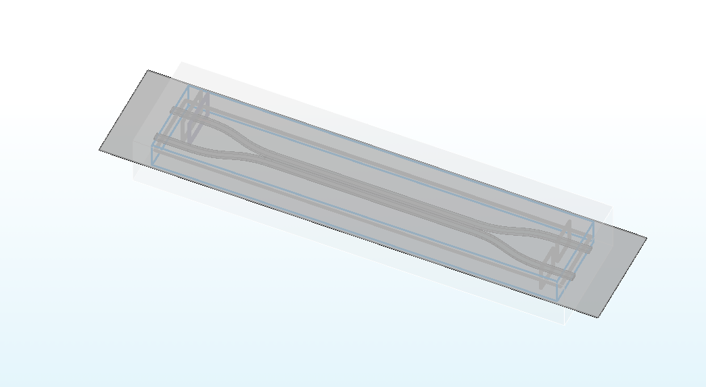 | 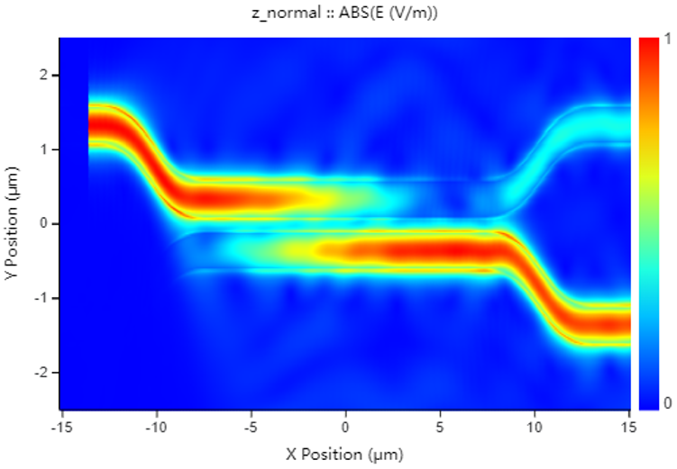 |
| ------------------------------------------------------------ | ------------------------------------------------------------ |


## Simulation Methods

<div class="text-justify">


The `FDE module` can be used to calculate the symmetric and anti-symmetric mode field distributions of the directional coupler’s two arms. From these calculations, the effective index can be determined, allowing for the theoretical calculation of the coupling length required to achieve the target splitting ratio.

And the `FDTD module` can be used to perform precise calculations of light propagation in the DC. The light field transmission images in the monitor allow for a visual assessment,the related data of which facilitate further optimization and validation of the coupling length and spacing parameters in the DC splitter.

After data processing, it can be obtained that the splitting ratio, insertion loss, and operating bandwidth of DC. In designing high-performance directional couplers for various optical communication and integrated photonics applications, these calculations and optimization processes are instrumental.

</div>

##  Directional Coupler(FDE module)

<div class="text-justify">


Using the `FDE module`, we will calculate symmetric and antisymmetric modes in a Directional Coupler modeled with the SDK. The input light can be considered a combination of the symmetric mode and the antisymmetric mode so that we can precisely calculate the coupling coefficient by effective index from the FDE module. Referring to the *Silicon Photonics Design* written by Lukas Chrostowski, we build the structure of the Directional coupler in the simulation.

</div>

###  1. Basic Operations

#### 1.1 Import File

<div class="text-justify">

Once you have installed and configured the environment, import the python code and the GDS layout. The example library and related model code are usually located in the directory :`examples/func_demo`. The GDS file is generally imported into the path :`examples/examples_gds`

</div>

#### 1.2 SDK Initialization

<div class="text-justify">


Create a new terminal and run the code after you import the python script and GDS file. Max-Optics SDK may take some time to connect the service.

</div>

### 2. Code Description

<div class="text-justify">


Now let's learn the meaning of functions and parameters that correspond to the code.

</div>

#### 2.1 import Modules

<div class="text-justify">

To begin, we need to use the `import` command to call the relevant functional modules. For instance, we import the  `typing` ,  `os` and  `time` module in python. At the same time ,we import the customized module `maxoptics_sdk.all `and `maxoptics_sdk.helper`.

</div>

```python
from typing import List, Literal, NamedTuple
import os
import time
import maxoptics_sdk.all as mo
from maxoptics_sdk.helper import timed, with_path
```

The `typing` module provides support for type hints and annotations, which are used to indicate the expected types of variables, function arguments, and return values in your code. <br/>The `os` module provides a way to use operating system-dependent functionality such as reading or writing to the file system, working with environment variables, and executing system commands.<br/>The `time` module provides various functions to work with time-related operations and to measure time intervals. <br/>The `maxoptics_sdk` package provides all in one optical simulation with Python.


#### 2.2 Define Simulation

<div class="text-justify">

Firstly, We define parameters and give them a default value, such as the simulation wavelength and grid accuracy. Note that we can override this value in the following code.

</div>

```python
def simulation(*, run_mode="local", wavelength =1.55, grid = 0.02, number_of_trial_modes = 20, run_options: "RunOptions", **kwargs, ):
```

<div class="text-justify">

The provided code contains comments that define the simulation parameters. Let's explain each of these parameters. <br/>The function `simulation` is used to define the simulation parameters for the program. <br/>The `run_mode` parameter determines the type of calculation resources to be used. <br/>The `wavelength` parameter specifies the wavelength of the input light in micrometers. <br/>The `grid` parameter represents the grid accuracy in micrometers. <br/>Lastly, the `number_of_trial_modes` parameter sets the number of modes to be calculated.<br/>The `**kwargs` is a special syntax used in function definitions to accept an arbitrary number of keyword arguments as a dictionary.

</div>

#### 2.3 Define Parameters

<div class="text-justify">

Define commonly used parameters in region 0, such as the width and height of the simulation boundary, the start time of the simulation, the path and name for the simulation output, the path to the imported GDS layout, and other parameters required for structural parameterized modeling.

</div>

```python
# region --- 0. General Parameters ---
  yspan_solver = 5
  zspan_solver = 2
  time_str = time.strftime('%Y%m%d_%H%M%S', time.localtime())
  path = kwargs['path']
  simu_name = f'FDE_DC_yspan={yspan_solver}_{time_str}'
  gds_file_root_path = os.path.abspath(os.path.join(path, '..'))
  gds_file = gds_file_root_path + '/examples_gds/DC.gds'
  project_name = f'{simu_name}_{run_mode}_{time_str}'
  plot_path = kwargs.get('plot_dir', path) + '/plots/' + project_name + '/'
  kL = [f'0{k}' for k in range(5)]
  export_options = {"export_csv": True, "export_mat": True, "export_zbf": True}
  l_bend=5.6 # the length of z bend
  l_arm=15 # the length of 2 arms
  l_input=2.5 # the length of input wg
# endregion
```

<div class="text-justify">


The code defines several parameters and variables necessary for the simulation process. The `yspan_solver` parameter represents the width of the simulation boundary specified in micrometers. Similarly, the `zspan_solver` parameter denotes the height of the simulation boundary in micrometers. The `time_str` variable is used to obtain the current time as a timestamp for the simulation.<br/>The `path` variable defines the file path for the simulation, while `simu_name` specifies the name of the simulation file.<br/>The `gds_file_root_path` variable defines the path for importing the GDS layout. <br/>The `project_name` variable assigns a name to the project for the simulation output. <br/>The `plot_path` variable determines the directory where the simulation result plots will be saved. <br/>The `export_options` parameter allows for the definition of options for exporting the simulation results.<br/>Lastly, the variables `l_bend` ,`l_arm`, and `l_input` represent the lengths of specific components within the simulation, such as the length of the z-bend, the length of the two arms, and the length of the input waveguide, respectively. <br/>These parameters and variables together facilitate the successful execution and organization of the simulation process.

</div>

#### 2.4 Define Materials

<div class="text-justify">


Indeed, let's proceed to the next step, where we set up the materials required for the simulation in region 2. In this case, we will directly use relevant materials from the MO  material library.

</div>

```python
# region --- 2. Material ---
  mt = pj.Material()
  mt.add_lib(name='Si', data=mo.Material.Si_Palik, order=2)
  mt.add_lib(name='SiO2', data=mo.Material.SiO2_Palik, order=2)
  mt.add_lib(name='Air', data=mo.Material.Air, order=2)
# endregion
```

The `add_lib` is used to define three parameters `name`,`data` and `order`. <br/>The `data` calls up the property of simulation materials in the MO material library. <br/>The `Order` parameter determines the mesh order for the material during the simulation. <br/>Besides, we also support users to customize the material with `add_nondispersion`function.

#### 2.5 Create Model

<div class="text-justify">


Next, we will create the Directional Coupler model in region 3. We have two options for modeling the structure:

</div>

```python
# region --- 3. Structure ---
    st = pj.Structure()
    st.add_geometry(
        name="box",
        type="gds_file",
        property={
            "general": {"path": gds_file, "cell_name": "TOP", "layer_name": (1, 1)},
            "geometry": {"x": 0, "y": 0, "z": 0.11, "z_span": 6},
            "material": {"material": mt["SiO2"], "mesh_order": 1}, }, )

    st.add_geometry(
        name="dc",
        type="gds_file",
        property={
            "general": {"path": gds_file, "cell_name": "TOP", "layer_name": (0, 0)},
            "geometry": {"x": 0, "y": 0, "z": 0.11, "z_span": 0.22},
            "material": {"material": mt["Si"], "mesh_order": 2}, }, )
    st.add_geometry(
        name="slab",
        type="Rectangle",
        property={
            "geometry": {
                "x_min": -l_input - l_bend - l_beam / 2 - 3, "x_max": l_input + l_bend + l_beam / 2 + 3,
                "y": 0, "y_span": 8, "z": 0.045, "z_span": 0.09,},
            "material": {"material": mt["Si"], "mesh_order": 2}, }, )
# endregion
```

<div class="text-justify">


Here, we import the DC layout from the GDS file. we can create the DC model directly within the SDK using the `Structure` function.<br/>The `name` parameter defines the structure name.<br/>The `type` parameter specifies the structure type.<br/>The `path`, `cell_name`, and `layer_name` parameters point to the GDS file and specify the relevant layers and cell names used in the layout.<br/>The `geometry` parameter sets the structure's coordinates. <br/>The `material` parameter specifies the material properties <br/>The `mesh_order` parameter sets the mesh order for building structures.

</div>


#### 2.6 FDE Simulation

<div class="text-justify">


After establishing the model, we can add the simulation region in region 4.We add the FDE simulation module to support mode calculations and frequency scans. We can also and define the simulation boundary conditions. This involves specifying the geometry of the simulation region, the boundary conditions in the xyz directions, and detailed parameters.

</div>


<div class="text-justify">

</div>

```python
# region --- 4. Simulation ---
simu = pj.Simulation()
simu.add(
    name=simu_name,
    type="FDE",
    property={
        "background_material": mt["SiO2"],
        "geometry": {
            "x": 0, "x_span": 0, "y": 0, "y_span": yspan_solver, "z": 0, "z_span": zspan_solver,},
        "boundary_conditions": {
            "y_min_bc": "PEC", "y_max_bc": "PEC", "z_min_bc": "PEC", "z_max_bc": "PEC",},
        'general': {'solver_type': '2d_x_normal'},  # default is '2d_x_normal' ['2d_x_normal','2d_y_normal','2d_z_normal']
        "mesh_settings": {
                "mesh_refinement": { "mesh_refinement": "curve_mesh" }, "mesh_factor": 1.2, "global_mesh_uniform_grid": { "dy": grid, "dz": grid, }, }, }, )
simu_res = simu[simu_name].run()
# endregion
```

<div class="text-justify">

In this code segment, the `name` parameter defines the name of the simulation module.<br/>The `general` parameter specifies the type of the simulation module within the structure. It supports the following list selection`['2d_x_normal','2d_y_normal','2d_z_normal']`.<br/>The `mesh_settings` parameter is set to the previously defined the mesh.<br/>

In this case,we use Perfect Electric Conductor(PEC) boundary condition. The PEC boundary condition is a modeling approach used to simulate the behavior of perfectly conducting surfaces or boundaries in electromagnetic wave propagation analyses. This effectively models the behavior of a material with infinite conductivity and perfect electrical shielding. This boundary condition is particularly relevant when dealing with the interaction of light and electromagnetic fields with highly conductive materials, such as metals. <br/>Moreover, We also provide the usual boundary condition like  Perfectly Matched Layer(PML) and Perfect Magnetic Conductor (PMC), you can change the `PEC` to `PML` or `PMC`of 4 dimensions in the code.

</div>

#### 2.7 Add Sub-mesh

<div class="text-justify">


To achieve more accurate calculations of the model's modal fields, we can add a sub-mesh in region 5.

</div>

```python
# region --- 5. Sub Mesh ---
lm = pj.LocalMesh()
lm.add(
    name="sub_mesh",
    property={
        "general": {"dx": 0.002, "dy": 0.002, "dz": 0.002},
        "geometry": {
            "x": 0, "x_span": 6, "y": 0, "y_span": 2, "z": 0, "z_span": 0.2, }, }, )
# endregion
```

<div class="text-justify">


In this code segment, we use the `LocalMesh` to add a sub-mesh.<br/>The `name` parameter defines the name of the mesh.<br/>The `general` parameter specifies the grid accuracy in the xyz directions (in this case, 0.002 micrometers in each direction).<br/>The `geometry` parameter sets the coordinates of the sub-mesh.

</div>

#### 2.8 Add Analysis

<div class="text-justify">

Such as mode expansion and frequency analysis, we can add a sub-mesh in region 5 to achieve more analysis.

</div>

```python
# region --- 6. Analysis ---
analysis = pj.Analysis()
analysis.add_analysis(
    name="Mesh Structure",
    type="FDEAnalysis",
    props={
        "workflow_id": simu_res.workflow_id,
        "simulation_name": "FDE",
        "modal_analysis": {
            "calculate_modes": run_options.run, "mesh_structure": False, "wavelength": wavelength, "number_of_trial_modes": number_of_trial_modes, "search": "max_index",  # ['near_n','max_index'] "n": 1, "calculate_group_index": False, # 'mode_removal': {'threshold': 0.02},
            "bent_waveguide": {
                "bent_waveguide": False, "radius": 1, "orientation": 0, "location": "simulation_center",
            },
        },
        "frequency_analysis": {
            "frequency_analysis": run_options.run_frequency_sweep, "start_wavelength": 1.50, "stop_wavelength": 1.60, "number_of_points": 3, "effective_index": 2.67, "detailed_dispersion_calculation": False,
        },
    }
)
result_fde = analysis["Mesh Structure"].run()
# endregion
```
<div class="text-justify">

The `wavelength` parameter sets the wavelength-related parameters for the simulation.<br/>The `search` parameter specifies the mode search type. It supports the following list selection`['near_n','max_index']`.<br/>In this case, we use `max_index` to automatically search for the mode with max index in the structure. To use the ‘near_n’, we need to set the data in ‘n’.<br/>The `bent_waveguide` parameter can be used to set parameters for a bent waveguide.<br/>The `frequency_analysis` parameter allows us to set parameters for frequency scans or mode calculations with varying wavelengths.

</div>

#### 2.9 Retrieve Results

<div class="text-justify">


In region 7, you can retrieve and store the simulation results.

</div>

```python
# region --- 7. See Results ---
    if run_options.run:
            k = kL[2]
            res = result_fde.extract( data="calculate_modes", savepath=f"{plot_path}{k}_neff_table", export_csv=True, )
            print(res.to_string(index=False))
            for m in range(len(res)):
                k = kL[3]
                result_fde.extract( data="calculate_modes", savepath=f"{plot_path}{k}_mode{m}", attribute="Ey", real=True, imag=False, mode=m, show=False, **export_options, )

    if run_options.run_frequency_sweep:
            k = kL[4]
            result_fde.extract( data="frequency_analysis", savepath=f"{plot_path}{k}_freq_sweep_neff", attribute="neff", real=True, imag=True, show=False, export_csv=True, export_mat=True, )
    return project_name
# endregion
```

<div class="text-justify">

The `extract` function allows you to extract specific simulation results and store them for further analysis.<br/>The `attribute` parameter specifies the type of simulation results to be extracted.<br/>The `mode` parameter corresponds to the index of the FDE calculation mode.<br/>The `real` and `imag` parameters are used to extract the real and imaginary parts of the simulation results, respectively. <br/>If you run the frenquency sweep to calculate mode at different wavelength, you can also extract the relevant results. As an example above, we extrat the effective index.

</div>

#### 2.10 Switches

<div class="text-justify">


In this section of the code, the `simulation` function is called and executed, which allows you to reset relevant parameters for more convenient parameter scanning and optimization design. We also support control switches for various functionalities at the end of the code, and you can use configuration flags(True or False). These flags can be used to turn specific functionalities on or off, making it easier to check the model and perform efficient calculations.

</div>

```python
class RunOptions(NamedTuple):
    index_preview: bool
    run: bool
    run_frequency_sweep: bool
    extract: bool


if __name__ == "__main__":
    simulation(
        run_mode="local", wavelength=1.55, grid=0.02, number_of_trial_modes=3,
        run_options=RunOptions( index_preview=True, run=True, run_frequency_sweep=True, extract=True ), )

```

<div class="text-justify">

By turning on/off the relevant functionalities, you can control the simulation process and obtain the desired results. For example, the `index_preview` is to control whether to output images of the structural refractive index. `run` determines whether to run the program. `run_frequency_sweep` is used to enable frequency scanning, and `extract` is used to control data extraction. Properly utilizing these switches can help you inspect the simulation effectively.

</div>

### 3. Output Results

<div class="text-justify">


2. The results of the calculation mode will be stored in a CSV format file for subsequent data processing in Python and Excel.

</div>

| &emsp;**mode_order**&emsp; | **TE ratio** | &nbsp;**neff_real**&nbsp; | &nbsp;**neff_imag**&nbsp; | &nbsp;**ng_real**&nbsp; | &nbsp;**ng_imag**&nbsp; | **wavelength(nm)** | **loss(dB/cm)** |
| :-------: | :----------: | :-----------: | :-----------: | :----------: | :---------: | :----------------: | :---------: |
|     0     |   0.986860    |    2.593169      |  0   |      0       |      0      |        1550        |  0   |
|     1     |  0.987740    |   2.542372    |  0  |      0       |      0      |        1550        |  0   |
|     2     |   0.941287  |   2.129843    |  0   |      0       |      0      |        1550        |  0   |


<div class="text-justify">

1. Image of the Ey electric field component intensity in symmetric and antisymmetric mode modes.

</div>

|  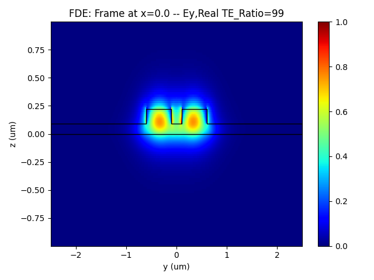 | 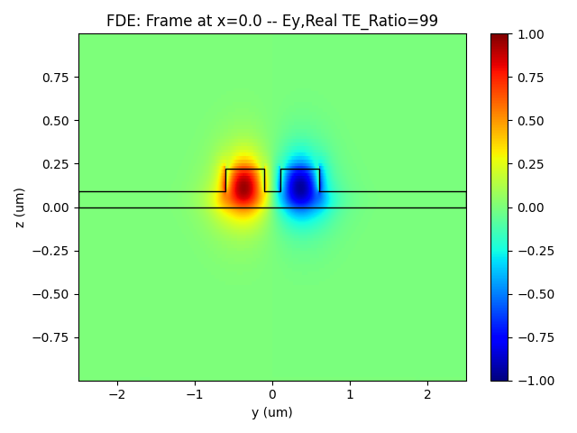 |
| :----------------------------------------------------------: | :----------------------------------------------------------: |

<div class="text-justify">


2. According to the effective refractive index of the obtained mode field, Python is used for data processing and drawing.

</div>


<div class="text-justify">


&emsp;The coupling length under the gap between two waveguides is calculated with the formula:

</div>

<BlockMath math="L_x = \frac{\lambda}{2|neff_1-neff_2|}" />

<div class="text-justify">


&emsp;We can also get the coupling coefficient by the formula:

</div>

<BlockMath math="\kappa = |sin(\frac{\pi\delta(n)L}{\lambda})|" />


| 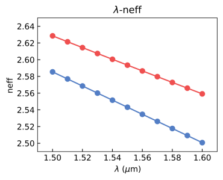 | 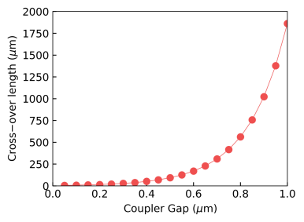 | 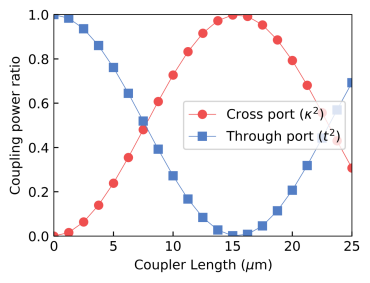 |
| :------------------------------------------------------------: | :------------------------------------------------------------: | :------------------------------------------------------------: |


<div class="text-justify">


5.  Similarly, we can obtain the relationship between the gap (distance) between two waveguides and the coupling coefficient and the relationship between the wavelength and the coupling length.

</div>


<div class="text-justify">


|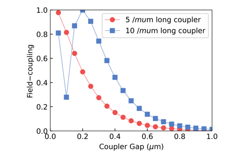| 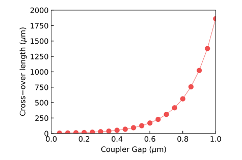 |
| :----------------------------------------------: | :----------------------------------------------: |

</div>


##  Directional Coupler(FDTD module)


<div class="text-justify">


Next, we will learn how to model a Directional Coupler using the SDK and calculate the light propagation in the structure using the FDTD module.

</div>

### 1. Basic Operations


<div class="text-justify">


Similarly, after installing and configuring the environment, we import the relevant python code file  and the GDS layout for the model. The example library and related model code are typically stored in the directory `examples/func_demo`, and the GDS file is imported into the folder `examples/examples_gds`.

</div>

### 2. Code Description

<div class="text-justify">


Next, we will continue to learn about the specific functionalities corresponding to the code.

</div>

#### 2.1 Define Parameters

<div class="text-justify">


Like the operations with the FDE module, after configuring the simulation wavelength, grid precision, and other parameters, we need to set the relevant parameters for simulation and parameterized modeling in Region 0. This includes defining the paths and names for the simulation files and output results and specifying the path for importing the GDS layout.

</div>

```python
# region --- 0. General Parameters ---
l_bend=5.6 # the length of z bend
l_beam=15 # the length of 2 beams
l_input=2.5 # the length of input wg
monitor_w = 3.0
monitor_h = 2.0
waveform_name = "wv" + str(round(wavelength * 1000))
time_str = time.strftime("%Y%m%d_%H%M%S", time.localtime())
path = kwargs["path"]
simu_name = "FDTD_DC"
project_name = f'{simu_name}_{time_str}'
plot_path = f'{path}/plots/{project_name}/'
gds_file_root_path = os.path.abspath(os.path.join(path, '..'))
gds_file = gds_file_root_path + "/examples_gds/DC.gds"
# endregion
```

#### 2.2 Define Materials

<div class="text-justify">


Subsequently, in Region 2, we ues the materials required for the simulation. We also support users to specify the refractive indices of Si (Silicon) and SiO2 (Silicon Dioxide) materials.

</div>

```python
# region --- 1. Material ---
mt = pj.Material()
mt.add_lib(name='Si', data=mo.Material.Si_Palik, order=2)
mt.add_lib(name='SiO2', data=mo.Material.SiO2_Palik, order=2)
# mt.add_nondispersion(name="Si", data=[(3.472, 0)], order=2)
# mt.add_nondispersion(name="SiO2", data=[(1.444, 0)], order=2)
mt.add_lib(name="Air", data=mo.Material.Air, order=2)
# endregion
```

<div class="text-justify">


The `add_nondispersion` function adds a non-dispersion material to the project in the simulation. <br/>The `data`, is specified as a list, typically in the format `[(index real, index imag)]`. This list contains the complex refractive index values for the material, enabling the simulation to model its optical properties accurately.<br/>The function allows users to incorporate non-dispersion materials into the simulation, contributing to a comprehensive and precise optical analysis of the system under investigation.

</div>

#### 2.3 Define Waveform

<div class="text-justify">


In Region 3, we define the parameters relevant to the wavelength.

</div>

```python
# region --- 3. Waveform ---
wv = pj.Waveform()
    wv.add(name=waveform_name,type='gaussian_waveform',
           property={'set': 'frequency_wavelength',  # selections are ['frequency_wavelength','time_domain']
                     'set_frequency_wavelength': {
                            'range_type': 'wavelength',  # selections are ['frequency','wavelength']
                            'range_limit': 'center_span',  # selections are ['min_max','center_span']
                            'wavelength_center': wavelength,
                            'wavelength_span': wavelength_span,},
                     }
    )
# endregion
```

<div class="text-justify">


The `Waveform` function is used to retrieve the waveform manager for the current project. It allows users to access and manipulate the waveform sources used in the simulation.<br/>The `name` parameter specifies the name of the waveform source.<br/>The `wavelength_center` parameter defines the center of the wavelength range for the source.<br/>The `wavelength_span` parameter determines the span of the wavelength range for the source.


</div>

#### 2.4 Create Model\Boundary

<div class="text-justify">


Next, similar to the procedure in the FDE module, in Region 4, we create the model by importing the GDS layout. Subsequently, in Region 5, we establish the boundary conditions.

</div>

```python
# region --- 4. Structure ---
    st = pj.Structure()

st.add_geometry(
    name="box",
    type="gds_file",
    property={
        "general": { "path": gds_file, "cell_name": "TOP", "layer_name": (1, 1) },
        "geometry": {"x": 0, "y": 0, "z": 0.11, "z_span": 6},
        "material": {"material": mt["SiO2"], "mesh_order": 1} }, )
st.add_geometry(
    name="dc",
    type="gds_file",
    property={
        "general": { "path": gds_file, "cell_name": "TOP", "layer_name": (0, 0) },
        "geometry": {"x": 0, "y": 0, "z": 0.11, "z_span": 0.22},
        "material": {"material": mt["Si"], "mesh_order": 2} }, )
st.add_geometry(
    name='slab',
    type='Rectangle',
    property={
        'geometry': { 'x_min': -l_input-l_bend-l_beam/2-3, 'x_max':l_input+l_bend+l_beam/2+3, 'y': 0, 'y_span': 8, 'z': 0.045, 'z_span': 0.09 },
        'material': {'material': mt['Si'], 'mesh_order': 2}, } , )
# endregion

```

<div class="text-justify">

In this code segment, we set detailed parameters for the PML boundar.
</div>

#### 2.5 FDTD Simulation/local mesh

<div class="text-justify">


In Region 6, we add the FDTD simulation.  Additionally, in Region 7, we can set the sub-mesh for improved precision.

</div>

```python
# region --- 6. Simulation ---
simu = pj.Simulation()
simu.add(
    name=simu_name,
    type="FDTD",
    property={
        "background_material": mt["SiO2"],
        "geometry": { "x": 0, "x_span": 2*(l_input+l_bend+l_beam/2-0.5), "y": 0, "y_span": 6, "z": 0.11, "z_span": monitor_h },
         "boundary_conditions": {"x_min_bc": "PML", "x_max_bc": "PML", "y_min_bc": "PML", "y_max_bc": "PML", "z_min_bc": "PML", "z_max_bc": "PML",
                                               "pml_settings": {"all_pml": {"layers": 8, "kappa": 2, "sigma": 0.8, "polynomial": 3, "alpha": 0, "alpha_polynomial": 1, }}},
        "general": { "simulation_time": 10000, },
        "mesh_settings": {
            "mesh_factor": 1.2,
            "mesh_type": "auto_non_uniform",
            "mesh_accuracy": {"cells_per_wavelength": grids_per_lambda},
            "minimum_mesh_step_settings": {"min_mesh_step": 1e-4},
            "mesh_refinement": { "mesh_refinement": "curve_mesh", } },
        # 'advanced_options': {'auto_shutoff': {'auto_shutoff_min': 1.00e-4, 'down_sample_time': 200}},
        # 'thread_setting': {'thread': 4}
    }, )
# endregion

# region --- 7. Sub Mesh ---
lm = pj.LocalMesh()
lm.add(
    name="sub_mesh",
    property={
        "general": { "dx": 0.05, "dy": 0.02, "dz": 0.02 },
        "geometry": { "x": 0, "x_span": 2*(l_input+l_bend+l_beam/2-0.5), "y": 0, "y_span": 6, "z": 0.11, "z_span": monitor_h }, }, )
# endregion
```

<div class="text-justify">

The `Simulation` manager is critical for setting up and running simulations in the current project.<br/>The `name` parameter allows users to assign a unique name to the simulation for identification purposes.<br/>The `type` parameter defines the type of the simulation.<br/>we define the boundary conditions for the simulation using the `boundary` dictionary, where the x ,y and the z directions all have PML boundary conditions.The `simulation_time` parameter specifies the duration of the simulation.<br/>The `mesh_settings` parameter enables users to configure various settings related to the simulation mesh. The `mesh_accuracy` parameter controls the precision of the mesh used in the simulation.<br/>The `cells_per_wavelength` parameter determines the wavelength precision used in the simulation.<br/>The `minimum_mesh_step_settings` parameter sets the minimum mesh step, allowing users to define the smallest allowable size for mesh elements.<br/>Users can tailor the simulation setup to meet their requirements by utilizing these input parameters, enabling accurate and efficient electromagnetic simulations of complex optical structures.

</div>

#### 2.6 Source

<div class="text-justify">

Then we need to establish the light source in the input waveguide, as shown in Region 8.

</div>

```python
# region --- 8. ModeSource ---
src = pj.Source()
src.add(
    name="source",
    type="mode_source",
    # axis="x_forward",
        property={
            "general": { "mode_selection": "user_select", "waveform": {"waveform_id": wv[waveform_name]}, "inject_axis": "x_axis", "direction": "forward" },
            "geometry": { "x": -l_input-l_beam/2-l_bend+2, "x_span": 0, "y": 1.35, "y_span": monitor_w, "z": 0.11, "z_span": monitor_h },
            "modal_analysis": { "mode_removal": {"threshold": 0.01} } , }, )
# endregion
```

<div class="text-justify">


The `Source` function is utilized to retrieve the source manager for the current project.<br/>The `type` parameter specifies the type of the source and is formatted as either `["mode_source"] or ["gaussian_source"]`.<br/>The `name` parameter represents the name assigned to the source.<br/>The `inject_axis` parameter defines the axis of the source.<br/>The `property` parameter allows for defining specific properties associated with the source.

</div>

#### 2.7 Monitor

<div class="text-justify">


In Region 9, we set up the monitors.

</div>

```python
# region --- 9. Monitor ---
# region --- 9.0 GlobalMonitor ---
mn = pj.Monitor()
mn.add(
    name="Global Option",
    type="global_option",
    property={
        "frequency_power": {
            "spacing_type": "wavelength",
            "spacing_limit": "center_span",
            "wavelength_center": wavelength,
            "wavelength_span":wavelength_span,
            "frequency_points": 3 }, }, )
# endregion

# region --- 9.1 z_normal ---
mn.add(
    name="z_normal",
    type="power_monitor",
    property={
        "general": {
            "frequency_profile": { "wavelength_center": wavelength, "wavelength_span": wavelength_span, "frequency_points": 3, },
        },
        "geometry": {
            "monitor_type": "2d_z_normal",
            "x": 0, "x_span": 2*(l_input+l_bend+l_beam/2-0.5), "y": 0, "y_span": 5, "z": 0.11, "z_span": 0 }, }, )
# endregion

# region --- 9.2 input ---
mn.add(
    type="power_monitor",
    name="input_reflect",
    property={
        "general": {
            "frequency_profile": { "wavelength_center": wavelength, "wavelength_span": wavelength_span, "frequency_points": 11 } },
        "geometry": {
            "monitor_type": "2d_x_normal",
            "x": -l_input-l_beam/2-l_bend+1.5, "x_span": 0, "y": 1.35, "y_span": monitor_w, "z": 0.11, "z_span": monitor_h }, } )
# endregion

# region --- 9.3 through ---
mn.add(
    type="power_monitor",
    name="through",
    property={
        "general": {
            "frequency_profile": { "wavelength_center": wavelength, "wavelength_span": wavelength_span, "frequency_points": 11 } },
        "geometry": {
            "monitor_type": "2d_x_normal",
            "x": l_input+l_beam/2+l_bend-2, "x_span": 0, "y": 1.35, "y_span": 2, "z": 0.11, "z_span": monitor_h }, }, )
# endregion

# region --- 9.4 cross ---
mn.add(
    name="cross",
    type="power_monitor",
    property={
        "general": {
            "frequency_profile": { "wavelength_center": wavelength, "wavelength_span": wavelength_span, "frequency_points": 11 } },
         "geometry": {
            "monitor_type": "2d_x_normal",
            "x": l_input+l_beam/2+l_bend-2,
            "x_span": 0, "y": -1.35, "y_span": 2, "z": 0.11, "z_span": monitor_h }, } )
# endregion
# endregion
```

<div class="text-justify">


For the global monitor, the `Monitor` function is utilized to retrieve the monitor manager for the current project, which allows users to access and manage various types of monitors used during simulation.<br/>The `name` parameter represents the name of the Global Option associated with the monitor.<br/>The `type` parameter defines the type of the Global Option and is formatted as a list containing one of several monitor types. The `property` parameter is used to define and set the relevant parameters specific to the chosen monitor type. These parameters control the monitor's behavior and data collection settings during the simulation.

The power monitor is a configuration setting that allows users to specify various simulation parameters.<br/>The `name` parameter assigns a name to the power monitor.<br/>The `type` parameter defines the type of power monitor.<br/>The `general` parameter pertains to settings related to the frequency domain and frequency-dependent behaviors of the simulation.<br/>The `geometry` parameter is used to define the geometric characteristics of the simulated structure.<br/>

</div>


#### 2.8 Calculate Source

<div class="text-justify">


To calculate the input mode light and save its electric field intensity data in region 10.

</div>

```python
# region --- 10. Calculate Mode ---
if run_options.calculate_modes:
    simu[simu_name].preview_modes(
        source_name = "source",
        savepath=f"{plot_path}00_source_modeprofile_fdeonly",
        attribute="E", real=True, imag=True, mode=0, show=False, export_csv=True, )
# endregion
```

#### 2.9 Run Simulation

<div class="text-justify">

Then, in Region 11, we run the simulation. 

</div>

```python
# region --- 11. Run ---
if run_options.run:
    fdtd_res = simu[simu_name].run()
# endregion
```
#### 2.10 Analysis

<div class="text-justify">

In Region 12, we run the analysis for the simulation.
The `mode_expansion` parameter involves relevant settings for mode expansion simulations. Users can customize the simulation settings by utilizing these input parameters to achieve accurate and comprehensive results based on their specific simulation requirements.


</div>

```python
# region --- 12. Run ---
analysis = pj.Analysis()
analysis.add(
    name="me_through",
    type="mode_expansion",
    property={
            "workflow_id": fdtd_res.workflow_id,
            "mode_expansion": {
                "direction": "positive",
                "monitors_for_expansion": [ {"name": "me_through", "frequency_monitor": "through"} ],
                "mode_calculation": {
                    "mode_selection": "user_select",
                    "mode_index": [0, 1, 2, 3],
                    "override_global_monitor_setting": { "wavelength_center": wavelength, "wavelength_span": 0.1, "frequency_points": 11, }, }, }, } )
analysis.add(
    name="me_cross",
    type="mode_expansion",
    property={
            "workflow_id": fdtd_res.workflow_id,
            "mode_expansion": {
                "direction": "positive",
                "monitors_for_expansion": [ {"name": "me_cross", "frequency_monitor": "cross"} ],
                "mode_calculation": {
                    "mode_selection": "user_select",
                    "mode_index": [0, 1, 2, 3],
                    "override_global_monitor_setting": { "wavelength_center": wavelength, "wavelength_span": 0.1, "frequency_points": 11, }, }, }, } )
me_res1 = analysis["me_through"].run()
me_res2 = analysis["me_cross"].run()
# endregion
```

#### 2.11 Results

<div class="text-justify">


In Region 13, we define the desired output results. Lastly, we control the switches of various functional modules at the end of the Python file.


</div>

```python
# region --- 13. See Results ---
if run_options.extract and run_options.run:
    # region --- z_normal ---
    """ 01_top_profile """
    for λ in [1.5, 1.55, 1.6]:
        fdtd_res.extract(
            data="fdtd:power_monitor",
            savepath=plot_path + "01_top_profile" + str(λ) + "um",
            monitor_name="z_normal",
            target="intensity",
            attribute="E",
            real=True, imag=True, wavelength=str(λ), plot_x="x", plot_y="y", show=False, export_csv=True, )
        # endregion

        # # region --- through ---
        """ 01_monitorThrough_modeprofile_fdtd """
        fdtd_res.extract(
            data="fdtd:power_monitor",
            savepath=plot_path + "01_monitorThrough_modeprofile_fdtd_"+ f"{wavelength}" + "um",
            monitor_name="through",
            target="intensity",
            attribute="E",
            real=True, imag=False, wavelength=f"{wavelength}", plot_x="y", plot_y="z", show=False, export_csv=True, )
        # # """ 02_Trans_ThroughVsLambda_power """
        fdtd_res.extract(
            data="fdtd:power_monitor",
            savepath=plot_path + "02_Trans_ThroughVsLambda_power",
            monitor_name="through",
            target="line",
            attribute="T",
            real=True, imag=False, plot_x="wavelength", show=False, export_csv=True, )
        # # """ 021_ME_ThroughVsLambda_mode """
        me_res1.extract(
            data="fdtd:mode_expansion",
            savepath=plot_path + "021_ME_ThroughVsLambda_mode",
            target="line",
            attribute="T_forward",
            real=True, imag=True, monitor_name="through", mode_expansion_name="me_through", mode=0, plot_x="wavelength", show=False, export_csv=True, )
        # # region --- cross ---
        """ 01_monitorcross_modeprofile_fdtd """
        fdtd_res.extract(
            data="fdtd:power_monitor",
            savepath=plot_path + "01_monitorcross_modeprofile_fdtd_"+ f"{wavelength}" + "um",
            monitor_name="cross",
            target="intensity",
            attribute="E",
            real=True, imag=False, wavelength=f"{wavelength}", plot_x="y", plot_y="z", show=False, export_csv=True, )
        # # """ 02_Trans_crossVsLambda_power """
        fdtd_res.extract(
            data="fdtd:power_monitor",
            savepath=plot_path + "02_Trans_crossVsLambda_power",
            monitor_name="cross",
            target="line",
            attribute="T",
            real=True, imag=False, plot_x="wavelength", show=False, export_csv=True, )
        # # """ 021_ME_crossVsLambda_mode """
        me_res2.extract(
            data="fdtd:mode_expansion",
            savepath=plot_path + "021_ME_crossVsLambda_mode",
            target="line",
            attribute="T_forward",
            real=True, imag=True, monitor_name="cross", mode_expansion_name="me_cross", mode=0, plot_x="wavelength", show=False, export_csv=True, )
    # endregion

```

#### 2.12 Switches

<div class="text-justify">


At the end of all codes, We control the switches of various functional modules.

</div>

```python
class RunOptions(NamedTuple):
    index_preview: bool
    calculate_modes: bool
    run: bool
    extract: bool


if __name__ == "__main__":
    simulation( wavelength=1.55, wavelength_span=0.1 , grids_per_lambda=6,
        run_options=RunOptions(
            index_preview=True, run=True, calculate_modes=True, extract=True ), )
```

### 3. Output Results

<div class="text-justify">


After running the program, we can obtain a series of corresponding output results:

1. Incident light electric field intensity, CRO output port electric field intensity, and TRU output port electric field intensity.

</div>

| 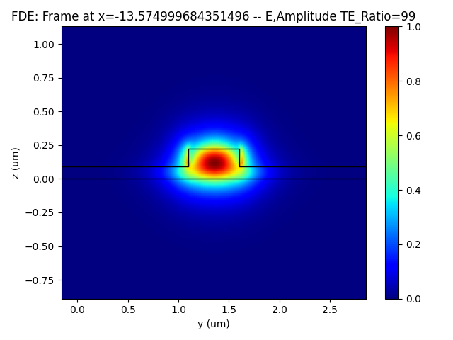 | 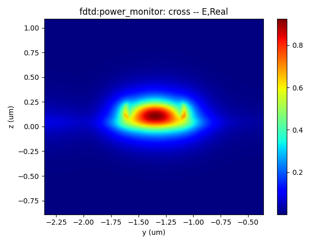 | 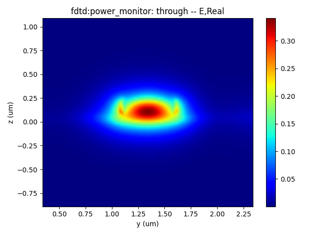 |
| ------------------------------------------------------------ | ------------------------------------------------------------ | ------------------------------------------------------------ |

<div class="text-justify">


2. DC (Directional Coupler)  Z-direction electric field intensity at different wavelengths: 1.50 *μ*m, 1.55 *μ*m, and 1.60 *μ*m.

</div>

| 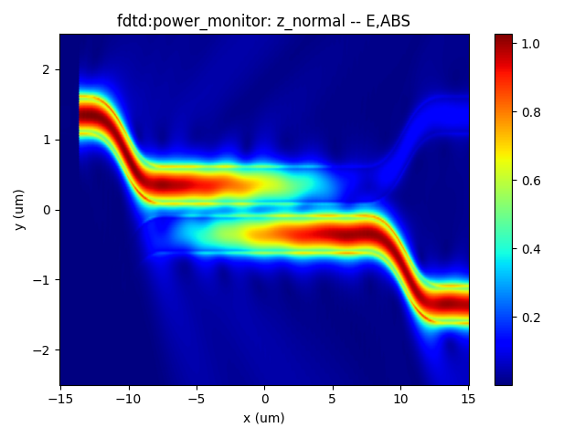 | 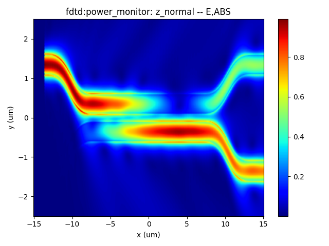 | 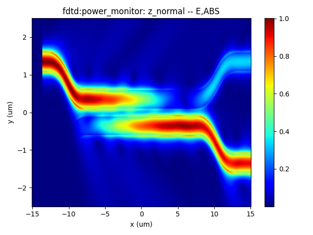 |
| ------------------------------------------------------------ | ------------------------------------------------------------ | ------------------------------------------------------------ |

<div class="text-justify">


1. Cross output port and TRU output port transmittance at different wavelengths,from 1.50 *μ*m to 1.60 *μ*m.

</div>

| 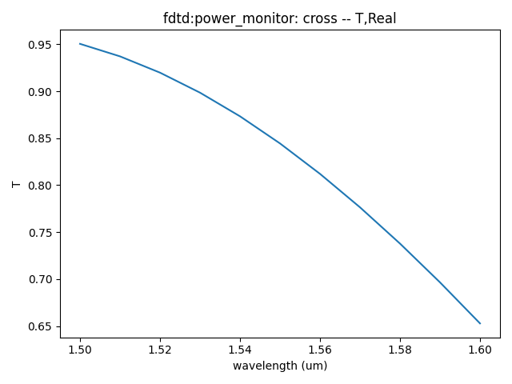 | 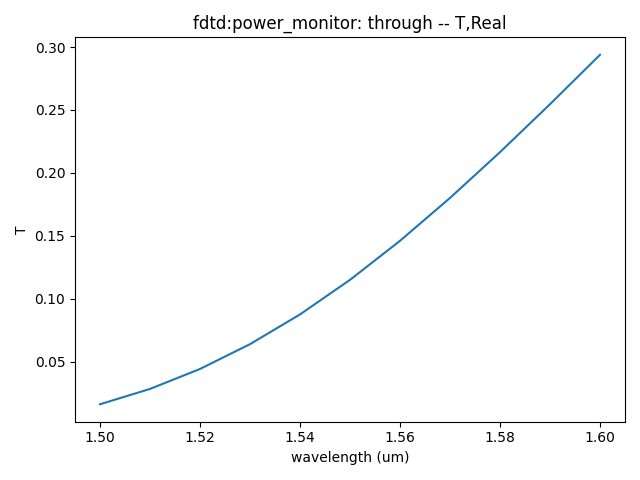 |
| ------------------------------------------------------------ | ------------------------------------------------------------ |


<div class="text-justify">


4. TE0 mode transmittance at Cross output port and TRU output port for different wavelengths,,from 1.50 *μ*m to 1.60 *μ*m.

</div>

| 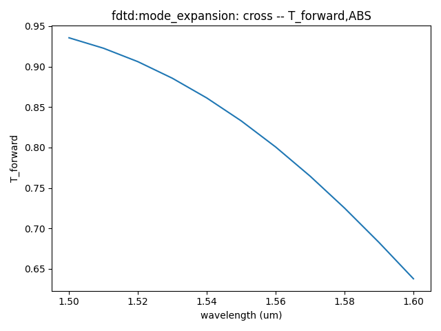 | 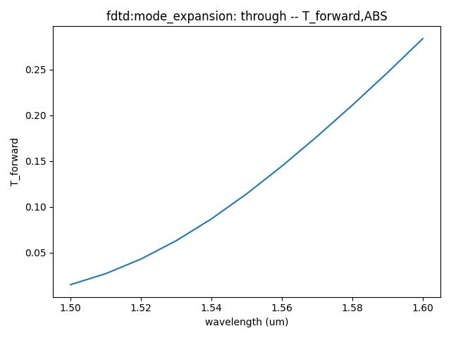 |
| ------------------------------------------------------------ | ------------------------------------------------------------- |


<div class="text-justify">

Based on the information provided, we can get the following results  when propogating wavelength  is 1.55 *μ*m and the two arm length of directional couper is equal to 15 *μ*m: 1. Insertion Loss: 0.236 dB; 2. Power Split Ratio: 11.2 : 83.3 (or approximately 11.2% to one port and 82.8% to the other port); 3. Dimensions: Approximately 5 *μ*m X 25 *μ*m.

</div>

## Supplement

<div class="text-justify">

To view a function's definition and supported parameters or a parameter dictionary, you can right-click on its name and select "Go to Definition"  or press "Ctrl" while left-clicking on its name to view its definition, showing the available parameters and their descriptions.


</div>

## References

<div class="text-justify">

Chrostowski, L., & Hochberg, M. (2015). Silicon Photonics Design: From Devices to Systems. Cambridge: Cambridge University Press. doi:10.1017/CBO9781316084168

</div>

</font>