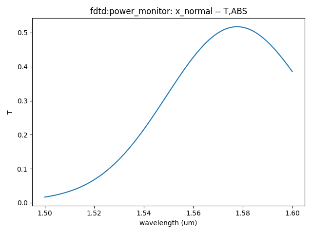

import 'katex/dist/katex.min.css';
import { InlineMath, BlockMath } from 'react-katex';

# Grating Coupler

<font face = "Calibri">

<div class="text-justify">

## Introduction:

Grating coupling is a simple method for connecting photonic integrated chips with optical fibers.

<div class="justify">

</div>

## Simulation

### 1 Code Description

#### 1.1 Import Toolkit

First, we need to import `maxoptics_sdk` and Python's third-party package. The import module for FDE and FDTD simulation are shown below.

```python
import maxoptics_sdk.all as mo
from maxoptics_sdk.helper import timed, with_path
import os
import time
import numpy as np
from typing import NamedTuple
```

#### 1.2  Define Simulation Function and parameters

To facilitate parameter changes, we can define function to encapsulate the entire simulation project. Before starting the simulation, you can define variables to control the parameters. Set as follows.

```python
@timed
@with_path
def simulation(*, run_mode, wavelength, grids_per_lambda, run_options: 'RunOptions', **kwargs):
    # region --- 0. General Parameters ---
    waveform_name = f'wv{wavelength*1e3}'
    path = kwargs['path']
    simu_name = 'GratingCoupler'
    time_str = time.strftime('%Y%m%d_%H%M%S', time.localtime())
    project_name = f'{simu_name}_{run_mode}_{time_str}'
    plot_path = f'{path}/plots/{project_name}/'
    gds_file_root_path = os.path.abspath(os.path.join(path, '..'))
    gds_file = gds_file_root_path + '/examples_gds/gc.gds'
    kL = [f'0{k}' for k in range(5)]
    # endregion
```

#### 1.3 Create project

You can create a new project using the `Project` function of Max's software development toolkit.

```python
# region --- 1. Project ---
    pj = mo.Project(name=project_name, location=run_mode,)
# endregion
```

#### 1.4 Add Material

<div class="text-justify">

Here we demonstrate using the `Material` function to create material and using the `add_lib` function to add materials from the material library. You can refer to the following script to set material.

</div>

```python
# region --- 2. Material ---
    mt = pj.Material()
    mt.add_nondispersion(name='Si', data=[(3.47656, 0)], order=2)
    mt.add_nondispersion(name='SiO2', data=[(1.44402, 0)], order=2)
    mt.add_lib(name='Air', data=mo.Material.Air, order=2)
# endregion
```

<div class="text-justify">

The `name` is used to define the name of the added material.<br/>The `data` is used to receive refractive index data extracted from the material library.<br/>The `order` is used to set the material priority of the grid.

</div>

#### 1.5 Add waveform

Adding a light source for simulating in 3D FDTD, and we use `Waveform` to set the waveform parameters of the light source.

```python
# region --- 3. Waveform ---
    wv = pj.Waveform()
    wv.add(name=waveform_name, wavelength_center=wavelength, wavelength_span=0.1)
# endregion
```

`name` sets the name of the waveform, `wavelength_center` sets the center wavelength of the light source, and `wavelength_span` sets the wavelength range of the light source.

#### 1.6 Add Structure

<div class="text-justify">
Microring resonator is typical filter for Soi waveguide, including two straight optical waveguides and a coupled ring-shaped waveguide.

We use `Structure` to create structure , where `mesh_type` is the type of mesh, `mesh_factor` is the growth factor of the mesh, and `background_material` is the background material of the structure. Use the `add_geometry` function to add geometric structures and select the type from the structural components. The specific properties can be set as follows.

</div>

```python
# region --- 4. Structure ---
    st = pj.Structure()

    st.add_geometry(
        name='top_cladding',
        type='gds_file',
        property={
            'general': {
                'path': gds_file, 'cell_name': 'gc', 'layer_name': (1, 0)},
                'geometry': {'z': 0.11, 'z_span': 0.22},
                'material': {'material': mt['Si'], 'mesh_order': 2} } )
    st.add_geometry(
        name='middle_cladding',
        type='gds_file',
        property={
            'general': {
                'path': gds_file, 'cell_name': 'gc', 'layer_name': (2, 0)},
                'geometry': {'z': 0.075, 'z_span': 0.15},
                'material': {'material': mt['Si'], 'mesh_order': 2} } )
    st.add_geometry(
        name='grating',
        type='gds_file',
        property={
            'general': {'path': gds_file, 'cell_name': 'gc', 'layer_name': (3, 0)},
            'geometry': {'z': 0.185, 'z_span': 0.07},
            'material': {'material': mt['Si'], 'mesh_order': 2} } )
    st.add_geometry(
        name='SiO2_TOX_UP',
        type='gds_file',
        property={'general': {'path': gds_file, 'cell_name': 'gc', 'layer_name': (4, 0)},
                              'geometry': {'z': 0.5, 'z_span': 1.0},
                              'material': {'material': mt['SiO2'], 'mesh_order': 1} } )
    st.add_geometry(
        name='SiO2_TOX_DOWN',
        type='gds_file',
        property={'general': {'path': gds_file, 'cell_name': 'gc', 'layer_name': (5, 0)},
                              'geometry': {'z': -1, 'z_span': 2},
                              'material': {'material': mt['SiO2'], 'mesh_order': 2} } )
    st.add_geometry(
        name='Si_substrate',
        type='gds_file',
        property={'general': {'path': gds_file, 'cell_name': 'gc', 'layer_name': (6, 0)},
                              'geometry': {'z': -6, 'z_span': 8},
                              'material': {'material': mt['Si'], 'mesh_order': 2} } )
# endregion
```


| Key                       | Value                     | type                          | Description                                                                                             |
| ------------------------- | ------------------------- | ----------------------------- | ------------------------------------------------------------------------------------------------------- |
| name                      | top_cladding              | string                        | name the added geometry                                                                                 |
| type                      | gds_file                  | string                        | select the type of structure                                                                            |
| x&emsp;&emsp;&emsp;&emsp; | 0&emsp;&emsp;&emsp;&emsp; | float&emsp;&emsp;&emsp;&emsp; | center position in the x-direction of the geometric structure&nbsp;&emsp;&emsp;&emsp;&emsp;&emsp;&emsp; |
| path                      | gds_file                  | string                        | file path of GDS file                                                                                   |
| cell_name                 | SSC                       | string                        | name of the GDS cell                                                                                    |
| layer_name                | (1,0)                     | list                          | name of the GDS layer                                                                                   |
| z                         | 0.11                      | float                         | center position in the z-direction of the geometric structure                                           |
| z_span                    | 0.22                      | float                         | length of the geometric structure in the z-direction                                                    |
| material                  | mt["Si"]                  | material                      | select the material added Materials                                                                     |
| mesh_order                | 2                         | integer                       | set the priority of the material                                                                        |

#### 1.7 Set Boundary

<div class="text-justify">

Set the user defined parameters of pml boundary in the simulation.

</div>

```python
# region --- 5. Boundary ---
    bc = { "pml_layer": 8, "pml_kappa": 2, "pml_sigma": 0.8, "pml_polynomial": 3, "pml_alpha": 0, "pml_alpha_polynomial": 1, }
# endregion
```

#### 1.8 Add Simulation

<div class="text-justify">
We use the `Simulation` function to create a simulation and the `add` function to add a solver.
</div>

```python
# region --- 6. Simulation ---
    simu = pj.Simulation()
    simu.add(
        name=simu_name,
        type="FDTD",
        property={
            "background_material": mt["Air"],
            "geometry": { 'x': -3.5, 'x_span': 47, 'y': 0, 'y_span': 28, 'z': -0.5, 'z_span': 5 },
            "boundary_conditions": {
                "x_min_bc": "PML", "x_max_bc": "PML", "y_min_bc": "PML", "y_max_bc": "PML", "z_min_bc": "PML", "z_max_bc": "PML",
                "pml_settings": { "x_min_pml": bc, "x_max_pml": bc, "y_min_pml": bc, "y_max_pml": bc, "z_min_pml": bc, "z_max_pml": bc, },
            },
            'general': {
                'simulation_time': 30000,
                # 'dimension': '2d'
            },
            "mesh_settings": {
                "mesh_factor": 1.2,
                "mesh_type": "auto_non_uniform",
                "mesh_accuracy": {"cells_per_wavelength": grids_per_lambda},
                "minimum_mesh_step_settings": {"min_mesh_step": 1e-4},
                "mesh_refinement": {
                    "mesh_refinement": "curve_mesh", } },
                    # 'advanced_options': {'auto_shutoff': {'auto_shutoff_min': 1.00e-5, 'down_sample_time': 100}},
                } )
# endregion
```

#### 1.9 Add source

<div class="text-justify">
In 3D FDTD simulation, a light source is required. We use `Source` to create the light source and `add` to add the required light source. The settings for the light source as follows.
</div>

```python
# region --- 7. GaussianSource ---
    so = pj.Source()
    so.add(
        name='source',
        type='gaussian_source',
        property={
            'general': {
                'angle_theta': 12, 'angle_phi': 0, 'polarization_angle': 90,
                "inject_axis": "z",
                "direction": "backward",
                'waveform': {'waveform_id_select': wv[waveform_name]},
                'beam_settings': {
                                'beam_parameters': 0,  # [waist_size_and_position,beam_size_and_divergence]
                                'waist_radius': 5.2,
                                'distance_from_waist': 1.5,
                            #    'beam_radius': 5.201947263996544,
                            #    'divergence_angle': 5.420045638438343
                                }},
            'geometry': {'x': 4, 'x_span': 20, 'y': 0, 'y_span': 20, 'z': 1.5, 'z_span': 0}})
# endregion
```

Use `type` to select the type of light source, and `axis` to set the direction of the mode light source.

#### 1.10 Add Monitor

In the simulation, `Monitor` function is used to create monitor and `add` function is used to add a monitor. By using `type` to select a power monitor, the transmittance and field distribution of the cross-section can be obtained. It is necessary to add a time monitor to check the field strength at the end of the simulation to determine the accuracy of the simulation results.

```python
# region --- 8. Monitor ---
    ''' 8.0 GlobalMonitor '''
    mn = pj.Monitor()
    mn.add(name='Global Option', type='global_option',
           property={'frequency_power': {'spacing_type': 'wavelength', 'spacing_limit': 'center_span',
                                         'wavelength_center': wavelength, 'wavelength_span': 0.1, 'frequency_points': 5}})
    ''' 8.1 x_normal '''
    mn.add(name='x_normal', type='power_monitor',
           property={'general': {'frequency_profile': {'spacing_type': 'wavelength', 'spacing_limit': 'center_span',
                                                       'wavelength_center': wavelength, 'wavelength_span': 0.1, 'frequency_points': 101}},
                     'geometry': {'monitor_type': '2d_x_normal', 'x': -26, 'x_span': 0, 'y': 0, 'y_span': 3, 'z': 0.11, 'z_span': 3}})

    ''' 8.2 y_normal '''
    mn.add(name='y_normal', type='power_monitor',
           property={'geometry': {'monitor_type': '2d_y_normal', 'x': -5, 'x_span': 44, 'y': 0, 'y_span': 0, 'z': 0.2, 'z_span': 3.5}})
# endregion
```

#### 1.11 Run

Pass in the name of the simulation and use `simu[simu_name].run` function to run the simulation.We support the GPU acceleration for FDTD simlation.

```python
# region --- 9. Run ---
if run_options.run:
        fdtd_res = simu[simu_name].run(
            # resources={"compute_resources": "gpu", "gpu_devices": [{"id": 0},{"id": 1},{"id": 2},{"id": 3}]}
        )
# endregion
```

#### 1.13 Run and Extract Results

<div class="text-justify">

Extract data using `extract`, where `data` is the calculation result data, `savepath` is the storage path, `target` is the classification of the data, and `monitor_name` is the name of the monitor. The data extraction reference is as follows.

</div>

```python
# region --- 10. See Results ---
    if run_options.extract and run_options.run:
        fdtd_res.extract(
            data='fdtd:power_monitor',
            savepath=f'{plot_path}02_x_normal_abs(T)',
            monitor_name='x_normal', attribute='T', target='line', plot_x='wavelength', real=True, imag=True, export_csv=True, show=False
        )
        fdtd_res.extract(
            data='fdtd:power_monitor',
            savepath=f'{plot_path}02_y_normal_abs(T)',
            monitor_name='y_normal',
            attribute='T', target='line', plot_x='wavelength', real=True, imag=True, export_csv=True, show=False
        )
        fdtd_res.extract(
            data='fdtd:power_monitor',
            savepath=f'{plot_path}02_y_normal_E_{wavelength}_um',
            monitor_name='y_normal',
            target="intensity", attribute="E", real=True, imag=False, wavelength=f"{wavelength}", plot_x="x", plot_y="z", show=False, export_csv=True,
        )
# endregion
    return fdtd_res if run_options.run else None
```

#### 1.14 Control Switch

We can control the operation of the simulation by passing in bool values through tuple, as shown in the following code. In every simulation, only one solver will be enabled. When using the FDE solver, set "run_fde" to True and "run_fdtd" to False; When using the FDTD solver, set "run_fdtd" to True and "run_fde" to False.

```python
class RunOptions(NamedTuple):
    index_preview: bool
    run: bool
    extract: bool

if __name__ == '__main__':
    simulation(run_mode='local', is_gds_import=True, wavelength=1.55, grids_per_lambda=8,
               run_options=RunOptions(index_preview=True, run=True, extract=True))
```

### 2. Output results

#### Electric profile

When the wavelength of the incident light meets the Bragg condition, the incident light will enter the waveguide through grating coupling.


|  |
------------------------------------------------------------ |

#### Transmission

The transmittance of grating coupling varies with wavelength as shown in the following figure.


 |   |
------------------------------------------------------------ |

## References

D. Taillaert, F. Van Laere, M. Ayre, W. Bogaerts, D. Van Thourhout, P. Bienstman and R. Baets, “Grating Couplers for Coupling between Optical Fibers and Nanophotonic Waveguides,” Japanese Journal of Applied Physics, vol. 45, no. 8a, pp. 6071-6077, 2006.

</div>

</font>
