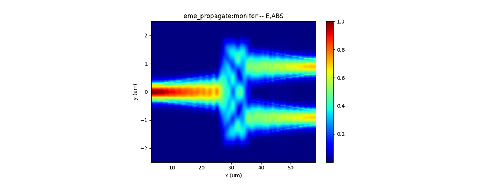
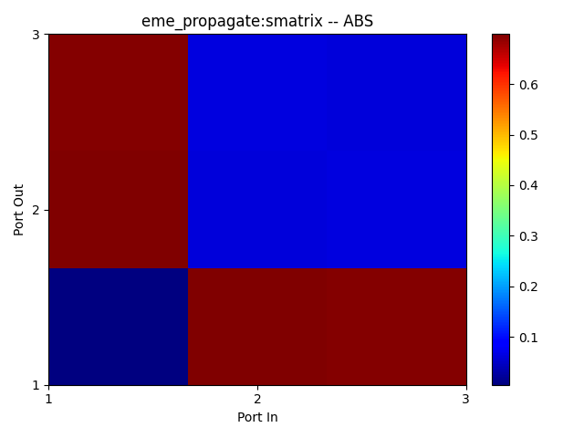
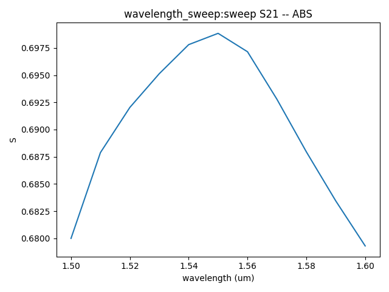

import 'katex/dist/katex.min.css';
import { InlineMath, BlockMath } from 'react-katex';

# Multi-Mode Interference

<font face = "Calibri">

## Introduction

<div class="text-justify">

Multi-mode interferometer, due to their advantages of low insertion loss, wide bandwidth, simple fabrication process, and good tolerance, have been widely used in important optical devices such as optical switches and wavelength-division multiplexers.

The main performance parameters of multi-mode interference couplers include **insertion Loss**, **imbalance**, **device dimensions**, **operating bandwidth**.

</div>

| |  |
| ------------------------------------------------------------ | ------------------------------------------------------------ |


## Simulation Methods

<div class="text-justify">

With the `EME module`, the corresponding cell groups and cell numbers can be set up with the structure, and a parameter sweep can be performed in the propagation sweep to obtain the S-parameters of the device. This parameter sweep helps optimize the core dimensions of the multi-mode interferometer, ensuring desired performance characteristics.

Alternatively, `FDTD module` can be conducted to obtain the intensity distribution of the optical field and the transmittance at each port. This allows the verification of the optimized results for the multi-mode interferometer.

After data processing, performance parameters such as the imbalance, insertion loss, and bandwidth of the device can be determined.

</div>

##  Multi-Mode Interference(EME module)

The simulation design of a multimode interference coupler typically employs the EME module. This allows for a rapid scan of the length of the multimode interference region to quickly identify the optimal length for beam splitting. Therefore, in the following code, we will learn how to create a Multi-Mode Interference (MMI) simulation and output the results for data processing.

###  1. Basic Operations

#### 1.1 Import File

<div class="text-justify">

Once you have installed and configured the environment, import the python code and the GDS layout. The example library and related model code are usually located in the directory :`examples/func_demo`. The GDS file is generally imported into the path :`examples/examples_gds`

</div>

#### 1.2 SDK Initialization

<div class="text-justify">


Create a new terminal and run the code after you import the python script and GDS file. Max-Optics SDK may take some time to connect the service.

</div>

### 2.Code Description


<div class="text-justify">


Now let's learn the meaning of functions and parameters that correspond to the code.

</div>

#### 2.1 import Modules

<div class="text-justify">


To begin, we need to use the `import` command to call the relevant functional modules. For instance, we import the  `typing` ,  `os` and  `time` module in python. At the same time ,we import the customized module `maxoptics_sdk.all `and `maxoptics_sdk.helper`.

</div>

```python
import maxoptics_sdk.all as mo
from maxoptics_sdk.helper import timed, with_path
import os
import time
from typing import NamedTuple
```

<div class="text-justify">

The `maxoptics_sdk` package provides all in one optical simulation with Python.<br/>The `os` module provides a way to use operating system-dependent functionality such as reading or writing to the file system, working with environment variables, and executing system commands.<br/>The `time` module provides various functions to work with time-related operations and to measure time intervals.<br/>The `typing` module provides support for type hints and annotations, which are used to indicate the expected types of variables, function arguments, and return values in your code.

</div>

#### 2.2 Define Simulation

<div class="text-justify">


Firstly, We define parameters and give them a default value, such as the simulation wavelength and number of modes. Note that we can override this value in the following code.

</div>

```python
@timed
@with_path
def simulation(
    *, wavelength=1.55, number_of_modes=10, global_mesh_grid=0.155, local_mesh_grid=0.01, run_options: "RunOptions", **kwargs
):
```

<div class="text-justify">

The provided code contains comments that define the simulation parameters. Let's explain each of these parameters. <br/>The function `simulation` is used to define the simulation parameters for the program. <br/>The `run_mode` parameter determines the type of calculation resources to be used. <br/>The `wavelength` parameter specifies the wavelength of the input light in micrometers. <br/>The `number_of_trial_modes` parameter sets the number of modes to be calculated.<br/>The `**kwargs` is a special syntax used in function definitions to accept an arbitrary number of keyword arguments as a dictionary.


</div>

#### 2.3 Define Parameters

<div class="text-justify">


Define commonly used parameters in region 0, such as the mesh grid of the simulation boundary, the start time of the simulation, the path and name for the simulation output, the path to the imported GDS layout, and other parameters required for structural parameterized modeling.

If you need to calculate the bandwith of the device in the EME simulation, you can also decide the wavelength for sweeping in this section.

</div>

```python
# region --- 0. General Parameters ---
path = kwargs["path"]
simu_name = "EME_1X2MMI"
time_str = time.strftime("%Y%m%d_%H%M%S", time.localtime())
project_name = f'{simu_name}_{time_str}'
plot_path = f'{path}/plots/{project_name}/'
gds_file_root_path = os.path.abspath(os.path.join(path, '..'))
gds_file = gds_file_root_path + "/examples_gds/1X2MMI.gds"
kL = [f"0{k}" for k in range(5)]
wavelength_start = 1.55
wavelength_stop = 1.65
wavelength_points = 10
# endregion
```

<div class="text-justify">


The code defines several parameters and variables necessary for the simulation process. The `global_mesh_grid` parameter represents the mesh in the EME simulation region. Similarly, the `local_mesh_grid` parameter denotes the customized mesh for user defined region.<br/>The `path` variable defines the file path for the simulation, while `simu_name` specifies the name of the simulation file.<br/> The `time_str` variable is used to obtain the current time as a timestamp for the simulation.<br/>The `project_name` variable assigns a name to the project for the simulation output. <br/>The `plot_path` variable determines the directory where the simulation result plots will be saved.<br/>The `gds_file_root_path` variable defines the path for importing the GDS layout. <br/>The parameters `wavelength_start`,`wavelength_stop`,`wavelength_points` are for sweeping.<br/>These parameters and variables together facilitate the successful execution and organization of the simulation process.

</div>

#### 2.4 Creat Project

You can create a new project using the Project function of Max's software development toolkit in region 1.

```python
# region --- 1. Project ---
pj = mo.Project(name=project_name)
# endregion
```

#### 2.5 Define Materials

<div class="text-justify">

Let's proceed to the next step, where we set up the materials required for the simulation in region 2. In this case, we will directly use relevant materials from the MO  material library.

</div>

```python
# region --- 2. Material ---
mt = pj.Material()
mt.add_nondispersion(name="Si", data=[(3.454996, 0)], order=2)
mt.add_nondispersion(name="SiO2", data=[(1.444991, 0)], order=2)
mt.add_lib(name="Air", data=mo.Material.Air, order=2)
# endregion
```

The `add_lib` contains three parameters `name`,`data` and `order`. <br/>The `data` calls up the property of simulation materials in the MO material library. <br/>The `Order` parameter determines the mesh order for the material during the simulation. <br/>As the same, we also support users to customize the material with `add_nondispersion`function.

Detailed explaination about material :  <a href='https://itsays-zqc.github.io/my-website/docs/test/v2_core/1Material'>Material</a>

#### 2.6 Create Model

<div class="text-justify">

Next, we will create the MMI model in region 3.

</div>

```python
# region --- 3. Structure ---
st = pj.Structure()

st.add_geometry(name="box", type="gds_file",
                property={"general": {"path": gds_file, "cell_name": "TOP", "layer_name": (1, 1)},
                            "geometry": {"x": 0, "y": 0, "z": 0, "z_span": 4},
                            "material": {"material": mt["SiO2"], "mesh_order": 2}})
st.add_geometry(name="psr", type="gds_file",
                property={"general": {"path": gds_file, "cell_name": "TOP", "layer_name": (2, 1)},
                            "geometry": {"x": 0, "y": 0, "z": 0.11, "z_span": 0.22},
                            "material": {"material": mt["Si"], "mesh_order": 2}})
# endregion
```

<div class="text-justify">

We can import the MMI layout from the GDS file.<br/>The `name` parameter defines the structure name.<br/>The `type` parameter specifies the structure type.<br/>The `path`, `cell_name`, and `layer_name` parameters point to the GDS file and specify the relevant layers and cell names used in the layout.<br/>The `geometry` parameter sets the structure's coordinates. <br/>The `material` parameter specifies the material properties <br/>The `mesh_order` parameter sets the mesh order for the simulation.

</div>

#### 2.7 Simulation

<div class="text-justify">
After establishing the model, we can add the simulation  in region 4.
</div>

```python
# region --- 4. Simulation ---
simu = pj.Simulation()
simu.add(
    name=simu_name,
    type="EME",
    property={
        "background_material": mt["Air"],
        "mesh_settings": { "mesh_factor": 1.2, "mesh_refinement": { "mesh_refinement": "curve_mesh", }, },
        "geometry": {"x_min": -1, "y": 0, "y_span": 3, "z": 0, "z_span": 3},
        "boundary_conditions": {
            "y_min_bc": "PML", "y_max_bc": "PML", "z_min_bc": "PML", "z_max_bc": "PML",
            "pml_settings": { "pml_kappa": 2, "pml_sigma": 5, "pml_layer": 12, "pml_polynomial": 3, }, },
        "general": { "wavelength": wavelength, "wavelength_offset": 0.0003, "use_wavelength_sweep": True, },
        "eme_setup": {
            "cell_geometry": {
                "cell_group_definition": [
                    {"span": 2, "cell_number": 1, "number_of_modes": number_of_modes, "sc": "none"},
                    {"span": 20, "cell_number": 10, "number_of_modes": number_of_modes, "sc": "sub_cell"},
                    {"span": 11.5, "cell_number": 1, "number_of_modes": number_of_modes, "sc": "none"},
                    {"span": 20, "cell_number": 10, "number_of_modes": number_of_modes, "sc": "sub_cell"},
                    {"span": 2, "cell_number": 1, "number_of_modes": number_of_modes, "sc": "none"}, ] } },
        "transverse_mesh_setting": {
            "global_mesh_uniform_grid": {"dy": global_mesh_grid, "dz": global_mesh_grid} }, }, )
# endregion
```

The `name` parameter defines the name of the simulation module.<br/>The `property` parameter specifies the general property of the simulation module, such as the geometry of cell, wavelength and so on.<br/>
The `cell_group_definition` parameter specifies the general property of the cell group.<br/>
The `number_of_modes` parameter specifies the general property of the simulation module within the structure, such as the geometry of cell, wavelength and so on.<br/>
The `sc` parameter sets the subcell method in EME simulation. Selections are ['none', 'sub_cell'].<br/>


#### 2.8 Add Sub-mesh

<div class="text-justify">
To achieve more accurate calculations of the model's modal fields, we can add a sub-mesh in region 5.
</div>

```python
# region --- 5. Sub Mesh ---
lm = pj.LocalMesh()
lm.add(
    name="sub_mesh",
    property={
        "general": {"dx": local_mesh_grid,"dy": local_mesh_grid, "dz": local_mesh_grid},
        "geometry": {"x": 30.75, "x_span": 11.5, "y": 0, "y_span": 5, "z": 0.11, "z_span": 0.4}, }, )
# endregion
```

<div class="text-justify">

In this code segment, we  add a sub-mesh in region 5.<br/>The `name` parameter defines the name of the mesh.<br/>The `general` parameter specifies the grid accuracy in the xyz directions .<br/>The `geometry` parameter sets the coordinates of the sub-mesh.

</div>

#### 2.9 EME Port

<div class="text-justify">
In region 6, we add the EME Port for calculating modes in the simulation.
</div>

```python
# region --- 6. Port ---
pjp = pj.Port()

# region --- input_te_tm ---
pjp.add(
    name="input_port",
    type="eme_port",
    property={ "modal_analysis": { "wavelength": wavelength, },
        "geometry": { "port_location": "left", "use_full_simulation_span": True, },
        "eme_port": {
            "general": {"mode_selection": "fundamental_TE", "mode_index": 0},
            "advanced": {"offset": 0.1, "number_of_trial_modes": number_of_modes }}})
# endregion

# region --- output_up_te_tm ---
pjp.add(
    name="output_port1",
    type="eme_port",
    property={ "modal_analysis": { "wavelength": wavelength, },
            "geometry": { "port_location": "right", "use_full_simulation_span": False, "y": 0.9, "y_span": 2, "z": 0.11, "z_span": 2 },
            "eme_port": {
                "general": {"mode_selection": "fundamental_TE", "mode_index": 0},
                "advanced": {"offset": 0, "number_of_trial_modes": number_of_modes}}})
# endregion

# region --- output_down_te_tm ---
pjp.add(
    name="output_port2",
    type="eme_port",
    property={
        "modal_analysis": { "wavelength": wavelength, },
        "geometry": { "port_location": "right", "use_full_simulation_span": False, "y": -0.9, "y_span": 2, "z": 0.11, "z_span": 2},
        "eme_port": {
            "general": {"mode_selection": "fundamental_TE", "mode_index": 0, "search": "max_index"},
            "advanced": {"offset": 0, "number_of_trial_modes": number_of_modes }}})
# endregion
# endregion
```
<div class="text-justify">

The `name` parameter defines the name of the EME port.<br/>
The `port_location` parameter sets the location type of EME port. Selections are ['left', 'right'].<br/>
The `use_full_simulation_span` parameter confirms whether to use full simulation span.<br/>
The `mode_selection` parameter decides the mode which propagates in the waveguide. Selections are ['fundamental', 'fundamental_TE', 'fundamental_TM', 'fundamental_TE_and_TM', 'user_select', 'user_import'].<br/>
The `mode_index` is used to decide the source mode in the 'user_select' condition.<br/>
The `search` parameter calculates the mode based on the maximum refractive index or user defined refractive index in the structure. Selections are ['near_n', 'max_index']. Selections are ['near_n', 'max_index'].<br/>
The `number_of_trial_modes` parameter determines the calculated number of modes around the refractive index.<br/>

</div>

#### 2.10 Add Monitor

<div class="text-justify">

In region 7, we add the profile monitors for the EME simulation.

</div>

```python
# region --- 7. Monitor ---
mn = pj.Monitor()
mn.add(
    name="z_normal",
    type="profile_monitor",
    property={
        "geometry": {
            "monitor_type": "2d_z_normal", "x_resolution": 100,
            "x": 30.75, "x_span": 55.5, "y": 0, "y_span": 5, "z": 0.11, "z_span": 0 }})
for i, pos in enumerate([10, 17.5, 23.5, 34.5, 39.5]):
    mn.add(
        name="section"+str(i+1),
        type="profile_monitor",
        property={"geometry": {"monitor_type": "2d_x_normal", "x_resolution": 100,
                                "x": pos, "x_span": 0, "y": 0, "y_span": 5, "z": 0.11, "z_span": 2}})
# endregion
```

The `monitor_type` parameter selects the profile monitor type and the orientation.Selections are ['2d_x_normal', '2d_y_normal', '2d_z_normal', 'x', 'y', 'z'].<br/>
The `x_resolution` parameter decides the resolution of output simulation results in profile monitor.<br/>

#### 2.11 Calculate Mode

<div class="text-justify">

In this region, we calculate the modes of ports. Before running EME simulation calculations, we can calculate the mode field distribution of the port by setting the type of mode selection to True and other simulations to False.

</div>

```python
# region --- 8. Calculate Mode ---
if run_options.calculate_modes:
    for port in ["input_port", "output_port1","output_port2"]:
        k = kL[2]
        simu[simu_name].preview_modes(
            port_name=port,
            data="calculate_modes",
            savepath=f"{plot_path}{k}_modeprofile_fdeonly_{port}", attribute="E", mode=0, )
        simu[simu_name].preview_modes(
            port_name=port,
            data="calculate_modes",
            savepath=f"{plot_path}{k}_Preview_{port}_neff", show=False, export_csv=True, )
# endregion
```

#### 2.14 Run

<div class="text-justify">

In the region 9 ,we can recall the simulation name to run it.

</div>

```python
# region --- 9. Run ---
eme_base_res = simu[simu_name].run()
# endregion
```

#### 2.15 EME Analysis

<div class="text-justify">
In region 10, we run the analysis for this simulation.In this part, we can set detailed information of wavelength sweep,groupspan sweep,periodicity and so on.
</div>

```python
# region --- 10. Analysis ---
grating_periods = 1
analysis = pj.Analysis()
analysis.add(
    name="eme_propagate",
    type="eme_analysis",
    property={
        "workflow_id": eme_base_res.workflow_id,
        "eme_propagate": run_options.run,
        "periodicity": {
            "periodicity": True,
            "periodic_group_definition": [
                { "start_cell_group": "group_span_1", "end_cell_group": "group_span_1", "periods": grating_periods, } ], },
        "group_span_sweep": { "group_span_sweep": run_options.run_length_sweep, "parameter": "group_span_1", "start": 0, "stop": 10, "number_of_points": 11, },
        "wavelength_sweep": { "wavelength_sweep": run_options.run_wavelength_sweep, "start": 1.5, "stop": 1.6, "number_of_wavelength_points": 11, },
        # "override_wavelength":{
        #     "wavelength": 1.55
        # }
    },)
eme_res = analysis["eme_propagate"].run()
# endregion
```


#### 2.16 Extract Results

<div class="text-justify">


In region 11, we can retrieve and store the simulation results.

</div>

```python
# region --- 11. See Results --
if run_options.extract:
    # region --- 11.1 EME Results --
    if run_options.run:
        # region --- facet data ---
        eme_res.extract(
            data="eme_propagate:facet_data",
            savepath=f"{plot_path}",
            real=True, imag=True, export_csv=True, )
        eme_res.extract(
            data="eme_propagate:cell_power_total",
            savepath=f"{plot_path}00_cell_power_total",
            target="line", toward="forward", export_csv=True, )
        eme_res.extract(
            data="eme_propagate:cell_power_mode",
            savepath=f"{plot_path}01_cell_power_mode",
            target="intensity", toward="forward", export_csv=True, )
        eme_res.extract(
            data="eme_propagate:cell_neff",
            savepath=f"{plot_path}02_cell_neff",
            target="intensity", export_csv=True, )
        for port_name in ["input_port",  "output_port1","output_port2"]:
            res = eme_res.extract(
                data="eme_propagate:port_mesh_structure",
                savepath=f"{plot_path}03_eme_structure_{port_name}",
                port_name=port_name, target="intensity", )
        # region --- smatrix_intensity ---
        eme_res.extract(
            data="eme_propagate:smatrix",
            savepath=plot_path + "011_eme_smatrix_intensity",
            target="intensity", export_csv=True)
        # endregion

        # region --- monitor ---
        eme_res.extract(
            data="eme_propagate:monitor",
            savepath=plot_path + "013_eme_z_normal",
            monitor_name="z_normal", attribute="E", export_csv=True )
        for i in range(5):
            eme_res.extract(
                data="eme_propagate:monitor",
                savepath=plot_path + "013_eme_section"+str(i+1),
                monitor_name="section"+str(i+1), attribute="E", export_csv=True)
    #     # endregion
    # # endregion

    # # region --- 11.2 EME Wavelength Sweep Results ---
    if run_options.run_wavelength_sweep:
        eme_res.extract(
                data="wavelength_sweep:sweep",
                savepath=plot_path + "06_wavelength_sweep",
                plot_x="wavelength", export_csv=True, )
    # endregion
# endregion
return project_name
```

<div class="text-justify">

The `extract` function allows you to extract specific simulation results and store them for further analysis.<br/>
The `data` parameter is to decide what type/field data will be extracted.<br/>
The `savepath` parameter specifies the save path of picture.<br/>
The `monitor_name` parameter specifies the name of monitor which provides the data needed.<br/>
The `plot_x` parameter specifies the data of x axis.<br/>
The `export_csv` parameter is to decide whether to export a csv. Default as False.<br/>

</div>

#### 2.16 Switches

<div class="text-justify">


In this section of the code, the `simulation` function is called and executed, which allows you to reset relevant parameters for more convenient parameter scanning and optimization design. We also support control switches for various functionalities at the end of the code, and you can use configuration flags(True or False). These flags can be used to turn specific functionalities on or off, making it easier to check the model and perform efficient calculations.

</div>

```python
class RunOptions(NamedTuple):
    calculate_modes: bool
    run: bool
    run_length_sweep: bool
    run_wavelength_sweep: bool
    extract: bool

if __name__ == "__main__":
    simulation( run_mode="local", wavelength=1.55, global_mesh_grid=0.01, local_mesh_grid=0.005, number_of_modes=10,
        run_options=RunOptions( calculate_modes=True, run=True, run_length_sweep=False, run_wavelength_sweep=True, extract=True, ), )
```

<div class="text-justify">

By turning on/off the relevant functionalities, you can control the simulation process and obtain the desired results. For example, the `calculate_modes` determines whether to calculate the modes. The `run` determines whether to do the EME propagation in the program. `run_wavelength_sweep` is used to enable wavelength scanning, and `extract` is used to control data extraction. Properly utilizing these switches can help you inspect the simulation effectively.

</div>


### 3.Output Results

<div class="text-justify">

1. the z-normal E intensity of EME propagation

|  |
| :----------------------------------------------------------: |

3. The S matrix of EME propagation and the S parameters and transmission at different wavelength..

As shown in the figure below, the S-matrix is a 3∙3 matrix.

|   |  |
| :----------------------------------------------------------: | :----------------------------------------------------------: |

</div>

<div class="text-justify">

The S21 parameter represents the absolute value of the transmission coefficient from port 1 input to port 2 output. Due to the symmetry of the structure, S31=S21.
The transmission result is shown in the left picture below which is calculted form the S parameter about the one of output ports. Therefore, we can obtain the insert loss is about 0.114 dB at 1.55 micrometer wavelength.

</div>


## Supplement

<div class="text-justify">

To view a function's definition and supported parameters or a parameter dictionary, you can right-click on its name and select "Go to Definition"  or press "Ctrl" while left-clicking on its name to view its definition, showing the available parameters and their descriptions.

</div>

</font>