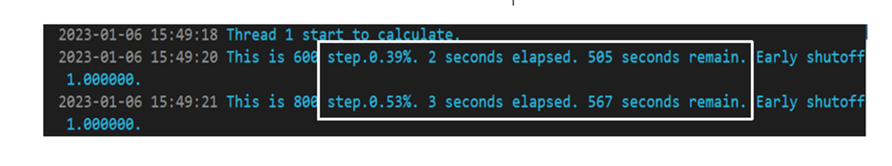

# How to set simulation time? 

When either the maximum simulation time is reached or the energy in the simulation area is less than the convergence threshold, the simulation project will end. In order to obtain convergence results, the simulation time should be set long enough, and it is recommended that the simulation time be no less than 1000 fs.

# Relationship between structural dimensions and simulation time

1. The estimated time required for simulating and calculating non resonant devices is: L𝑛_𝑔/c;
2. For SOI devices with a 100 micron length and a group refractive index of 4.23, the simulation time should be at least 1410 fs;
3. For SiN devices with a 100 micron length and a group refractive index of 2.01, the simulation time is at least 670fs.
4. In general, we need the light field energy in the simulation to converge below 1e-4. In order to ensure that the energy at the end of the simulation is less than 1e-4, the simulation time should be set sufficiently large.

# What is the relationship between the 'step. 0.39%' printed during the simulation process and the simulation time?

At the beginning of the simulation, a maximum simulation time will be estimated based on the number of grid points, simulation time, and current computer performance, corresponding to the sum of "elapsed" and "remaining" times in each row of the following figure. 

 

After each iteration, the program will calculate the current elapsed time elapsed time and the maximum required simulation time remaining time until the end of the simulation. When the simulation time is set sufficiently large, the Early shutdown condition will be triggered when the energy of light in the simulation area decreases to the convergence level, and the simulation time used is less than 100%.
                               
                               step = elapsed_time/(elapsed_time + remain_time)            

