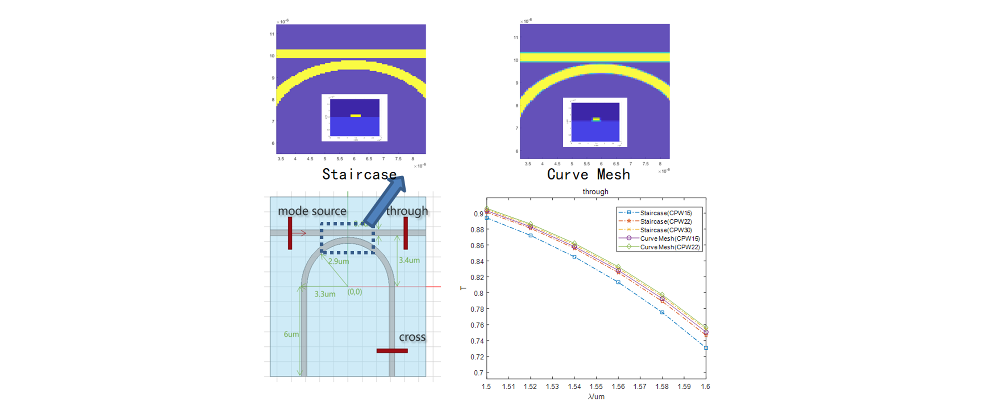
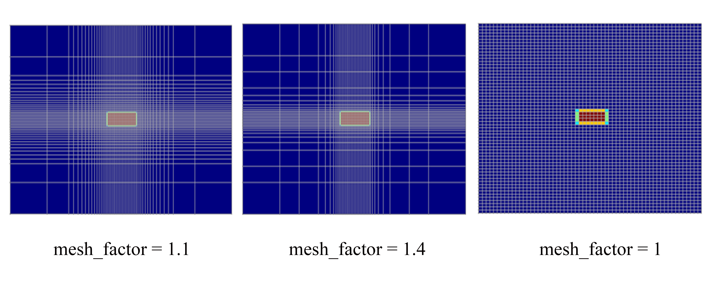

import 'katex/dist/katex.min.css';
import { InlineMath, BlockMath } from 'react-katex';

# How to set mesh?

## 1 Mesh type

| Solver |FDE|EME|FDTD|description|
|--------|---|---|----|-----------|
|uniform|  √| √ | √ | The grid size in the x, y, and z directions are the same in the structure.|
|auto non-uniform| |  √ |  |The size of the non-uniform grid is determined by "cells per wavelength", and the grid size is the wavelength in the structure divided by "cells per wavelength".|

### 1.1 Uniform
The uniform type of grid is evenly distributed in the x, y, and z directions, and the step size of the grid is set by the user.

### 1.2 Auto non-uniform

Global automatic non-uniform grid distribution, with "cells per wavelength" determining the grid size at different positions. The grid division uses the same "cells per wavelength", so the grid step size is smaller in areas with high refractive index.

## 2 Mesh type refinement

According to the different ways in which the refractive index of materials is filled in hexahedral and rectangular grids, they can be divided into "staircase" and "curve mesh" types of grids.

### 2.1 Staircase

When multiple materials appear in a grid, one of them will be selected as the filling material for the grid. The size of the divided grid is too large, which can easily create a stepped shape in curved structures. As shown in the figure below, the refractive index distribution of the structure is observed, and a stepped shape appears at the boundary of the curved waveguide.

### 2.2 Curve mesh

In the case of multiple materials in the grid, the equivalent refractive index within the grid is calculated based on the electromagnetic field equation at the boundary, and then filled into the grid. Using "curve mesh" can significantly improve the accuracy of calculations with the same grid accuracy.

* The refractive index of different materials in the "staircase" type of mesh varies directly at the interface, while the interface of the "curve mesh" material is gradient.
* Under the same grid size, using a "curve mesh" type of grid is more accurate in characterizing the structure, and the accuracy of the calculation results is significantly improved. From the following example, it can be seen that using a grid size of "cells per wavelength" of 15 for the "curve mesh" type mesh is equivalent to using a grid size of "cells per wavelength" of 22 for the "staircase" type mesh, but the simulation time is saved by four times.
* The “curve mesh” is applicable to FDE, EME, and FDTD solvers.

## 3 Mesh accuracy

The mesh accuracy represents the size of the mesh, and the commonly used grid accuracy is shown in the table below.

| Mesh Accuracy of "Gloden" |1|2|3|4|5|
|---------------------------|--|--|--|--|--|
|&emsp;&emsp;cells per wavelength of "Max-optics" &emsp;&emsp;&emsp;&emsp;|&emsp;&emsp;6&emsp;&emsp;|&emsp;&emsp;10&emsp;&emsp;|&emsp;&emsp;14&emsp;&emsp;|&emsp;&emsp;18&emsp;&emsp;|&emsp;&emsp;22&emsp;&emsp;|

1. To meet the accuracy requirements of the calculation, it is recommended to set "cells per wavelength" to 14 or above.
2. If we only focus on the transmission rate, it is not necessary to set "cells per wavelength" above 22. Generally, the transmission rate set to 18 is within ±0.01 of the transmission rate error for higher grid accuracy.
3. If more accurate reflectivity (-60 dB) is required, "cells per wavelength" should be set to be greater than 26.

## 4 Mesh factor

The grid growth factor is only applicable to non-uniform grids and is used to control the rate of grid size change at the junction of different sizes of grids.To ensure the accuracy of the calculation results, the change rate of the grid should not be too large, and the default value of mesh factor is 1.2.

In the area where the global mesh and local mesh are connected, the gradient trend of grid size with different growth factors is as follows. It is obvious that the larger the growth factor, the faster the grid change rate in the connected areas, and the corresponding number of meshs is smaller. If the size of the local area network grid is a, the size of the global grid is b, and the grid factor is m, then there will be a grid gradient process of a, a∙m, a∙m^2, a∙m^3, ...b in the connected areas.

The mesh factor cannot be too small. If the mesh factor is 1, the grid will be evenly distributed throughout the entire space without any changes in size, and the number of meshs will increase significantly.

