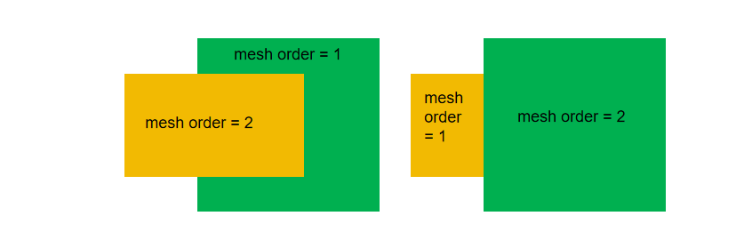

# Mesh

<font face = "Calibri">

<div class="text-justify">

In this section, we will discuss how to add meshing to the simulation. This step is crucial to ensure the precision and dependability of the simulation outcomes.

## 3.1 Add mesh

Add sub mesh to the simulation project with the code below (for optical simulation).

```python
add(
        name: str,
        property: dict,
    )
```

**Example:**
The following command sets the size of the local mesh area to 6 um * 3 um * 3 um and the local mesh size of 0.2 um in the x, y, and z directions.

```python
lm = pj.LocalMesh()
lm.add(name="sub_mesh",
        property={"general": {"dx": 0.2, "dy": 0.2, "dz": 0.2},
                    "geometry": {"x": 0, "x_span": 6, "y": 0, "y_span":3, "z": 0, "z_span": 3 } } )
```

### General properties
 dx/dy/dz: Specify the mesh size in the x/y/z direction.

#### Geometry properties
| Parameter                | Type    | Default   | Description        |
|:---------------|:--------|:----------:|:----------------------|
|  x, y, z               | number  |     -    | The center position of the geometry. |
|  x_span, y_span, z_span         | number  |     -   | X span, Y span, Z span of the geometry. |
|  x_min, x_max           | number  |     -     | X min, X max position of the geometry. |
|  y_min, y_max           | number  |     -     | Y min, Y max position of the geometry. |
|  z_min, z_max           | number  |     -     | Z min, Z max position of the geometry. |

### 2.1.12 Mesh order

The mesh order decides the coverage when creating a geometric structure.

When the mesh order of two structures are same, the structure which is established later has a higher priority. When the mesh order of two structures are different, the large numerical value of mesh order has greater priority than the small one. That is, The large mesh order of structure is able to cover small mesh order of structure.
For example, the mesh order=2 structure will cover the mesh order=1.



The advantage is that increasing the value of mesh order allows user to make new nested structures in the complex model.


## 3.2 Add emesh

In the context of electrical simulation, we present guidelines on how to incorporate meshing to ensure the precision and dependability of the simulation outcomes. The code explanations and a practical example provided below.

```python
add_emesh(
            self,
            *,
            name: str,
            property: Dict[str, Any],
    	 )
```

| **Parameters** |          Description          |
| :------------: | :---------------------------: |
|      name      |   Electric local mesh name.   |
|    property    | Electric local mesh property. |

**Example:**

```python
st.add_emesh(name="EMesh_Local", property={
    "y_min": oe_y_min, "y_max": oe_y_max, "z_min": oe_z_min, "z_max": oe_z_max, "mesh_size": egrid_local})
```

| **Parameters** | Default | Type  |                 Notes                  |
| :------------: | :-----: | :---: | :------------------------------------: |
|     geometry.x      |    -     |  float   |  The x-coordinate of the center point position of the electrical mesh.    |
|   geometry.x_span   |    -     |  float   | The length in x direction of the electrical mesh. Restrained by condition: >0.  |
|   geometry.x_min    |    -     |  float   | The minimum x-coordinate endpoint data of the electrical mesh.      |
|   geometry.x_max    |     -    |  float   |  The maximum x-coordinate endpoint data of the electrical mesh.     |
|     geometry.y      |    -     |  float   |  The y-coordinate of the center point position of the electrical mesh.      |
|   geometry.y_span   |    -     |  float   | The width in y direction of the electrical mesh. Restrained by condition: >0.  |
|   geometry.y_min    |    -     |  float   |The minimum y-coordinate endpoint data of the electrical mesh.       |
|   geometry.y_max    |     -    |  float   |  The maximum y-coordinate endpoint data of the electrical mesh.      |
|     geometry.z      |    -     |  float   |   The z-coordinate of the center point position of the electrical mesh.    |
|   geometry.z_span   |    -     |  float   | The thinckness in z direction of the electrical mesh. Restrained by condition: >0.  |
|   geometry.z_min    |     -    |  float   |The z-coordinate of the bottom position of the thickness of the electrical mesh.      |
|   geometry.z_max    |     -    |  float   |  The z-coordinate of the top position of the thickness of the electrical mesh.     |
|   mesh_size    |       -  | float | The max size of electrical simulation mesh. |


### 3.2.3 Add emesh along line

By implementing an electric mesh along line, you can accurately capture intricate electrical phenomena and variations, enhancing the comprehensiveness of your simulation results.

```python
add_emesh_along_line(
            self,
            *,
            name: str,
            property: Dict[str, Any],
    )
```

| **Parameters** |             Description             |
| :------------: | :---------------------------------: |
|      name      |   The name of electric mesh along line.   |
|    property    | The property of electric mesh along line. |

**Example:**

```python
st.add_emesh_along_line(name="EMesh_Ge_SiO2_Interface_Slope_Left", property={
    "start_x": oe_x_mean, "start_y": -Ge_y_span_bottom/2, "start_z": Si_z_span,
    "end_x": oe_x_mean, "end_y": -Ge_y_span_top/2, "end_z": Si_z_span+Ge_z_span,
    "mesh_size": egrid_interface})
```

| Parameters | Default | Type  |             Notes             |
| :------------: | :-----: | :---: | :---------------------------: |
|    start_x     |    0    | float |  The minimum value of mesh region in x axis. |
|    start_y     |    0    | float | The minimum value of mesh region in y axis. Restrained by condition: >=0. |
|    start_z     |    0    | float | The minimum value of mesh region in z axis.   |
|     end_x      |    1    | float | The maximum value of mesh region in x axis.   |
|     end_y      |    1    | float | The maximum value of mesh region in y axis.   |
|     end_z      |    1    | float | The maximum value of mesh region in z axis.  Restrained by condition: >=0. |
|   mesh_size    |  0.01   | float |  The size of the unit grid.     |


</div>

</font>