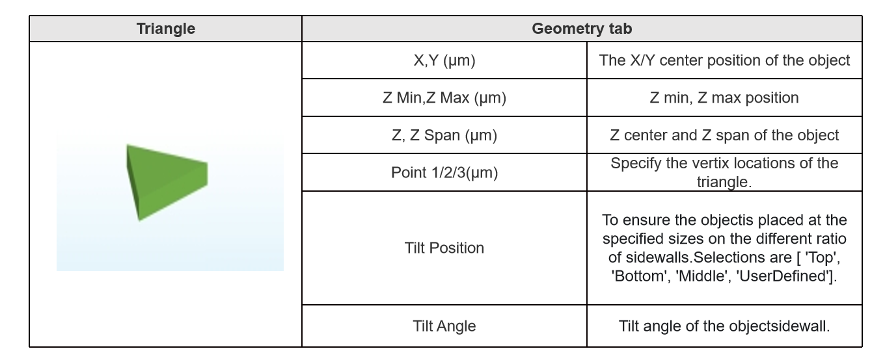
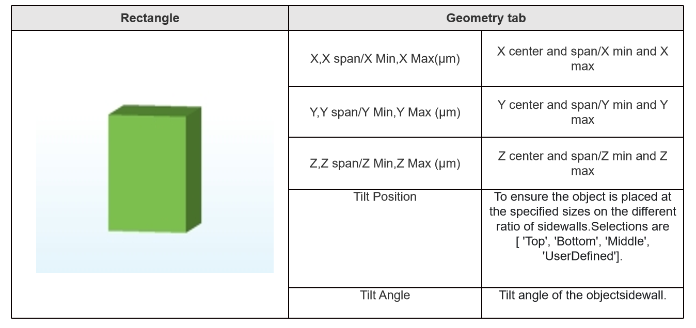
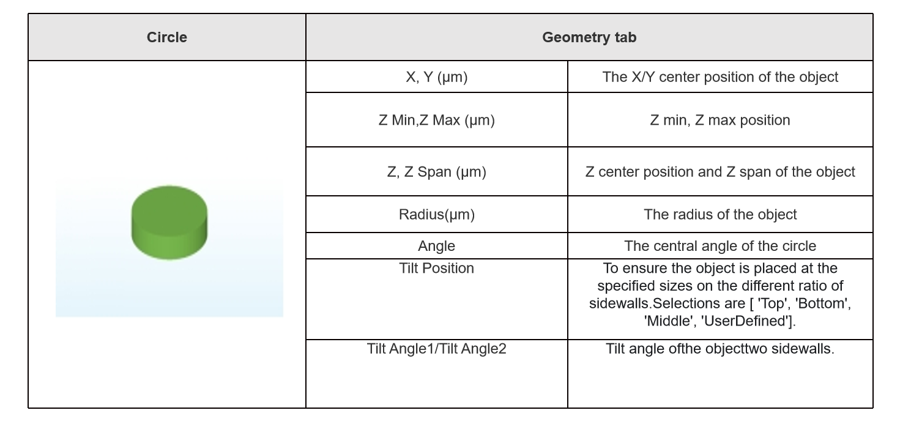
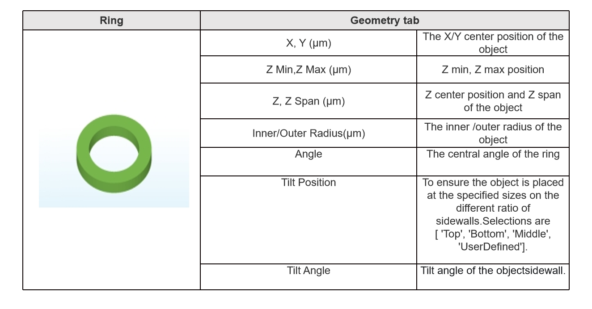
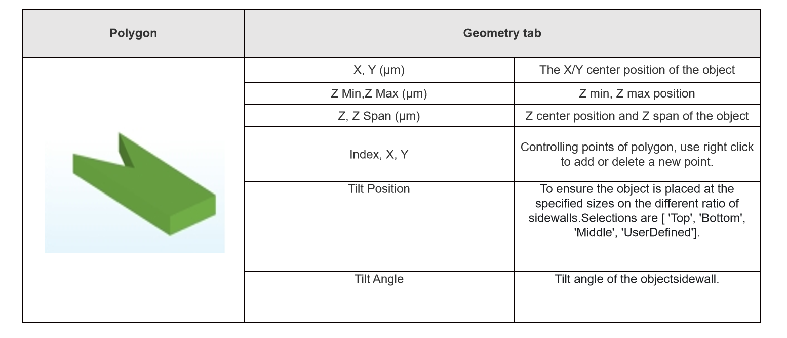
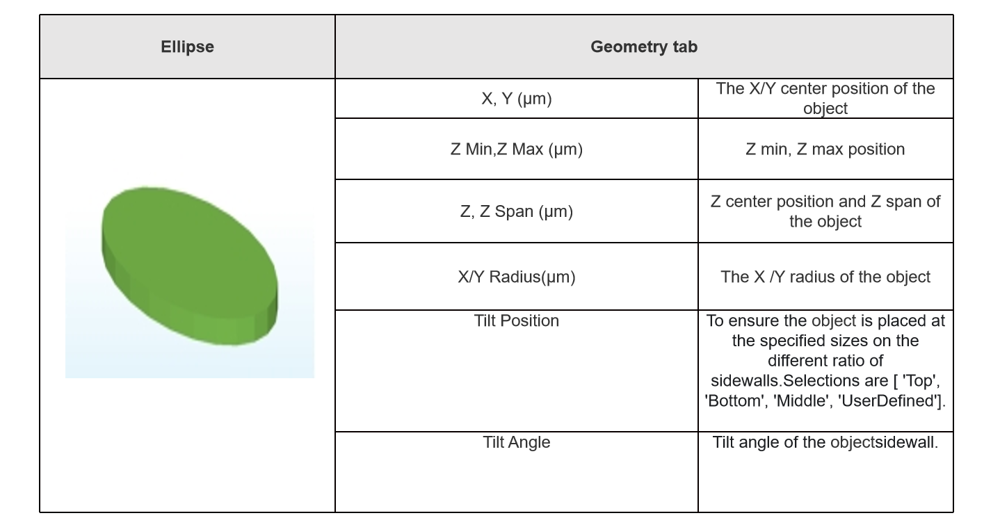
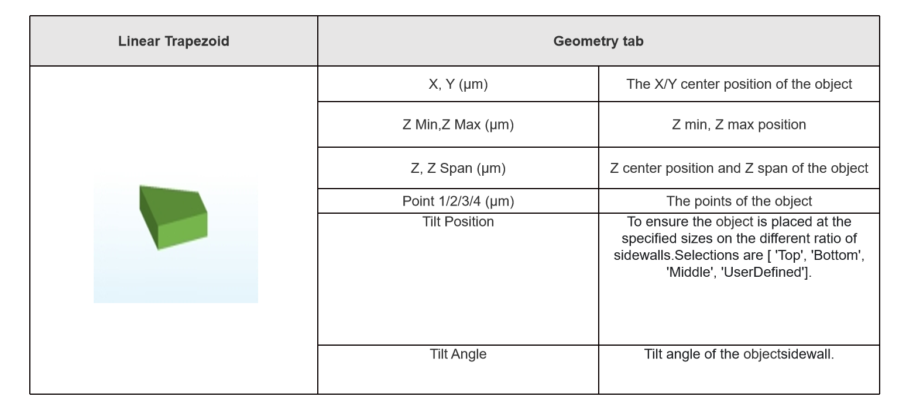
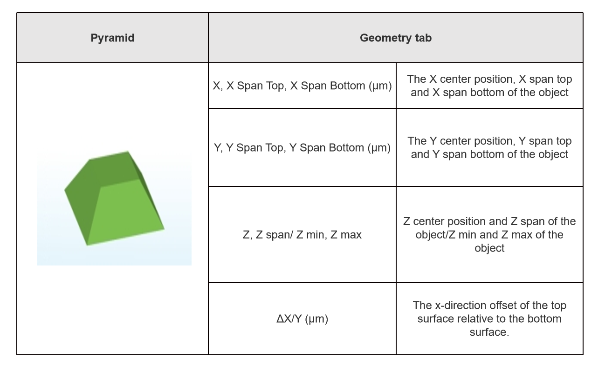
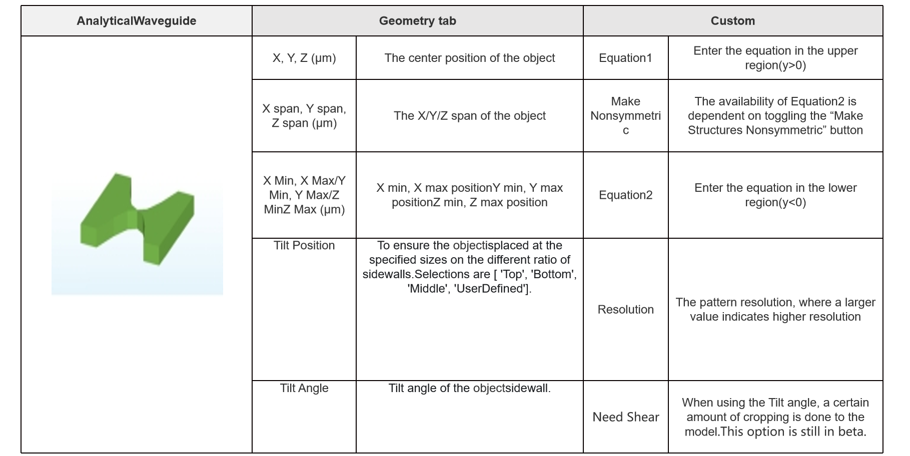
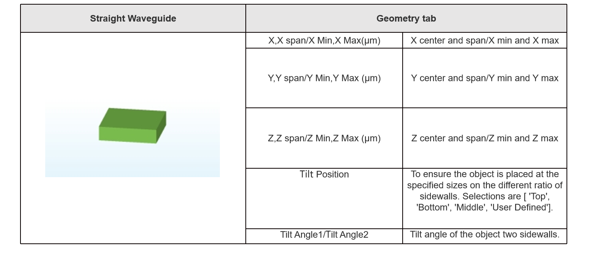

# Structure

__Features Description:__ Add or Edit Structures. This Part mainly contains the establishment of structures and the importation and exportation of GDS files or STL files.

|  |
| :------------------------------------------------------------: |

## 1 Structures

In the Structure, there are __“Triangle”__, __“Rectangle”__, __“Circle”__, __“Ring”__, __“Polygon”__, __“Ellipse”__, __“Linear Trapezoid”__, __“Pyramid”__, __“Sphere”__, __“Straight Waveguide”__, __“Bezier Waveguide”__, __“Analytical Waveguide”__. All structures support 3d modeling, and meet X, Y, Z direction rotation.

| |
| :------------------------------------------------------------: |

The edit window of each structure contains three tabs: Geometry, Material. The interface of Material tab and function are below.

| |
| :------------------------------------------------------------: |

### 1.1 Triangle

| |
| :------------------------------------------------------------: |

### 1.2 Rectangle

| |
| :------------------------------------------------------------: |

### 1.3 Circle
| |
| :------------------------------------------------------------: |

### 1.4 Ring

| |
| :------------------------------------------------------------: |

### 1.5 Polygon

| |
| :------------------------------------------------------------: |

### 1.6 Ellipse

| |
| :------------------------------------------------------------: |

### 1.7 Linear Trapezoid

| |
| :------------------------------------------------------------: |

### 1.8 Pyramid

| |
| :------------------------------------------------------------: |

### 1.9 Sphere

| |
| :------------------------------------------------------------: |

### 1.10 Analytical Waveguide

| |
| :------------------------------------------------------------: |

### 1.11 Straight Waveguide

| |
| :------------------------------------------------------------: |

__Note__ : The straight wave-guide and the rectangle are the same in modeling when the tilt angle and tile position are not used to change the sidewall. It is important to note that the straight wave-guide only has two sides to be shaped, whereas the rectangle will be shaped by the parameters regarding the fore sides.

### 1.12 Bezier Waveguide

| |
| :------------------------------------------------------------: |

__Tilt Position-> User-Defined:__ allows user to define the objective location,if user-defined is selected, user can set the value in the “User-Defined” box, the value of user defined location would be limited between 0~1.(default:1)

## 2 Import/Export

Additionally, for modeling complex structures, users can efficiently import or export GDS II/STL files using GDS II/STL files.

### 2.1 Import GDS File

| |
| :------------------------------------------------------------: |

The descriptions of each tab in the Import GDS II File are below:

| |
| :------------------------------------------------------------: |

| |
| :------------------------------------------------------------: |

| |
| :------------------------------------------------------------: |

The descriptions of each tab in the Export GDS II File are below:

| Import GDS II File | Description |
|--------------------|-------------|
| File Path          | The file path of the imported GDS II file. |
| select file        | To import GDS II file. |
| Cell Name          | The name of different cell in the GDS II file. |
| Layer Number       | The layer number. |
| X/Y (um)           | In the XY direction, the position offset from the origin. |
| Z, Z span/ Z min, Z max | Z center position and Z span of the object/Z min and Z max of the object. |
| Tile Position      | To ensure the object is placed at the specified sizes on the different ratio of sidewalls. Selections are [ 'Top', 'Bottom', 'Middle','UserDefined']. |
| Tilt Angle         | Tilt angle of the object's sidewall. |
| Construction Method | Selections are [ 'Method 1', 'Method 2']. Default value is Method 1. |

### 2.2 Export GDS File

| |
| :------------------------------------------------------------: |

The descriptions of each tab in the Export GDS II File are below:

| Export GDS II File | Description                                      |
|--------------------|--------------------------------------------------|
| Structure          | Drop down to select the exported structure in the project |
| Z                  | The Z plane position of the exported structure.  |
| Path               | The file path of the exported GDS II file.       |

Moreover, clicking the “Import STL II File”, a windows will pop up directly and users can import structures from the STL File. Clicking the “Export STL II File”, a windows will pop up directly and export structures to the STL file.

## 3 Structure Group

In this section, users can use __“Structure Group”__ to change the properties of all the structures in this group, including location bias, material and tilt angle.

| |
| :------------------------------------------------------------: |

To set the Geometry and Material of Structure Group in “Edit”.

| |
| :------------------------------------------------------------: |

| |
| :------------------------------------------------------------: |

## 4 Transform

Enable users to transform selected objects. Clicking the “Transform” button in the ribbon initiates a dialog box. Users can add transform items with a right-click and select types from the drop-down menu. The available transform types encompass translation, scaling, rotation, and mirroring.

| |
| :------------------------------------------------------------: |

| |
| :------------------------------------------------------------: |

Type -- A drop-down menu, with options for “Translate”, “Scale”, “Rotate”, or “Mirror”.

Shape Center -- When in the “on” state, X0, Y0, and Z0 are non-editable; the switch is defaulted to “on”. Note that, the shape center does not support “Translate” feature.

X/Y/Z -- Define translate vector / scale vector / rotate angle / mirror plane normal.

X0/Y0/Z0 -- Specify the origin for the transform operation, excluding the translate operation.

